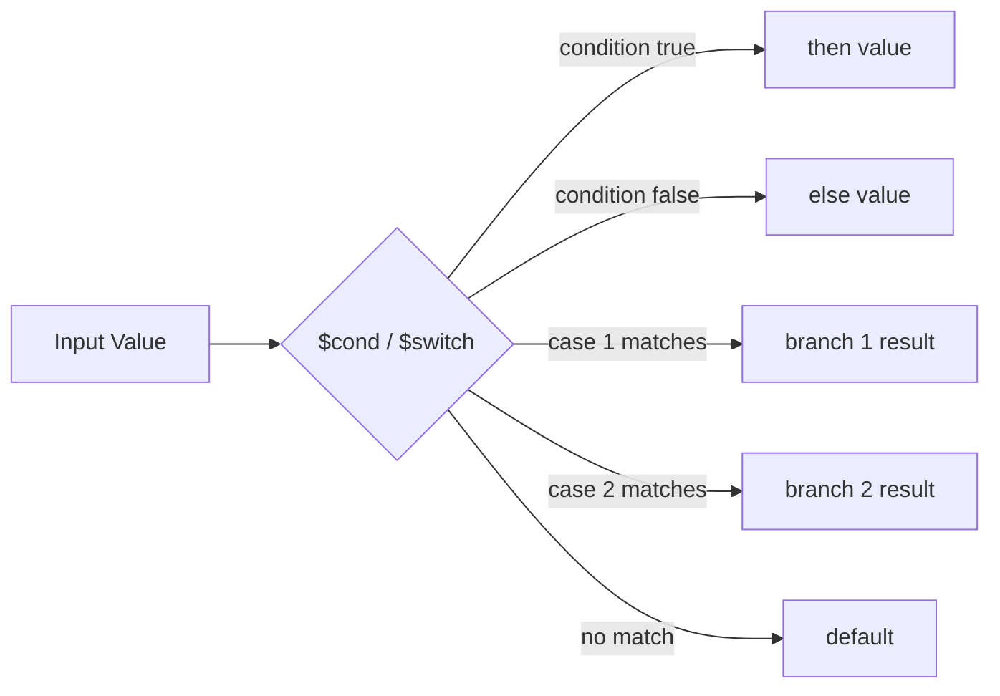

# How to Use $cond and $switch in MongoDB Aggregation

Author: [nawazdhandala](https://www.github.com/nawazdhandala)

Tags: MongoDB, Aggregation, $cond, $switch, Pipeline, Conditional

Description: Learn how to use $cond and $switch in MongoDB aggregation to apply conditional logic and multi-branch expressions within pipeline stages.

---

## How $cond and $switch Work

`$cond` and `$switch` are conditional expression operators that evaluate conditions and return different values based on the result. They work in any context that accepts expressions, including `$project`, `$addFields`, `$group`, and `$match` (via `$expr`).

- `$cond` is a ternary if/else operator.
- `$switch` is a multi-branch case/when operator, similar to SQL `CASE WHEN`.



## Syntax

### $cond

```javascript
// Object form
{
  $cond: {
    if: <boolean expression>,
    then: <expression>,
    else: <expression>
  }
}

// Array form (shorthand)
{ $cond: [ <if>, <then>, <else> ] }
```

### $switch

```javascript
{
  $switch: {
    branches: [
      { case: <expression>, then: <expression> },
      { case: <expression>, then: <expression> },
      ...
    ],
    default: <expression>   // optional; error if no branch matches and no default
  }
}
```

## Examples

### Input Documents

```javascript
[
  { _id: 1, name: "Alice", score: 92, age: 28, status: "active"   },
  { _id: 2, name: "Bob",   score: 73, age: 35, status: "inactive" },
  { _id: 3, name: "Carol", score: 55, age: 22, status: "active"   },
  { _id: 4, name: "Dave",  score: 85, age: 45, status: "active"   }
]
```

### Example 1 - $cond: Binary Classification

Add a `result` field that is "Pass" or "Fail" based on score:

```javascript
db.students.aggregate([
  {
    $project: {
      name: 1,
      score: 1,
      result: {
        $cond: {
          if: { $gte: ["$score", 60] },
          then: "Pass",
          else: "Fail"
        }
      }
    }
  }
])
```

Output:

```javascript
[
  { _id: 1, name: "Alice", score: 92, result: "Pass" },
  { _id: 2, name: "Bob",   score: 73, result: "Pass" },
  { _id: 3, name: "Carol", score: 55, result: "Fail" },
  { _id: 4, name: "Dave",  score: 85, result: "Pass" }
]
```

### Example 2 - $cond Array Shorthand

```javascript
db.students.aggregate([
  {
    $project: {
      name: 1,
      label: { $cond: [{ $eq: ["$status", "active"] }, "Active User", "Inactive User"] }
    }
  }
])
```

### Example 3 - $switch: Multi-Level Grade Classification

Assign letter grades using `$switch`:

```javascript
db.students.aggregate([
  {
    $project: {
      name: 1,
      score: 1,
      grade: {
        $switch: {
          branches: [
            { case: { $gte: ["$score", 90] }, then: "A" },
            { case: { $gte: ["$score", 80] }, then: "B" },
            { case: { $gte: ["$score", 70] }, then: "C" },
            { case: { $gte: ["$score", 60] }, then: "D" }
          ],
          default: "F"
        }
      }
    }
  }
])
```

Output:

```javascript
[
  { _id: 1, name: "Alice", score: 92, grade: "A" },
  { _id: 2, name: "Bob",   score: 73, grade: "C" },
  { _id: 3, name: "Carol", score: 55, grade: "F" },
  { _id: 4, name: "Dave",  score: 85, grade: "B" }
]
```

### Example 4 - $cond Inside $group (Conditional Counting)

Count only active users who passed (score >= 60):

```javascript
db.students.aggregate([
  {
    $group: {
      _id: null,
      activePassCount: {
        $sum: {
          $cond: {
            if: {
              $and: [
                { $eq: ["$status", "active"] },
                { $gte: ["$score", 60] }
              ]
            },
            then: 1,
            else: 0
          }
        }
      }
    }
  }
])
```

Output:

```javascript
[
  { _id: null, activePassCount: 2 }
]
```

### Example 5 - $switch for Age Groups

Classify users into age groups:

```javascript
db.students.aggregate([
  {
    $addFields: {
      ageGroup: {
        $switch: {
          branches: [
            { case: { $lt:  ["$age", 25] }, then: "Under 25"  },
            { case: { $lt:  ["$age", 35] }, then: "25-34"     },
            { case: { $lt:  ["$age", 45] }, then: "35-44"     },
            { case: { $gte: ["$age", 45] }, then: "45+"       }
          ],
          default: "Unknown"
        }
      }
    }
  }
])
```

### Example 6 - Nested $cond

Apply nested conditions for complex logic:

```javascript
db.students.aggregate([
  {
    $project: {
      category: {
        $cond: {
          if: { $eq: ["$status", "active"] },
          then: {
            $cond: {
              if: { $gte: ["$score", 80] },
              then: "Active High Achiever",
              else: "Active Standard"
            }
          },
          else: "Inactive"
        }
      }
    }
  }
])
```

### Example 7 - $switch Without Default (Error Potential)

When no branch matches and no `default` is provided, MongoDB throws an error:

```javascript
// This will throw if score is not in any branch range
db.students.aggregate([
  {
    $project: {
      tier: {
        $switch: {
          branches: [
            { case: { $gte: ["$score", 90] }, then: "Premium" },
            { case: { $gte: ["$score", 70] }, then: "Standard" }
          ]
          // No default - scores below 70 will cause an error
        }
      }
    }
  }
])
```

Always add a `default` unless you are certain all inputs are covered.

## Use Cases

- Adding classification labels (pass/fail, tier, category) to documents
- Conditional counting and summing in `$group`
- Replacing null or missing values with defaults
- Applying different discount rates or tax rules based on document fields

## Summary

`$cond` provides binary if/else conditional logic and `$switch` provides multi-branch case logic. Both work as expression operators anywhere in a pipeline. `$cond` is ideal for simple boolean conditions, while `$switch` is cleaner for three or more mutually exclusive cases. Always include a `default` in `$switch` to handle unexpected values.
