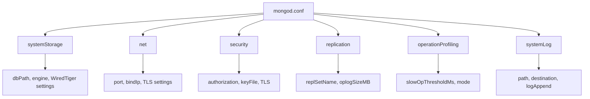

# How to Configure MongoDB with mongod.conf

Author: [nawazdhandala](https://www.github.com/nawazdhandala)

Tags: MongoDB, Configuration, Operations, Administration, Linux

Description: A complete guide to MongoDB's mongod.conf configuration file, covering storage, network, security, replication, and logging options with working examples.

---

## How mongod.conf Works

MongoDB's main configuration file is `/etc/mongod.conf` on Linux systems. It uses YAML format and controls almost every aspect of MongoDB's behavior - from the port it listens on to authentication, storage engine settings, and replication. When MongoDB starts via systemd, it reads this file automatically.



## Basic File Structure

The configuration file is divided into top-level sections. Each section corresponds to a category of settings.

```yaml
# /etc/mongod.conf

systemLog:
  destination: file
  logAppend: true
  path: /var/log/mongodb/mongod.log

storage:
  dbPath: /var/lib/mongodb
  journal:
    enabled: true

net:
  port: 27017
  bindIp: 127.0.0.1

processManagement:
  timeZoneInfo: /usr/share/zoneinfo
```

## systemLog Section

Controls where MongoDB writes its logs.

```yaml
systemLog:
  destination: file        # "file" or "syslog"
  logAppend: true          # append to existing log file on restart
  path: /var/log/mongodb/mongod.log
  logRotate: rename        # "rename" or "reopen"
  verbosity: 0             # 0=default, 1-5 increases verbosity
  component:
    query:
      verbosity: 1         # per-component verbosity override
    write:
      verbosity: 0
```

## storage Section

Controls the data directory and WiredTiger storage engine settings.

```yaml
storage:
  dbPath: /var/lib/mongodb
  journal:
    enabled: true
    commitIntervalMs: 100  # journal commit interval in milliseconds
  directoryPerDB: false    # store each database in its own directory
  engine: wiredTiger
  wiredTiger:
    engineConfig:
      cacheSizeGB: 2       # WiredTiger cache size, defaults to ~50% of RAM
      journalCompressor: snappy  # snappy, zlib, zstd, or none
      directoryForIndexes: false
    collectionConfig:
      blockCompressor: snappy  # snappy, zlib, zstd, or none
    indexConfig:
      prefixCompression: true
```

## net Section

Controls network interfaces, ports, and TLS.

```yaml
net:
  port: 27017
  bindIp: 0.0.0.0          # listen on all interfaces; use specific IPs for security
  bindIpAll: false
  maxIncomingConnections: 1000000
  compression:
    compressors: snappy,zstd,zlib  # enable wire compression
  tls:
    mode: requireTLS         # disabled, allowTLS, preferTLS, requireTLS
    certificateKeyFile: /etc/ssl/mongodb/mongodb.pem
    CAFile: /etc/ssl/mongodb/ca.pem
    allowConnectionsWithoutCertificates: false
```

## security Section

Controls authentication and authorization.

```yaml
security:
  authorization: enabled           # "enabled" or "disabled"
  keyFile: /etc/mongodb/keyfile    # for replica set / sharded cluster authentication
  clusterAuthMode: keyFile         # keyFile, sendKeyFile, sendX509, x509
  javascriptEnabled: false         # disable server-side JavaScript execution
  redactClientLogData: false       # redact sensitive data from log output
```

## replication Section

Required for replica sets.

```yaml
replication:
  replSetName: rs0          # replica set name
  oplogSizeMB: 10240        # oplog size in MB, defaults to 5% of free disk
  enableMajorityReadConcern: true
```

## operationProfiling Section

Controls the database profiler for slow query analysis.

```yaml
operationProfiling:
  mode: slowOp              # off, slowOp, or all
  slowOpThresholdMs: 100    # log operations slower than this value (ms)
  slowOpSampleRate: 1.0     # fraction of slow ops to profile (0.0 to 1.0)
```

## sharding Section

Required for config servers and mongos.

```yaml
sharding:
  clusterRole: configsvr    # configsvr or shardsvr
```

## processManagement Section

Controls how the mongod process itself runs.

```yaml
processManagement:
  fork: false               # run as a background daemon (not needed with systemd)
  pidFilePath: /var/run/mongodb/mongod.pid
  timeZoneInfo: /usr/share/zoneinfo
```

## Complete Production Example

The following is a well-rounded configuration for a standalone production server with authentication enabled.

```yaml
# /etc/mongod.conf - production standalone

systemLog:
  destination: file
  logAppend: true
  path: /var/log/mongodb/mongod.log
  logRotate: rename
  verbosity: 0

storage:
  dbPath: /var/lib/mongodb
  journal:
    enabled: true
    commitIntervalMs: 100
  engine: wiredTiger
  wiredTiger:
    engineConfig:
      cacheSizeGB: 4
      journalCompressor: snappy
    collectionConfig:
      blockCompressor: snappy
    indexConfig:
      prefixCompression: true

net:
  port: 27017
  bindIp: 127.0.0.1,10.0.0.5   # localhost + private IP
  compression:
    compressors: snappy,zstd

security:
  authorization: enabled

operationProfiling:
  mode: slowOp
  slowOpThresholdMs: 100

processManagement:
  timeZoneInfo: /usr/share/zoneinfo
```

## Applying Configuration Changes

After editing `mongod.conf`, restart MongoDB for changes to take effect:

```bash
sudo systemctl restart mongod
```

Test the configuration file for syntax errors before restarting:

```bash
mongod --config /etc/mongod.conf --configTest
```

Expected output on success:

```text
{"t":{"$date":"2026-03-31T10:00:00.000Z"},"s":"I", "c":"CONTROL","id":20533, "ctx":"main","msg":"Config file is valid"}
```

## Viewing Active Configuration at Runtime

While MongoDB is running, view the effective configuration from mongosh:

```bash
mongosh --eval "db.adminCommand({ getCmdLineOpts: 1 })"
```

This returns the parsed configuration including command-line overrides.

## Best Practices

- Never edit `mongod.conf` while MongoDB is running and under heavy write load without a maintenance window.
- Set `bindIp` to only the IP addresses that need to reach MongoDB - avoid `0.0.0.0` in production unless behind a firewall.
- Configure `cacheSizeGB` explicitly rather than relying on the default, especially on shared hosts.
- Set `authorization: enabled` on all production instances from day one.
- Use version control (git) to track changes to `mongod.conf` across your fleet.
- Keep a backup of your working `mongod.conf` before making changes.

## Summary

The `mongod.conf` file is the central configuration point for MongoDB. It uses YAML format and covers logging, storage, networking, security, replication, and profiling. Always validate the file with `--configTest` before restarting, set `authorization: enabled` and a specific `bindIp` for production, and tune `cacheSizeGB` to match your server's memory. Changes require a restart except for a few runtime-settable parameters that can be adjusted with `db.adminCommand({ setParameter: 1, ... })`.
