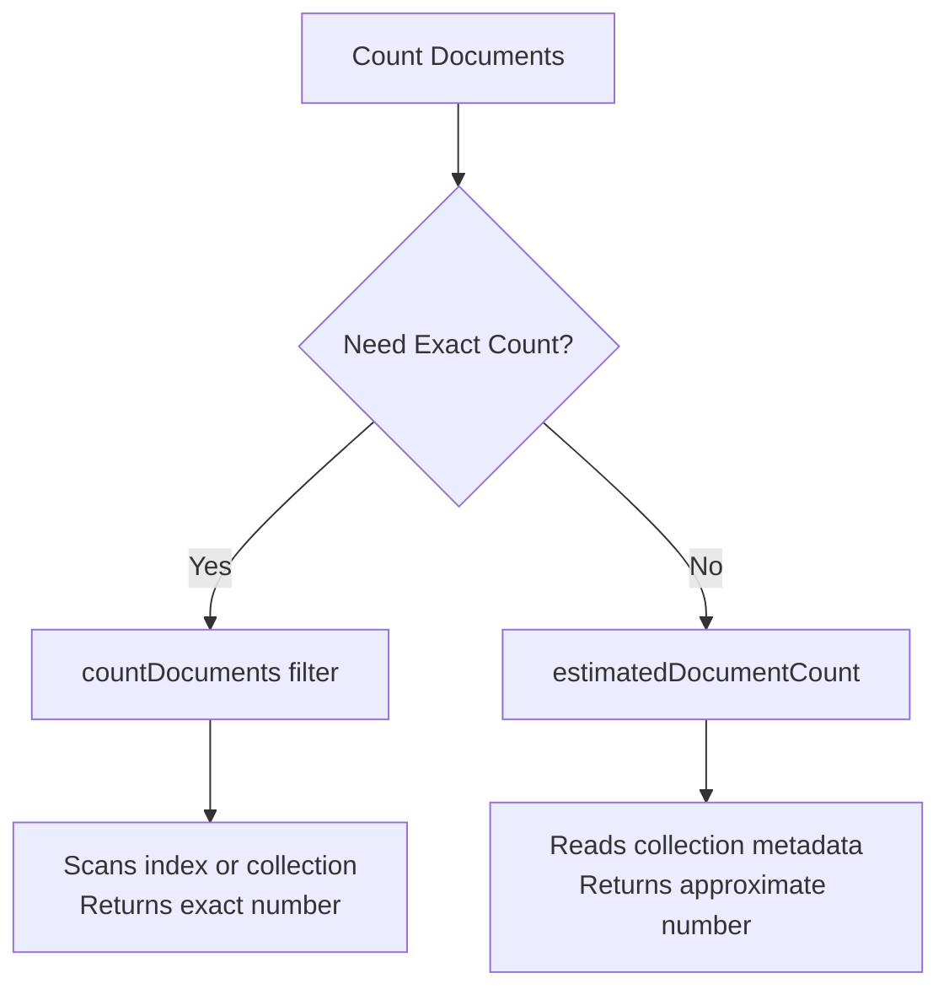
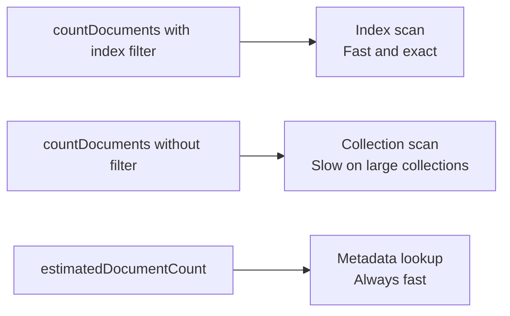

# How to Count Documents in MongoDB with countDocuments()

Author: [nawazdhandala](https://www.github.com/nawazdhandala)

Tags: MongoDB, countDocuments, estimatedDocumentCount, Query, Collection

Description: Learn how to count documents in MongoDB using countDocuments() for accurate filtered counts and estimatedDocumentCount() for fast approximate totals.

---

## Overview

MongoDB provides two primary methods for counting documents in a collection:

- `countDocuments()` - returns an exact count matching a filter, using a collection scan or index scan
- `estimatedDocumentCount()` - returns a fast approximate count of all documents using collection metadata



## countDocuments()

### Syntax

```javascript
db.collection.countDocuments(filter, options)
```

- `filter` - a query filter document (optional, defaults to `{}` which counts all documents)
- `options` - optional settings such as `limit`, `skip`, `hint`, `maxTimeMS`

### Count All Documents

```javascript
db.orders.countDocuments({})
```

Returns the total number of documents in `orders`.

### Count Documents Matching a Filter

```javascript
db.orders.countDocuments({ status: "shipped" })
```

Returns the number of orders with `status` equal to `"shipped"`.

### Count with Multiple Conditions

```javascript
db.orders.countDocuments({
  status: "shipped",
  totalAmount: { $gt: 100 }
})
```

Returns orders that are shipped and have a `totalAmount` greater than 100.

### Count with Limit and Skip

```javascript
db.orders.countDocuments(
  { status: "pending" },
  { limit: 1000, skip: 0 }
)
```

The `limit` option caps how many documents are scanned, which can improve performance when you only need to know if at least N documents match.

### Count with a Hint

```javascript
db.orders.countDocuments(
  { status: "shipped" },
  { hint: { status: 1 } }
)
```

Forces the query planner to use the `status` index.

## estimatedDocumentCount()

### Syntax

```javascript
db.collection.estimatedDocumentCount(options)
```

This method does not accept a filter. It uses collection metadata (stored statistics) to return an approximate count very quickly.

```javascript
db.orders.estimatedDocumentCount()
```

### When to Use estimatedDocumentCount()

Use `estimatedDocumentCount()` when:

- You need a fast count of all documents without a filter
- An approximate count is acceptable (counts may be slightly inaccurate after an unclean shutdown)
- You are displaying a rough document count in a dashboard or status page

### Comparison Table

| Feature | countDocuments() | estimatedDocumentCount() |
|---|---|---|
| Accepts filter | Yes | No |
| Accuracy | Exact | Approximate |
| Performance | Slower (scan) | Very fast (metadata) |
| Index usage | Yes | No |
| Use after unclean shutdown | Always accurate | May be stale |

## Example: Combining with Aggregation

For complex counting scenarios (group counts, conditional counts), use the aggregation pipeline instead:

```javascript
// Count orders by status
db.orders.aggregate([
  {
    $group: {
      _id: "$status",
      count: { $sum: 1 }
    }
  }
])
```

Output:

```javascript
[
  { _id: "shipped",   count: 412 },
  { _id: "pending",   count: 87  },
  { _id: "cancelled", count: 33  }
]
```

## Example: Pagination Total Count

A common pattern is to return both the paginated results and the total count in one aggregation:

```javascript
db.orders.aggregate([
  { $match: { status: "shipped" } },
  {
    $facet: {
      metadata: [{ $count: "total" }],
      data: [
        { $sort: { createdAt: -1 } },
        { $skip: 0 },
        { $limit: 20 }
      ]
    }
  }
])
```

Output:

```javascript
[
  {
    metadata: [{ total: 412 }],
    data: [ /* 20 documents */ ]
  }
]
```

## Performance Notes

- `countDocuments({})` on a large collection without a filter performs a full collection scan. Prefer `estimatedDocumentCount()` for full-collection counts.
- Adding a filter that matches a selective index makes `countDocuments()` fast because MongoDB uses a covered index scan rather than fetching documents.
- Avoid `count()` (deprecated) in modern MongoDB drivers. Use `countDocuments()` or `estimatedDocumentCount()` instead.



## Summary

Use `countDocuments(filter)` when you need an exact count of documents matching specific criteria. Use `estimatedDocumentCount()` when you need a quick total count of all documents and precision is not critical. For grouped or conditional counts, use the aggregation pipeline with `$count` or `$group`. Avoid the deprecated `count()` method in new code.
