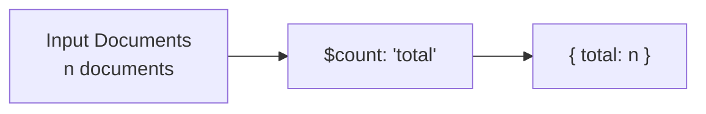

# How to Use $count Stage in MongoDB Aggregation

Author: [nawazdhandala](https://www.github.com/nawazdhandala)

Tags: MongoDB, Aggregation, $count, Pipeline, Stage

Description: Learn how to use the $count stage in MongoDB aggregation to count the number of documents passing through the pipeline.

---

## How $count Works

The `$count` stage returns a single document with one field whose value equals the number of documents that entered the stage. It is the most concise way to count pipeline documents and is equivalent to using `$group` with `$sum: 1` followed by `$project`, but more readable.



## Syntax

```javascript
{ $count: "<outputFieldName>" }
```

The output field name must be a non-empty string and cannot contain a dot (`.`) or start with a dollar sign (`$`).

## Examples

### Input Documents

```javascript
[
  { _id: 1, status: "active",   score: 85 },
  { _id: 2, status: "inactive", score: 60 },
  { _id: 3, status: "active",   score: 92 },
  { _id: 4, status: "active",   score: 78 },
  { _id: 5, status: "inactive", score: 45 }
]
```

### Example 1 - Count All Documents

Count all documents in the collection:

```javascript
db.users.aggregate([
  { $count: "totalUsers" }
])
```

Output:

```javascript
[
  { totalUsers: 5 }
]
```

### Example 2 - Count After $match

Count only active users:

```javascript
db.users.aggregate([
  { $match: { status: "active" } },
  { $count: "activeUsers" }
])
```

Output:

```javascript
[
  { activeUsers: 3 }
]
```

### Example 3 - Count After Multiple Stages

Count users with `active` status and a score above 80:

```javascript
db.users.aggregate([
  { $match: { status: "active" } },
  { $match: { score: { $gt: 80 } } },
  { $count: "highScoringActiveUsers" }
])
```

Output:

```javascript
[
  { highScoringActiveUsers: 2 }
]
```

### Example 4 - $count vs $group for Counting

The `$count` stage is shorthand for this `$group` + `$project` pattern:

```javascript
// Using $count
db.users.aggregate([
  { $match: { status: "active" } },
  { $count: "activeUsers" }
])

// Equivalent using $group
db.users.aggregate([
  { $match: { status: "active" } },
  { $group: { _id: null, activeUsers: { $sum: 1 } } },
  { $project: { _id: 0, activeUsers: 1 } }
])
```

Both produce `[{ activeUsers: 3 }]`.

### Example 5 - Count Inside $facet

Use `$count` within `$facet` to return both paginated results and the total count in one query:

```javascript
db.users.aggregate([
  { $match: { status: "active" } },
  {
    $facet: {
      count: [{ $count: "total" }],
      data: [
        { $sort: { score: -1 } },
        { $skip: 0 },
        { $limit: 2 }
      ]
    }
  }
])
```

Output:

```javascript
[
  {
    count: [{ total: 3 }],
    data: [
      { _id: 3, status: "active", score: 92 },
      { _id: 1, status: "active", score: 85 }
    ]
  }
]
```

### Example 6 - Counting After $lookup

Count how many orders are associated with a customer:

```javascript
db.customers.aggregate([
  {
    $lookup: {
      from: "orders",
      localField: "_id",
      foreignField: "customerId",
      as: "orders"
    }
  },
  { $unwind: "$orders" },
  { $count: "totalOrdersAcrossAllCustomers" }
])
```

## $count vs countDocuments()

| Method | Use Case |
|---|---|
| `$count` stage | Within an aggregation pipeline after filtering/joining stages |
| `db.collection.countDocuments()` | Simple filtered count without a full pipeline |
| `db.collection.estimatedDocumentCount()` | Fast approximate count of the entire collection |

Use `$count` when counting is one step in a larger aggregation. Use `countDocuments()` for standalone count queries.

## Use Cases

- Returning paginated data with total record counts
- Validating how many documents match a complex filter
- Counting within multi-faceted query results
- Auditing pipeline stages during development

## Summary

The `$count` stage outputs a single document with the count of documents that reached that stage. It is the cleanest way to count pipeline results and is especially useful inside `$facet` for pagination, or at the end of a filtered pipeline to verify record counts. For simple counts without a full pipeline, `countDocuments()` is often more direct.
