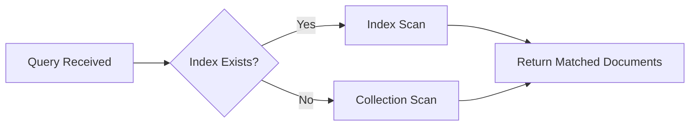

# How to Create an Index in MongoDB with createIndex()

Author: [nawazdhandala](https://www.github.com/nawazdhandala)

Tags: MongoDB, Index, Performance, Query Optimization

Description: Learn how to use createIndex() in MongoDB to create indexes that speed up queries, reduce scan overhead, and improve overall database performance.

---

## How createIndex() Works

MongoDB uses indexes to avoid full collection scans. Without an index, MongoDB reads every document to satisfy a query. An index stores a small, ordered representation of one or more fields so the query planner can jump directly to matching documents.

The `createIndex()` method accepts a key specification and an optional options document. It is idempotent: calling it when an identical index already exists is a no-op.



## Syntax

The basic signature is:

```javascript
db.collection.createIndex(keys, options)
```

- `keys` - an object whose keys are field names and whose values are `1` (ascending) or `-1` (descending).
- `options` - an optional object with index properties such as `name`, `unique`, `sparse`, `background`, `expireAfterSeconds`, and others.

## Examples

### Single-Field Ascending Index

Creating an index on the `email` field of a `users` collection speeds up lookups by email.

```javascript
db.users.createIndex({ email: 1 })
```

### Single-Field Descending Index

A descending index is useful when queries sort by a field in descending order.

```javascript
db.orders.createIndex({ createdAt: -1 })
```

### Named Index

Giving an index an explicit name makes it easier to reference in `dropIndex()` or monitoring tools.

```javascript
db.products.createIndex(
  { sku: 1 },
  { name: "idx_sku_asc" }
)
```

### Unique Index

A unique index prevents duplicate values in the indexed field.

```javascript
db.users.createIndex(
  { username: 1 },
  { unique: true }
)
```

### Checking Whether the Index Was Created

After running `createIndex()`, verify the result with `getIndexes()`.

```javascript
db.users.getIndexes()
```

Expected output includes the new index alongside the default `_id` index:

```text
[
  { "v": 2, "key": { "_id": 1 }, "name": "_id_" },
  { "v": 2, "key": { "email": 1 }, "name": "email_1" }
]
```

### Full Working Example with Node.js Driver

The following script connects to a local MongoDB instance and creates an index programmatically.

```javascript
const { MongoClient } = require("mongodb");

async function main() {
  const client = new MongoClient("mongodb://localhost:27017");
  await client.connect();

  const db = client.db("shop");
  const collection = db.collection("products");

  // Create an ascending index on the "category" field
  const result = await collection.createIndex({ category: 1 });
  console.log("Index created:", result); // "category_1"

  // Create a unique index on "sku"
  await collection.createIndex({ sku: 1 }, { unique: true, name: "idx_sku" });

  const indexes = await collection.indexes();
  console.log("All indexes:", JSON.stringify(indexes, null, 2));

  await client.close();
}

main().catch(console.error);
```

## Background Index Builds

In MongoDB 4.2 and later, all index builds are performed as rolling background operations by default. In earlier versions you could pass `{ background: true }` to avoid blocking the collection.

```javascript
// MongoDB < 4.2 only - no longer needed in 4.2+
db.orders.createIndex({ status: 1 }, { background: true })
```

## Best Practices

- **Index fields used in query filters, sorts, and joins.** Every index you create consumes memory (RAM) and slows writes, so only index what you actually query.
- **Prefer compound indexes over multiple single-field indexes.** A single compound index can serve many query shapes.
- **Use `explain()` to verify the index is used.** Run `db.collection.find(query).explain("executionStats")` and check that `IXSCAN` appears in the winning plan.
- **Name your indexes.** Default names like `email_1_status_-1` can get long. A short, descriptive name simplifies monitoring and `dropIndex()` calls.
- **Avoid over-indexing.** Each index increases write latency and memory usage. Audit unused indexes regularly with `$indexStats`.
- **Monitor index builds on large collections.** On collections with millions of documents, index builds can take minutes. Use the `currentOp()` command to watch progress.

## Summary

`createIndex()` is the primary way to create indexes in MongoDB. You pass a key specification indicating which fields to index and in what direction, plus an optional options object for properties like uniqueness or a custom name. Indexes dramatically reduce query execution time by replacing full collection scans with targeted index scans. Always verify that a new index is being used with `explain()` and audit your index set periodically to remove unused ones.
