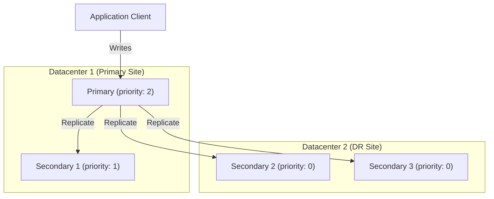

# How to Set Up Cross-Datacenter Replication in MongoDB

Author: [OneUptime](https://www.github.com/oneuptime)

Tags: MongoDB, Replication, Replica Set, Datacenter, High Availability

Description: Learn how to configure MongoDB replica sets across multiple datacenters using priority and hidden members, election settings, and write concerns for geo-redundancy.

---

## Introduction

Cross-datacenter replication in MongoDB ensures that your data is available even if an entire datacenter goes offline. MongoDB replica sets support multi-datacenter deployments natively by letting you assign members to different physical sites. With the right configuration of priorities, write concerns, and election settings, you can achieve geographic redundancy while controlling which datacenter acts as primary.

## Architecture Overview



## Step 1: Plan Your Replica Set Topology

For a two-datacenter setup you typically need at least three members so that elections can complete even if one site goes down. A common pattern is:

- DC1: 2 voting members (1 primary, 1 secondary)
- DC2: 1 voting member or 2 non-voting members + 1 arbiter in DC1

For a three-datacenter setup use one member per site plus an arbiter or a third full member.

## Step 2: Start mongod on Each Node

On every node, use the same `replSetName` and ensure all hosts can reach each other on port 27017 (or your chosen port).

```yaml
# /etc/mongod.conf (same on all nodes)
net:
  port: 27017
  bindIp: 0.0.0.0

replication:
  replSetName: "rs-geo"

security:
  keyFile: /etc/mongodb/keyfile
```

Restart mongod after editing the config:

```bash
sudo systemctl restart mongod
```

## Step 3: Initiate the Replica Set with Site-Aware Configuration

Connect to the primary node and initiate with member-level priorities and tags.

```javascript
rs.initiate({
  _id: "rs-geo",
  members: [
    {
      _id: 0,
      host: "dc1-node1.example.com:27017",
      priority: 2,
      tags: { dc: "dc1", rack: "rack1" }
    },
    {
      _id: 1,
      host: "dc1-node2.example.com:27017",
      priority: 1,
      tags: { dc: "dc1", rack: "rack2" }
    },
    {
      _id: 2,
      host: "dc2-node1.example.com:27017",
      priority: 0,
      tags: { dc: "dc2", rack: "rack1" }
    },
    {
      _id: 3,
      host: "dc2-node2.example.com:27017",
      priority: 0,
      tags: { dc: "dc2", rack: "rack2" }
    }
  ]
})
```

Setting `priority: 0` on DC2 members prevents them from ever becoming primary, keeping writes local to DC1 during normal operations.

## Step 4: Configure Write Concern for Cross-Datacenter Durability

Use a custom write concern that requires acknowledgment from at least one member in each datacenter before considering a write durable.

```javascript
// Add a custom write concern that requires one ack per datacenter
db.adminCommand({
  setDefaultRWConcern: 1,
  defaultWriteConcern: {
    w: { dc1: 1, dc2: 1 },
    wtimeout: 5000
  }
})
```

You must define a tag set rule in the replica set config first:

```javascript
cfg = rs.conf()
cfg.settings = {
  getLastErrorModes: {
    multiDC: { dc1: 1, dc2: 1 }
  }
}
rs.reconfig(cfg)
```

Now use the named write concern on critical writes:

```javascript
db.orders.insertOne(
  { orderId: "ORD-1001", amount: 250 },
  { writeConcern: { w: "multiDC", wtimeout: 5000 } }
)
```

## Step 5: Configure Election Timeouts for WAN Latency

WAN links add latency. Increase `heartbeatTimeoutSecs` to avoid spurious elections:

```javascript
cfg = rs.conf()
cfg.settings.heartbeatTimeoutSecs = 20
cfg.settings.electionTimeoutMillis = 15000
rs.reconfig(cfg)
```

## Step 6: Verify Replication Across Datacenters

Check that all members are replicating and note the optime lag:

```javascript
rs.status().members.forEach(m => {
  printjson({
    name: m.name,
    state: m.stateStr,
    health: m.health,
    optimeDate: m.optimeDate,
    lastHeartbeatMessage: m.lastHeartbeatMessage
  })
})
```

Check replication lag explicitly:

```javascript
var status = rs.status()
var primary = status.members.find(m => m.stateStr === "PRIMARY")
status.members.filter(m => m.stateStr === "SECONDARY").forEach(s => {
  var lagSec = (primary.optimeDate - s.optimeDate) / 1000
  print(s.name + " lag: " + lagSec + "s")
})
```

## Step 7: Read from the Nearest Datacenter

Configure your driver to read from the nearest member to reduce read latency:

```javascript
// Node.js driver example
const { MongoClient } = require("mongodb")
const client = new MongoClient("mongodb://dc1-node1:27017,dc2-node1:27017/?replicaSet=rs-geo", {
  readPreference: "nearest",
  readPreferenceTags: [{ dc: "dc1" }, {}]
})
```

The fallback `{}` ensures reads go anywhere if DC1 members are unavailable.

## Step 8: Simulate a Datacenter Failure

Test your failover by shutting down DC1 members:

```bash
# On dc1-node1 and dc1-node2
sudo systemctl stop mongod
```

Since DC2 members have `priority: 0` they cannot elect a new primary on their own. For intentional DR failover, reconfigure from a surviving node:

```javascript
// Connect to dc2-node1 in a direct connection
cfg = rs.conf()
cfg.members.find(m => m.host.startsWith("dc2-node1")).priority = 2
rs.reconfig(cfg, { force: true })
```

## Monitoring Cross-Datacenter Replication

```javascript
// Check oplog window (how much history is retained)
use local
db.oplog.rs.find().sort({ $natural: 1 }).limit(1)
db.oplog.rs.find().sort({ $natural: -1 }).limit(1)

// Check replication info
db.getReplicationInfo()
db.printSecondaryReplicationInfo()
```

## Summary

Cross-datacenter MongoDB replication requires careful planning of member priorities, write concern tag sets, and election timeouts. Assign higher priorities to members in your primary datacenter, use named write concerns requiring acknowledgment from both sites for critical data, and tune heartbeat timeouts to accommodate WAN latency. Always test failover procedures before relying on them in production.
