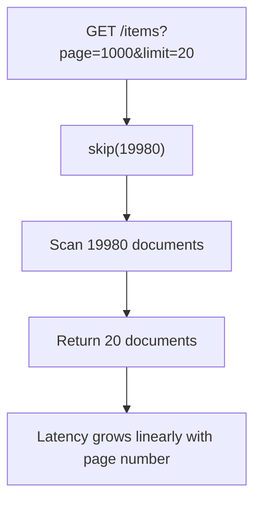

# How to Implement Pagination with Cursors in MongoDB

Author: [nawazdhandala](https://www.github.com/nawazdhandala)

Tags: MongoDB, Pagination, Cursor, Performance, API

Description: Learn how to implement keyset cursor pagination in MongoDB to replace slow skip-based pagination and keep list APIs fast at any page depth.

---

## Why Offset Pagination Breaks at Scale

Offset-based pagination uses `skip()` to jump to a page. MongoDB must scan and discard every document before the skip offset, which gets slower as the page number grows.



Cursor pagination avoids `skip()` entirely. It instead uses the last seen value as a boundary for the next query.

## How Cursor Pagination Works


## Setting Up the Index

The cursor field must be indexed. For a created-at timeline with stable ordering use a compound index on `(createdAt, _id)` because timestamps can collide.

```javascript
// Unique enough for most workloads: timestamp + ObjectId tiebreaker
db.posts.createIndex({ createdAt: -1, _id: -1 });
```

## First-Page Query

```javascript
const { MongoClient, ObjectId } = require("mongodb");

const PAGE_SIZE = 20;

async function getFirstPage(db) {
  const items = await db.collection("posts")
    .find({})
    .sort({ createdAt: -1, _id: -1 })
    .limit(PAGE_SIZE)
    .toArray();

  if (items.length === 0) {
    return { items: [], nextCursor: null };
  }

  const last = items[items.length - 1];
  const nextCursor = encodeCursor({ createdAt: last.createdAt, _id: last._id });

  return { items, nextCursor };
}
```

## Subsequent Pages Using a Cursor

```javascript
function encodeCursor(payload) {
  return Buffer.from(JSON.stringify(payload)).toString("base64url");
}

function decodeCursor(cursor) {
  const payload = JSON.parse(Buffer.from(cursor, "base64url").toString("utf8"));
  return {
    createdAt: new Date(payload.createdAt),
    _id: new ObjectId(payload._id)
  };
}

async function getNextPage(db, cursorToken) {
  const { createdAt, _id } = decodeCursor(cursorToken);

  const items = await db.collection("posts")
    .find({
      $or: [
        { createdAt: { $lt: createdAt } },
        { createdAt: createdAt, _id: { $lt: _id } }
      ]
    })
    .sort({ createdAt: -1, _id: -1 })
    .limit(PAGE_SIZE)
    .toArray();

  if (items.length === 0) {
    return { items: [], nextCursor: null };
  }

  const last = items[items.length - 1];
  const nextCursor = encodeCursor({ createdAt: last.createdAt, _id: last._id });

  return { items, nextCursor: items.length === PAGE_SIZE ? nextCursor : null };
}
```

## Full Pagination API Example

```javascript
const express = require("express");
const app = express();

app.get("/api/posts", async (req, res) => {
  const { cursor } = req.query;
  let result;

  if (!cursor) {
    result = await getFirstPage(db);
  } else {
    result = await getNextPage(db, cursor);
  }

  res.json(result);
});

// Response shape
// {
//   "items": [...],
//   "nextCursor": "eyJjcmVhdGVkQXQiOiIyMDI2LTAzLTMxVC4uLiIsIl9pZCI6Ii4uLiJ9"
// }
```

## Cursor Pagination with Filters

When combining cursor pagination with search filters, include the filter in both the first-page query and all subsequent queries.

```javascript
async function getPaginatedByCategory(db, category, cursorToken) {
  const baseFilter = { category, status: "published" };

  if (!cursorToken) {
    const items = await db.collection("posts")
      .find(baseFilter)
      .sort({ createdAt: -1, _id: -1 })
      .limit(PAGE_SIZE)
      .toArray();

    const last = items[items.length - 1];
    return {
      items,
      nextCursor: last ? encodeCursor({ createdAt: last.createdAt, _id: last._id }) : null
    };
  }

  const { createdAt, _id } = decodeCursor(cursorToken);

  const items = await db.collection("posts")
    .find({
      ...baseFilter,
      $or: [
        { createdAt: { $lt: createdAt } },
        { createdAt, _id: { $lt: _id } }
      ]
    })
    .sort({ createdAt: -1, _id: -1 })
    .limit(PAGE_SIZE)
    .toArray();

  const last = items[items.length - 1];
  return {
    items,
    nextCursor: items.length === PAGE_SIZE && last
      ? encodeCursor({ createdAt: last.createdAt, _id: last._id })
      : null
  };
}

// Index to support the filtered cursor query
db.posts.createIndex({ category: 1, status: 1, createdAt: -1, _id: -1 });
```

## Previous Page (Bidirectional Cursors)

Bidirectional pagination requires a `prevCursor` pointing to the first document of the current page.

```javascript
async function getPage(db, afterCursor, beforeCursor) {
  let query = {};
  let sortDir = -1;

  if (afterCursor) {
    const { createdAt, _id } = decodeCursor(afterCursor);
    query = {
      $or: [
        { createdAt: { $lt: createdAt } },
        { createdAt, _id: { $lt: _id } }
      ]
    };
    sortDir = -1;
  } else if (beforeCursor) {
    const { createdAt, _id } = decodeCursor(beforeCursor);
    query = {
      $or: [
        { createdAt: { $gt: createdAt } },
        { createdAt, _id: { $gt: _id } }
      ]
    };
    sortDir = 1;
  }

  let items = await db.collection("posts")
    .find(query)
    .sort({ createdAt: sortDir, _id: sortDir })
    .limit(PAGE_SIZE + 1)
    .toArray();

  const hasMore = items.length > PAGE_SIZE;
  if (hasMore) items = items.slice(0, PAGE_SIZE);
  if (beforeCursor) items.reverse();

  const first = items[0];
  const last = items[items.length - 1];

  return {
    items,
    prevCursor: first ? encodeCursor({ createdAt: first.createdAt, _id: first._id }) : null,
    nextCursor: last && hasMore ? encodeCursor({ createdAt: last.createdAt, _id: last._id }) : null
  };
}
```

## Offset vs Cursor Pagination Comparison

| Attribute | Offset (`skip`) | Cursor (keyset) |
|---|---|---|
| Performance at deep pages | O(n) scan | O(log n) index seek |
| Consistent results under writes | No - inserts shift pages | Yes - anchored to last seen value |
| Random page jump | Yes | No - sequential only |
| Implementation complexity | Low | Medium |
| Suitable for infinite scroll | No | Yes |

## Summary

Cursor pagination in MongoDB replaces `skip()` with a `$gt`/`$lt` boundary on the last seen document's sort fields. A compound index on `(createdAt, _id)` keeps each page fetch an O(log n) index seek regardless of depth. Encoding the cursor as a Base64 opaque token keeps the API clean, and including the same filters in every query ensures consistent results when data changes between requests.
