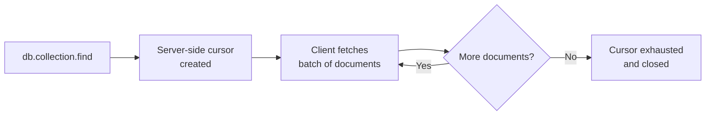
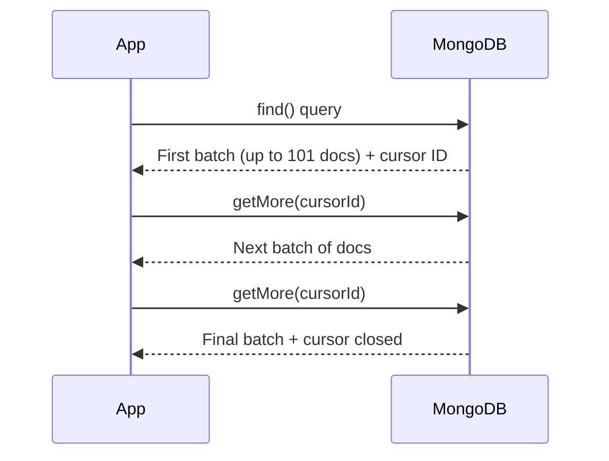

# How to Use Cursors in MongoDB to Iterate Over Large Result Sets

Author: [nawazdhandala](https://www.github.com/nawazdhandala)

Tags: MongoDB, Cursor, Query, Iterator, Performance

Description: Learn how MongoDB cursors work, how to iterate over large result sets efficiently, and how to use cursor methods like forEach, toArray, hasNext, and next.

---

## Overview

When you run a `find()` query in MongoDB, it does not immediately return all matching documents. Instead, it returns a cursor - a pointer to the result set stored on the server. The cursor allows you to fetch documents in batches, which is essential for handling large result sets without exhausting memory.



## How Cursors Work

MongoDB returns documents from a cursor in batches. The default initial batch size is 101 documents (or 1 MB, whichever is smaller). Subsequent `getMore` requests fetch additional batches.



## Basic Cursor Usage in mongosh

### Opening a Cursor

```javascript
const cursor = db.orders.find({ status: "pending" })
```

The cursor is lazy - the query executes when you begin iterating.

### Iterating with hasNext() and next()

```javascript
const cursor = db.orders.find({ status: "pending" })

while (cursor.hasNext()) {
  const doc = cursor.next()
  printjson(doc)
}
```

- `hasNext()` returns `true` if more documents are available
- `next()` retrieves the next document

### Iterating with forEach()

```javascript
db.orders.find({ status: "pending" }).forEach(function(doc) {
  printjson(doc)
})
```

`forEach()` iterates through all documents in the cursor without loading them all into memory at once.

### Converting to Array

```javascript
const results = db.orders.find({ status: "pending" }).toArray()
```

`toArray()` loads all cursor results into an in-memory array. Use only when the result set is small enough to fit in memory.

## Cursor Methods

### limit()

Cap the number of documents returned:

```javascript
db.orders.find({}).limit(100)
```

### skip()

Skip a number of documents (used for pagination):

```javascript
db.orders.find({}).skip(20).limit(10)
```

### sort()

Sort the cursor results:

```javascript
db.orders.find({}).sort({ createdAt: -1 })
```

### Chaining Methods

```javascript
db.orders
  .find({ status: "shipped" })
  .sort({ createdAt: -1 })
  .skip(0)
  .limit(25)
```

### batchSize()

Control how many documents are fetched per `getMore` request:

```javascript
db.orders.find({}).batchSize(500)
```

Increasing batch size reduces round-trips but increases memory usage per batch.

## Cursor Timeout

By default, a server-side cursor times out after 10 minutes of inactivity (controlled by `cursorTimeoutMillis`). If your application processes documents slowly, use `noCursorTimeout()`:

```javascript
const cursor = db.orders.find({}).noCursorTimeout()

// Always close manually when done
cursor.close()
```

Only use `noCursorTimeout()` when necessary and always close the cursor explicitly.

## Processing Large Collections Efficiently

For large collections, avoid `toArray()` and instead iterate with `forEach()` or `hasNext()`/`next()`:

```javascript
// Process 10 million documents without memory issues
db.events.find({}).forEach(function(doc) {
  // process one document at a time
  processEvent(doc)
})
```

### Using Projection to Reduce Data Transfer

Combine cursors with projection to fetch only the fields you need:

```javascript
db.orders.find(
  { status: "pending" },
  { _id: 1, customerId: 1, totalAmount: 1 }
)
```

## Cursor in Node.js Driver

```javascript
const { MongoClient } = require("mongodb")

async function processOrders(client) {
  const collection = client.db("shop").collection("orders")
  const cursor = collection.find({ status: "pending" })

  for await (const doc of cursor) {
    console.log(doc._id, doc.totalAmount)
  }
}
```

The `for await...of` loop uses the async iteration protocol, fetching batches automatically.

## Cursor Explain

To understand how a cursor executes, use `explain()`:

```javascript
db.orders.find({ status: "pending" }).explain("executionStats")
```

This shows whether an index was used and how many documents were scanned.

## Summary

A MongoDB cursor is a server-side pointer to a query result set that returns documents in batches. Use `forEach()` or `hasNext()`/`next()` to iterate large result sets without loading everything into memory. Use `toArray()` only for small result sets. Combine cursors with `limit()`, `skip()`, `sort()`, and projection to control what data is fetched. Always close long-running cursors explicitly when using `noCursorTimeout()`.
