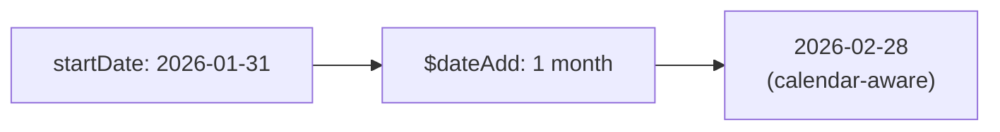

# How to Use $dateAdd and $dateSubtract in MongoDB

Author: [nawazdhandala](https://www.github.com/nawazdhandala)

Tags: MongoDB, Aggregation, $dateAdd, $dateSubtract, Pipeline, Date

Description: Learn how to use $dateAdd and $dateSubtract in MongoDB aggregation to perform arithmetic on date fields by adding or subtracting time units.

---

## How $dateAdd and $dateSubtract Work

`$dateAdd` (MongoDB 5.0+) adds a specified amount of time to a date value. `$dateSubtract` (MongoDB 5.0+) subtracts a specified amount of time. Both support calendar-aware units like `month` and `year` that respect varying month lengths and leap years.



## Syntax

### $dateAdd

```javascript
{
  $dateAdd: {
    startDate: <date expression>,
    unit: <string>,      // "year", "quarter", "month", "week", "day", "hour", "minute", "second", "millisecond"
    amount: <number>,
    timezone: <timezone> // optional
  }
}
```

### $dateSubtract

```javascript
{
  $dateSubtract: {
    startDate: <date expression>,
    unit: <string>,
    amount: <number>,
    timezone: <timezone> // optional
  }
}
```

## Examples

### Input Documents

```javascript
[
  { _id: 1, name: "Subscription A", startDate: ISODate("2026-01-31T00:00:00Z"), durationMonths: 3 },
  { _id: 2, name: "Subscription B", startDate: ISODate("2026-03-15T10:00:00Z"), durationMonths: 6 },
  { _id: 3, name: "Event",          startDate: ISODate("2026-03-31T14:30:00Z")                    }
]
```

### Example 1 - Add a Fixed Number of Days

Add 30 days to each `startDate`:

```javascript
db.subscriptions.aggregate([
  {
    $project: {
      name: 1,
      startDate: 1,
      reminderDate: {
        $dateAdd: {
          startDate: "$startDate",
          unit: "day",
          amount: 30
        }
      }
    }
  }
])
```

Output:

```javascript
[
  { _id: 1, name: "Subscription A", startDate: ISODate("2026-01-31"), reminderDate: ISODate("2026-03-02") },
  { _id: 2, name: "Subscription B", startDate: ISODate("2026-03-15"), reminderDate: ISODate("2026-04-14") },
  { _id: 3, name: "Event",          startDate: ISODate("2026-03-31"), reminderDate: ISODate("2026-04-30") }
]
```

### Example 2 - Add Months from a Field

Calculate the subscription end date using the `durationMonths` field as the amount:

```javascript
db.subscriptions.aggregate([
  {
    $project: {
      name: 1,
      startDate: 1,
      endDate: {
        $dateAdd: {
          startDate: "$startDate",
          unit: "month",
          amount: "$durationMonths"
        }
      }
    }
  }
])
```

Output:

```javascript
[
  { _id: 1, name: "Subscription A", startDate: ISODate("2026-01-31"), endDate: ISODate("2026-04-30") },
  { _id: 2, name: "Subscription B", startDate: ISODate("2026-03-15"), endDate: ISODate("2026-09-15") }
]
```

Note: Adding 3 months to `2026-01-31` produces `2026-04-30` (end of April), not April 31 which doesn't exist.

### Example 3 - $dateSubtract: Subtract Hours

Subtract 5 hours from each timestamp (e.g., convert UTC to US/Eastern):

```javascript
db.events.aggregate([
  {
    $project: {
      name: 1,
      utcTime: "$startDate",
      easternTime: {
        $dateSubtract: {
          startDate: "$startDate",
          unit: "hour",
          amount: 5
        }
      }
    }
  }
])
```

### Example 4 - $dateSubtract: Subtract a Week

Find what date was 1 week before each start date:

```javascript
db.subscriptions.aggregate([
  {
    $project: {
      name: 1,
      trialStart: {
        $dateSubtract: {
          startDate: "$startDate",
          unit: "week",
          amount: 1
        }
      }
    }
  }
])
```

### Example 5 - Filter Documents Within a Date Range

Find all events starting within the next 7 days from a reference date:

```javascript
const today = new Date("2026-03-31T00:00:00Z");

db.events.aggregate([
  {
    $match: {
      $expr: {
        $and: [
          { $gte: ["$startDate", today] },
          {
            $lte: [
              "$startDate",
              {
                $dateAdd: {
                  startDate: today,
                  unit: "day",
                  amount: 7
                }
              }
            ]
          }
        ]
      }
    }
  }
])
```

### Example 6 - Chaining Date Operations

Add 1 month then subtract 1 day (last day of the month pattern):

```javascript
db.subscriptions.aggregate([
  {
    $project: {
      name: 1,
      monthEnd: {
        $dateSubtract: {
          startDate: {
            $dateAdd: {
              startDate: "$startDate",
              unit: "month",
              amount: 1
            }
          },
          unit: "day",
          amount: 1
        }
      }
    }
  }
])
```

### Example 7 - Add Time with Timezone

Add 1 day respecting a timezone (handles DST transitions correctly):

```javascript
db.events.aggregate([
  {
    $project: {
      nextDay: {
        $dateAdd: {
          startDate: "$startDate",
          unit: "day",
          amount: 1,
          timezone: "America/New_York"
        }
      }
    }
  }
])
```

## Supported Units

| Unit | Description |
|---|---|
| `millisecond` | 1/1000 of a second |
| `second` | 1 second |
| `minute` | 60 seconds |
| `hour` | 60 minutes |
| `day` | 24 hours (or calendar day in a timezone) |
| `week` | 7 days |
| `month` | Calendar month (variable length) |
| `quarter` | 3 calendar months |
| `year` | Calendar year |

## Use Cases

- Calculating subscription or trial end dates from a start date and duration
- Computing due dates, deadlines, or reminder dates
- Date range filters relative to "today"
- Generating date series for time-based analytics

## Summary

`$dateAdd` and `$dateSubtract` perform calendar-aware date arithmetic in MongoDB aggregation pipelines. They support units from milliseconds to years and handle month-end edge cases correctly. The `amount` parameter can be a field reference for variable durations. Use the `timezone` parameter when calendar-day arithmetic must respect DST transitions.
