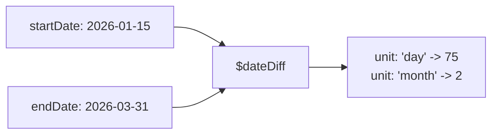

# How to Use $dateDiff in MongoDB Aggregation

Author: [nawazdhandala](https://www.github.com/nawazdhandala)

Tags: MongoDB, Aggregation, $dateDiff, Pipeline, Date

Description: Learn how to use $dateDiff in MongoDB aggregation to calculate the difference between two dates in a specified time unit.

---

## How $dateDiff Works

`$dateDiff` (MongoDB 5.0+) calculates the difference between two dates in a specified unit (days, months, years, etc.). It returns a signed integer - positive if `endDate` is after `startDate`, negative if before.

Unlike simple millisecond subtraction, `$dateDiff` respects calendar units. For example, the difference in months between January 31 and February 28 is 1 month, not 0.



## Syntax

```javascript
{
  $dateDiff: {
    startDate: <date expression>,
    endDate:   <date expression>,
    unit:      <string>,           // "year", "quarter", "month", "week", "day", "hour", "minute", "second", "millisecond"
    timezone:  <timezone>,         // optional
    startOfWeek: <string>          // optional: "monday" | "sunday" (for week unit)
  }
}
```

## Examples

### Input Documents

```javascript
[
  { _id: 1, name: "Alice",   joinDate: ISODate("2024-03-01"), lastLogin: ISODate("2026-03-31") },
  { _id: 2, name: "Bob",     joinDate: ISODate("2025-11-15"), lastLogin: ISODate("2026-03-20") },
  { _id: 3, name: "Carol",   joinDate: ISODate("2026-01-10"), lastLogin: ISODate("2026-03-31") },
  { _id: 4, name: "Project", startDate: ISODate("2026-01-05"), endDate: ISODate("2026-03-31") }
]
```

### Example 1 - Days Between Two Dates

Calculate how many days since each user joined:

```javascript
db.users.aggregate([
  {
    $project: {
      name: 1,
      daysSinceJoin: {
        $dateDiff: {
          startDate: "$joinDate",
          endDate: ISODate("2026-03-31"),
          unit: "day"
        }
      }
    }
  }
])
```

Output:

```javascript
[
  { _id: 1, name: "Alice", daysSinceJoin: 760 },
  { _id: 2, name: "Bob",   daysSinceJoin: 136 },
  { _id: 3, name: "Carol", daysSinceJoin: 80  }
]
```

### Example 2 - Months Between Dates

Calculate account age in months:

```javascript
db.users.aggregate([
  {
    $project: {
      name: 1,
      accountAgeMonths: {
        $dateDiff: {
          startDate: "$joinDate",
          endDate: ISODate("2026-03-31"),
          unit: "month"
        }
      }
    }
  }
])
```

Output:

```javascript
[
  { _id: 1, name: "Alice", accountAgeMonths: 24 },
  { _id: 2, name: "Bob",   accountAgeMonths: 4  },
  { _id: 3, name: "Carol", accountAgeMonths: 2  }
]
```

### Example 3 - Days Between Two Document Fields

Calculate project duration in days:

```javascript
db.projects.aggregate([
  {
    $project: {
      name: 1,
      durationDays: {
        $dateDiff: {
          startDate: "$startDate",
          endDate: "$endDate",
          unit: "day"
        }
      }
    }
  }
])
```

Output:

```javascript
[
  { _id: 4, name: "Project", durationDays: 85 }
]
```

### Example 4 - Hours Between Login Events

Calculate hours between `joinDate` and `lastLogin`:

```javascript
db.users.aggregate([
  {
    $project: {
      name: 1,
      hoursSinceJoin: {
        $dateDiff: {
          startDate: "$joinDate",
          endDate: "$lastLogin",
          unit: "hour"
        }
      }
    }
  }
])
```

### Example 5 - Filter by Date Difference

Find users who joined more than 365 days ago (churned candidates):

```javascript
db.users.aggregate([
  {
    $match: {
      $expr: {
        $gt: [
          {
            $dateDiff: {
              startDate: "$joinDate",
              endDate: ISODate("2026-03-31"),
              unit: "day"
            }
          },
          365
        ]
      }
    }
  }
])
```

Output (only Alice):

```javascript
[
  { _id: 1, name: "Alice", joinDate: ISODate("2024-03-01"), lastLogin: ISODate("2026-03-31") }
]
```

### Example 6 - Categorize Users by Account Age

Combine `$dateDiff` with `$switch` to create age segments:

```javascript
db.users.aggregate([
  {
    $addFields: {
      ageMonths: {
        $dateDiff: {
          startDate: "$joinDate",
          endDate: ISODate("2026-03-31"),
          unit: "month"
        }
      }
    }
  },
  {
    $addFields: {
      segment: {
        $switch: {
          branches: [
            { case: { $lte: ["$ageMonths", 3]  }, then: "New"      },
            { case: { $lte: ["$ageMonths", 12] }, then: "Growing"  },
            { case: { $lte: ["$ageMonths", 24] }, then: "Mature"   }
          ],
          default: "Veteran"
        }
      }
    }
  }
])
```

### Example 7 - Week Difference with startOfWeek

Calculate the number of full weeks between two dates, with weeks starting on Monday:

```javascript
db.projects.aggregate([
  {
    $project: {
      name: 1,
      weeksDuration: {
        $dateDiff: {
          startDate: "$startDate",
          endDate: "$endDate",
          unit: "week",
          startOfWeek: "monday"
        }
      }
    }
  }
])
```

## Use Cases

- Calculating account or subscription ages in days, months, or years
- Measuring project durations for billing or reporting
- Identifying inactive users by days since last login
- Segmenting customers by account age
- SLA tracking: measuring time elapsed since a ticket was opened

## Summary

`$dateDiff` returns the signed difference between two dates in the specified unit. It handles calendar-aware units (months, years) correctly without requiring manual day counting. Use it in `$project` to expose duration fields, in `$match` with `$expr` to filter by age/elapsed time, and in `$addFields` + `$switch` to classify entities by time-based segments.
