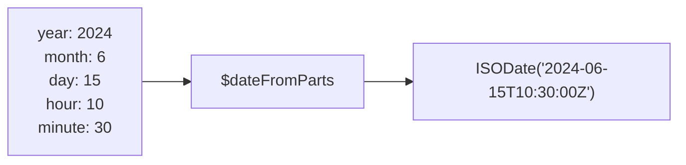

# How to Use $dateFromParts in MongoDB Aggregation

Author: [nawazdhandala](https://www.github.com/nawazdhandala)

Tags: MongoDB, Aggregation, Pipeline, Date, Expression

Description: Learn how to use $dateFromParts in MongoDB aggregation to construct a date from individual year, month, day, hour, minute, second, and timezone components.

---

## Overview

`$dateFromParts` constructs a BSON date from individual date and time component fields. It is the inverse of `$dateToParts`. Use it when you store date components separately (e.g., year, month, day as individual fields) and need to assemble them into a queryable date.



## Syntax

### ISO 8601 Calendar (default)

```javascript
{
  $dateFromParts: {
    year: <expression>,        // required
    month: <expression>,       // 1-12, default 1
    day: <expression>,         // 1-31, default 1
    hour: <expression>,        // 0-23, default 0
    minute: <expression>,      // 0-59, default 0
    second: <expression>,      // 0-59, default 0
    millisecond: <expression>, // 0-999, default 0
    timezone: <expression>     // optional, e.g. "America/New_York"
  }
}
```

### ISO Week Calendar

```javascript
{
  $dateFromParts: {
    isoWeekYear: <expression>,  // required
    isoWeek: <expression>,      // 1-53, default 1
    isoDayOfWeek: <expression>, // 1=Monday, 7=Sunday, default 1
    hour: <expression>,
    minute: <expression>,
    second: <expression>,
    millisecond: <expression>,
    timezone: <expression>
  }
}
```

## Examples

### Example 1 - Construct a Date from Stored Components

```javascript
// Input: { _id: 1, yr: 2024, mo: 6, dy: 15 }
db.schedule.aggregate([
  {
    $project: {
      eventDate: {
        $dateFromParts: {
          year: "$yr",
          month: "$mo",
          day: "$dy"
        }
      }
    }
  }
])
```

Output:

```javascript
[
  { _id: 1, eventDate: ISODate("2024-06-15T00:00:00.000Z") }
]
```

### Example 2 - Include Time Components

```javascript
// Input: { _id: 1, year: 2024, month: 3, day: 10, hour: 14, minute: 30, second: 0 }
db.appointments.aggregate([
  {
    $project: {
      scheduledAt: {
        $dateFromParts: {
          year: "$year",
          month: "$month",
          day: "$day",
          hour: "$hour",
          minute: "$minute",
          second: "$second"
        }
      }
    }
  }
])
```

Output:

```javascript
[
  { _id: 1, scheduledAt: ISODate("2024-03-10T14:30:00.000Z") }
]
```

### Example 3 - Specify a Timezone

Construct a date and interpret it in a specific timezone:

```javascript
db.events.aggregate([
  {
    $project: {
      localDate: {
        $dateFromParts: {
          year: 2024,
          month: 7,
          day: 4,
          hour: 9,
          minute: 0,
          timezone: "America/New_York"
        }
      }
    }
  }
])
```

Output (stored as UTC):

```javascript
[
  { localDate: ISODate("2024-07-04T13:00:00.000Z") }
]
```

### Example 4 - Use Overflow Values

MongoDB handles out-of-range values by carrying over into the next unit:

```javascript
// month: 13 overflows to January of next year
db.demo.aggregate([
  {
    $project: {
      date: {
        $dateFromParts: {
          year: 2024,
          month: 13,
          day: 1
        }
      }
    }
  }
])
```

Output:

```javascript
[
  { date: ISODate("2025-01-01T00:00:00.000Z") }
]
```

### Example 5 - ISO Week Calendar

Construct a date from ISO week year and week number:

```javascript
// Input: { _id: 1, isoYear: 2024, isoWeek: 1, isoDow: 1 }
db.weeklyReports.aggregate([
  {
    $project: {
      weekStart: {
        $dateFromParts: {
          isoWeekYear: "$isoYear",
          isoWeek: "$isoWeek",
          isoDayOfWeek: "$isoDow"
        }
      }
    }
  }
])
```

Output:

```javascript
[
  { _id: 1, weekStart: ISODate("2024-01-01T00:00:00.000Z") }
]
```

### Example 6 - Build First-of-Month Dates for a Range

Generate start-of-month dates for the first 6 months of a year:

```javascript
db.demo.aggregate([
  {
    $project: {
      monthStarts: {
        $map: {
          input: [1, 2, 3, 4, 5, 6],
          as: "m",
          in: {
            $dateFromParts: {
              year: 2024,
              month: "$$m",
              day: 1
            }
          }
        }
      }
    }
  }
])
```

## Inverse: $dateToParts

To go the other direction and extract components from a date:

```javascript
db.events.aggregate([
  {
    $project: {
      parts: {
        $dateToParts: {
          date: "$eventDate",
          timezone: "America/New_York"
        }
      }
    }
  }
])
```

## Summary

`$dateFromParts` assembles a BSON ISODate from individual numeric components, including optional timezone context. Use it to reconstruct dates stored as split fields, generate date ranges in a pipeline, or convert ISO week/year references to full dates. MongoDB handles overflowing component values gracefully, which enables arithmetic tricks like adding months by incrementing the month component and letting MongoDB normalize the result.
