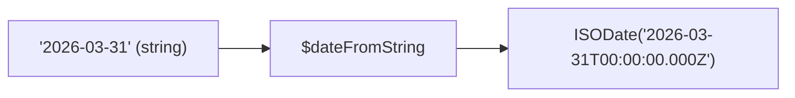

# How to Use $dateFromString in MongoDB Aggregation

Author: [nawazdhandala](https://www.github.com/nawazdhandala)

Tags: MongoDB, Aggregation, $dateFromString, Pipeline, Date

Description: Learn how to use $dateFromString in MongoDB aggregation to parse date strings into MongoDB date objects for querying and arithmetic.

---

## How $dateFromString Works

`$dateFromString` converts a date/time string into a BSON `Date` object. It accepts an optional format string (defaulting to ISO-8601), a timezone, and handlers for null and parse errors. This operator is essential when importing data with dates stored as strings.



## Syntax

```javascript
{
  $dateFromString: {
    dateString: <string expression>,
    format:     <format string>,     // optional; defaults to ISO-8601 parsing
    timezone:   <timezone>,          // optional
    onError:    <expression>,        // optional: returned on parse error
    onNull:     <expression>         // optional: returned when dateString is null/missing
  }
}
```

Format specifiers use the same `%Y`, `%m`, `%d`, `%H`, `%M`, `%S` syntax as `$dateToString`.

## Examples

### Input Documents

```javascript
[
  { _id: 1, name: "Event A", dateStr: "2026-03-31"             },
  { _id: 2, name: "Event B", dateStr: "31/01/2026"             },
  { _id: 3, name: "Event C", dateStr: "2026-03-15T10:30:00Z"   },
  { _id: 4, name: "Event D", dateStr: "March 31, 2026"         },
  { _id: 5, name: "Event E", dateStr: null                     },
  { _id: 6, name: "Event F", dateStr: "not-a-date"             }
]
```

### Example 1 - Parse ISO-8601 String (Default)

Parse a standard ISO date string without specifying a format:

```javascript
db.events.aggregate([
  { $match: { _id: 1 } },
  {
    $project: {
      name: 1,
      parsedDate: { $dateFromString: { dateString: "$dateStr" } }
    }
  }
])
```

Output:

```javascript
[
  { _id: 1, name: "Event A", parsedDate: ISODate("2026-03-31T00:00:00.000Z") }
]
```

### Example 2 - Parse Custom Date Format

Parse `DD/MM/YYYY` format strings:

```javascript
db.events.aggregate([
  { $match: { _id: 2 } },
  {
    $project: {
      name: 1,
      parsedDate: {
        $dateFromString: {
          dateString: "$dateStr",
          format: "%d/%m/%Y"
        }
      }
    }
  }
])
```

Output:

```javascript
[
  { _id: 2, name: "Event B", parsedDate: ISODate("2026-01-31T00:00:00.000Z") }
]
```

### Example 3 - Parse ISO String with Time

Parse a full ISO-8601 datetime string (auto-detected):

```javascript
db.events.aggregate([
  { $match: { _id: 3 } },
  {
    $project: {
      parsedDate: { $dateFromString: { dateString: "$dateStr" } }
    }
  }
])
```

Output:

```javascript
[
  { _id: 3, parsedDate: ISODate("2026-03-15T10:30:00.000Z") }
]
```

### Example 4 - onNull: Handle Null Values

Return a default date when `dateStr` is null:

```javascript
db.events.aggregate([
  { $match: { _id: 5 } },
  {
    $project: {
      name: 1,
      parsedDate: {
        $dateFromString: {
          dateString: "$dateStr",
          onNull: ISODate("1970-01-01T00:00:00.000Z")
        }
      }
    }
  }
])
```

Output:

```javascript
[
  { _id: 5, name: "Event E", parsedDate: ISODate("1970-01-01T00:00:00.000Z") }
]
```

### Example 5 - onError: Handle Parse Failures

Return `null` instead of throwing an error when the string cannot be parsed:

```javascript
db.events.aggregate([
  { $match: { _id: 6 } },
  {
    $project: {
      name: 1,
      parsedDate: {
        $dateFromString: {
          dateString: "$dateStr",
          onError: null
        }
      }
    }
  }
])
```

Output:

```javascript
[
  { _id: 6, name: "Event F", parsedDate: null }
]
```

### Example 6 - Parse with Timezone

Parse a date string and treat it as a specific timezone:

```javascript
db.events.aggregate([
  { $match: { _id: 1 } },
  {
    $project: {
      parsedDate: {
        $dateFromString: {
          dateString: "$dateStr",
          format: "%Y-%m-%d",
          timezone: "America/New_York"
        }
      }
    }
  }
])
```

Output (the midnight New York time is stored as UTC):

```javascript
[
  { _id: 1, parsedDate: ISODate("2026-03-31T04:00:00.000Z") }
]
```

### Example 7 - Parse Then Compare

After parsing, filter events by date range:

```javascript
db.events.aggregate([
  {
    $addFields: {
      parsedDate: {
        $dateFromString: {
          dateString: "$dateStr",
          onError: null,
          onNull: null
        }
      }
    }
  },
  {
    $match: {
      parsedDate: {
        $gte: ISODate("2026-01-01"),
        $lte: ISODate("2026-03-31")
      }
    }
  }
])
```

### Example 8 - Parse Then Group by Month

Parse string dates and group events by month:

```javascript
db.events.aggregate([
  {
    $addFields: {
      parsedDate: {
        $dateFromString: {
          dateString: "$dateStr",
          onError: null,
          onNull: null
        }
      }
    }
  },
  { $match: { parsedDate: { $ne: null } } },
  {
    $group: {
      _id: {
        year:  { $year:  "$parsedDate" },
        month: { $month: "$parsedDate" }
      },
      count: { $sum: 1 }
    }
  }
])
```

## Common Format Strings

| Input Format | format Parameter |
|---|---|
| `2026-03-31` | `%Y-%m-%d` (default) |
| `31/03/2026` | `%d/%m/%Y` |
| `03/31/2026` | `%m/%d/%Y` |
| `31-Mar-2026` | `%d-%b-%Y` |
| `2026-03-31 14:05:09` | `%Y-%m-%d %H:%M:%S` |

## Use Cases

- Parsing date strings imported from CSV or JSON files
- Converting legacy string-typed date fields to real dates for arithmetic and indexing
- Handling mixed date formats across documents using `onError` fallback
- Building ETL pipelines that normalize date representations

## Summary

`$dateFromString` parses a date string into a BSON `Date` object. It accepts an optional format string for non-ISO formats, timezone for localized parsing, `onError` for parse failure handling, and `onNull` for null input handling. After conversion, the resulting date field can be used with all MongoDB date operators including `$dateAdd`, `$dateDiff`, `$dateToString`, and date-based `$group` operators.
