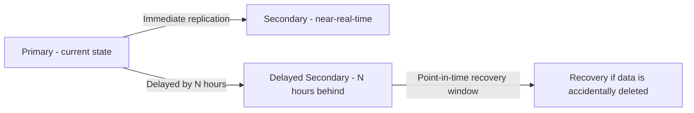
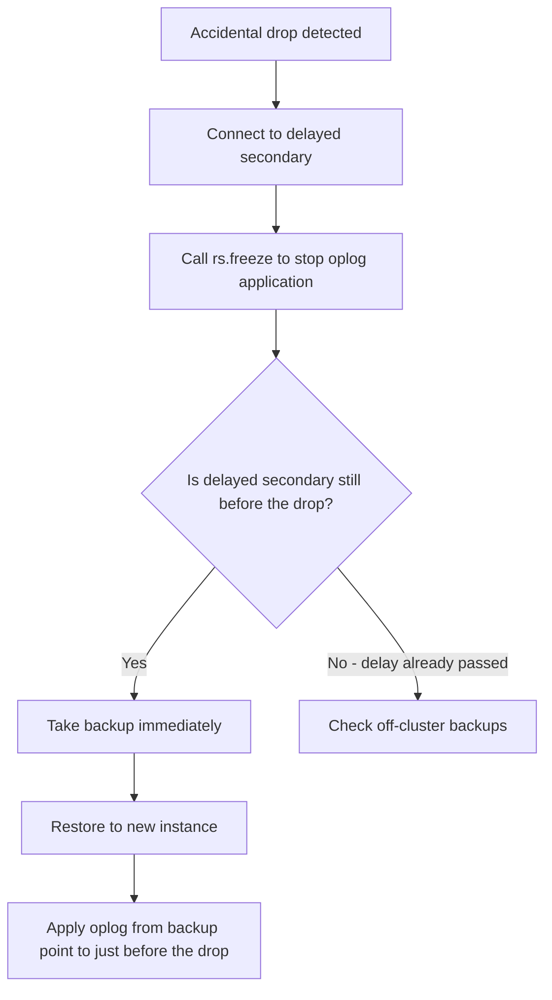

# How to Set Up Delayed Secondaries in MongoDB Replica Set

Author: [nawazdhandala](https://www.github.com/nawazdhandala)

Tags: MongoDB, Replica Set, Delayed Secondary, Replication, Backup

Description: Learn how to configure a delayed secondary in a MongoDB replica set to maintain a rolling backup window, protect against accidental data deletion, and recover from human errors.

---

## What is a Delayed Secondary

A delayed secondary is a replica set member that lags behind the primary by a configured number of seconds. It applies oplog operations later than other secondaries, maintaining a point-in-time snapshot of the data from a defined period in the past.

This protects against human errors such as accidental collection drops or mass deletes: if the delay is 1 hour and an error occurs, you have up to 1 hour to initiate a recovery from the delayed secondary before the incorrect operation is applied to it.



## Rules for Delayed Secondaries

1. `secondaryDelaySecs` must be greater than 0
2. The member must have `priority: 0` (cannot become primary)
3. The member should have `hidden: true` (prevents client connections)
4. The delay must be less than the oplog window length; if the primary's oplog is shorter than the delay, the secondary falls off the oplog and must resync from scratch

## Configuring a Delayed Secondary at Initialization

```javascript
rs.initiate({
  _id: "rs0",
  members: [
    {
      _id: 0,
      host: "primary.example.com:27017",
      priority: 2
    },
    {
      _id: 1,
      host: "secondary.example.com:27018",
      priority: 1
    },
    {
      _id: 2,
      host: "delayed.example.com:27019",
      priority: 0,                  // cannot become primary
      hidden: true,                 // not visible to clients
      secondaryDelaySecs: 3600      // 1 hour behind primary
    }
  ]
});
```

## Adding a Delayed Secondary to an Existing Replica Set

```javascript
// Step 1: Add the new member (it will sync normally at first)
rs.add({ host: "delayed.example.com:27019", priority: 0, hidden: true });

// Step 2: Wait for SECONDARY state
// rs.status() until stateStr == "SECONDARY"

// Step 3: Configure the delay
const cfg = rs.conf();
const delayedIdx = cfg.members.findIndex(m => m.host === "delayed.example.com:27019");
cfg.members[delayedIdx].secondaryDelaySecs = 3600;
rs.reconfig(cfg);
```

## Verifying the Delay Configuration

```javascript
// Check config
rs.conf().members.forEach(m => {
  if (m.secondaryDelaySecs > 0) {
    print(`Delayed member: ${m.host}, delay: ${m.secondaryDelaySecs}s (${m.secondaryDelaySecs / 3600}h)`);
  }
});

// Check current lag in rs.status()
rs.status().members.forEach(m => {
  const primary = rs.status().members.find(p => p.stateStr === "PRIMARY");
  if (m.stateStr === "SECONDARY") {
    const lagSec = (primary.optimeDate - m.optimeDate) / 1000;
    print(`${m.name}: lag = ${lagSec.toFixed(0)}s`);
  }
});
```

A healthy delayed secondary should show lag approximately equal to `secondaryDelaySecs`.

## Sizing the Oplog for the Delay

The oplog must retain entries covering at least the delay window. If the oplog rolls over before the delay, the delayed secondary falls behind and must perform a full initial sync.

```javascript
// Check current oplog size and window
rs.printReplicationInfo();
// log length start to end: 86400secs (24hrs)
// If delay is 3600s (1hr), the 24hr oplog window is sufficient
```

Increase the oplog size if needed:

```bash
# Set oplog size to 10 GB in mongod.conf
replication:
  replSetName: "rs0"
  oplogSizeMB: 10240
```

Or change on a running instance (MongoDB 3.6+):

```javascript
db.adminCommand({ replSetResizeOplog: 1, size: 10240 });
```

## Using a Delayed Secondary for Recovery

If a catastrophic operation occurs (e.g., accidental `db.collection.drop()`), you can recover from the delayed secondary:

```javascript
// Step 1: Immediately freeze the delayed secondary to prevent it from
// applying the destructive operation
mongosh --host delayed.example.com:27019 --directConnection true

rs.freeze(86400);  // Prevent this member from applying ops for 24 hours

// Step 2: Take a backup from the frozen delayed secondary
// (mongodump or file system snapshot)
// The secondary still holds data from before the accident

// Step 3: Restore the backup to a new standalone instance
// or apply oplog replay up to the point before the error

// Step 4: Unfreeze and let it catch up after data is recovered elsewhere
rs.freeze(0);  // Unfreeze
```



## Reading from a Delayed Secondary Directly

If you need to query historical data from the delayed secondary:

```javascript
// Connect directly with directConnection to bypass read preference routing
mongosh --host delayed.example.com:27019 --directConnection true

// Allow reads on secondary
db.getMongo().setReadPref("nearest");

// Query data as it was 1 hour ago
db.orders.find({ status: "pending" });
```

## Common Configurations

```javascript
// 1-hour rolling recovery window
{ secondaryDelaySecs: 3600, priority: 0, hidden: true }

// 24-hour rolling recovery window (requires large oplog)
{ secondaryDelaySecs: 86400, priority: 0, hidden: true }

// 6-hour window for high-frequency write workloads
{ secondaryDelaySecs: 21600, priority: 0, hidden: true }
```

## Votes on a Delayed Secondary

Delayed secondaries can vote in elections:

```javascript
// Voting delayed secondary
{ _id: 2, host: "delayed:27019", secondaryDelaySecs: 3600, priority: 0, hidden: true, votes: 1 }

// Non-voting delayed secondary (useful when you have 7 voting members already)
{ _id: 2, host: "delayed:27019", secondaryDelaySecs: 3600, priority: 0, hidden: true, votes: 0 }
```

## Monitoring Delayed Secondary Health

```javascript
// Watch for the delayed member to fall off the oplog (lag > oplog window)
const oplogWindow = 86400;  // seconds from rs.printReplicationInfo()
const status = rs.status();
const primary = status.members.find(m => m.stateStr === "PRIMARY");

status.members.forEach(m => {
  const lagSec = (primary.optimeDate - m.optimeDate) / 1000;
  if (lagSec > oplogWindow * 0.9) {
    print(`WARNING: ${m.name} lag (${lagSec}s) is approaching oplog window (${oplogWindow}s)`);
  }
});
```

## Summary

A delayed secondary is a hidden, non-primary replica set member that lags behind the primary by a configured number of seconds (`secondaryDelaySecs`). It provides a rolling recovery window against accidental data loss from human errors. Configure it with `priority: 0` and `hidden: true`, size the oplog to be longer than the delay, and use `rs.freeze()` immediately after an incident to stop the delayed member from applying the destructive operation. Monitor replication lag to ensure the delayed secondary stays within its configured window.
