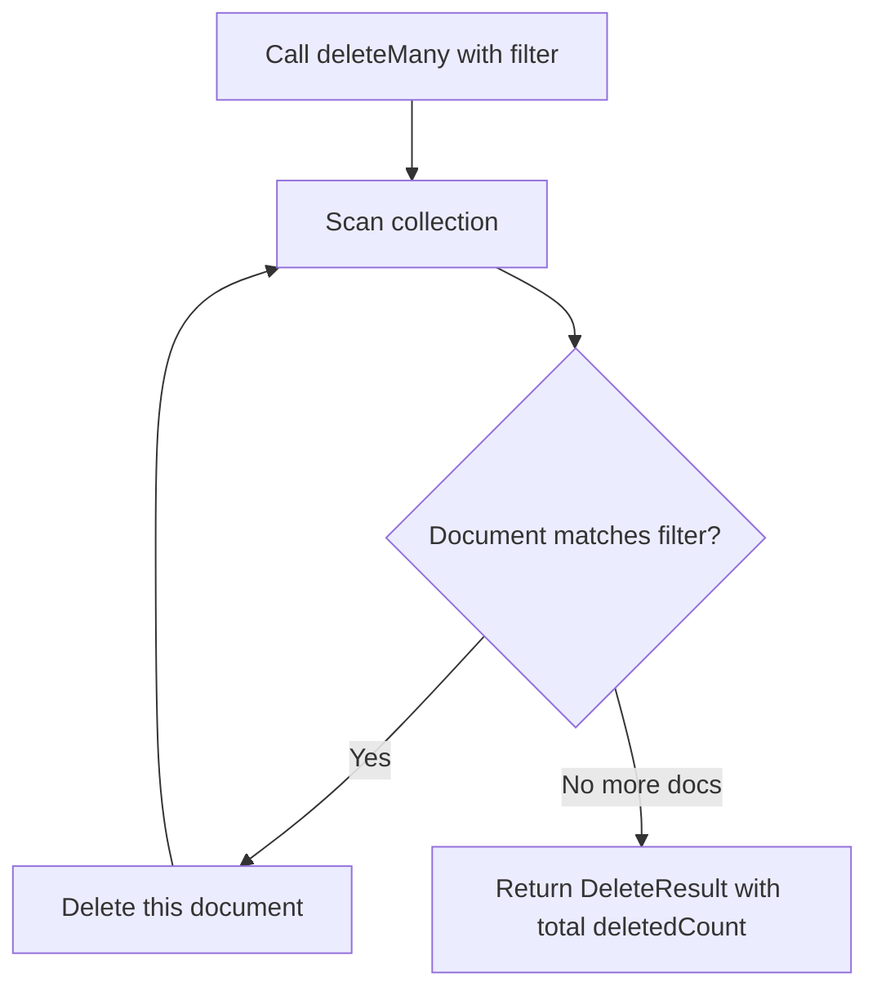

# How to Delete Multiple Documents with deleteMany() in MongoDB

Author: [nawazdhandala](https://www.github.com/nawazdhandala)

Tags: MongoDB, deleteMany, CRUD, Delete, Bulk

Description: Learn how to delete all matching documents from a MongoDB collection using deleteMany(), including safe filtering patterns, bulk deletion strategies, and cautions.

---

## How deleteMany() Works

`deleteMany()` removes all documents from a collection that match the provided filter. Unlike `deleteOne()`, which stops after the first match, `deleteMany()` continues until all matching documents are deleted. Passing an empty filter `{}` deletes every document in the collection.



## Syntax

```javascript
db.collection.deleteMany(filter, options)
```

- `filter` - Query to match documents to delete. Use `{}` to delete all
- `options` - Optional settings: `hint`, `comment`, `writeConcern`

## Basic Example - Delete by Condition

Delete all expired session documents:

```javascript
const result = db.sessions.deleteMany({
  expiresAt: { $lt: new Date() }
})

print(`Deleted ${result.deletedCount} expired sessions`)
```

## Deleting All Documents in a Collection

Pass an empty filter to delete everything:

```javascript
// Deletes all documents but preserves the collection and its indexes
db.tempLogs.deleteMany({})
```

If you want to delete both the documents and the collection structure (indexes, validators), use `drop()` instead:

```javascript
// Drops the entire collection including indexes
db.tempLogs.drop()
```

## Deleting by a List of IDs

```javascript
const idsToDelete = [
  ObjectId("64a1b2c3d4e5f6789012345a"),
  ObjectId("64a1b2c3d4e5f6789012345b"),
  ObjectId("64a1b2c3d4e5f6789012345c")
]

const result = db.users.deleteMany({
  _id: { $in: idsToDelete }
})

print(`Deleted ${result.deletedCount} users`)
```

## Deleting by Status

```javascript
// Archive then delete: move cancelled orders to archive before deleting
const cancelledOrders = db.orders.find({ status: "cancelled" }).toArray()

if (cancelledOrders.length > 0) {
  db.archivedOrders.insertMany(cancelledOrders.map(o => ({
    ...o,
    archivedAt: new Date()
  })))

  const result = db.orders.deleteMany({ status: "cancelled" })
  print(`Archived and deleted ${result.deletedCount} cancelled orders`)
}
```

## Deleting Old Records with a Date Filter

```javascript
// Delete log entries older than 90 days
const cutoffDate = new Date()
cutoffDate.setDate(cutoffDate.getDate() - 90)

const result = db.auditLogs.deleteMany({
  createdAt: { $lt: cutoffDate }
})

print(`Cleaned up ${result.deletedCount} old log entries`)
```

## Batched Deletion for Large Collections

For very large collections, deleting all at once can cause performance issues. Process in batches:

```javascript
let totalDeleted = 0
const batchSize = 1000

while (true) {
  // Find IDs of the next batch
  const batch = db.oldData.find(
    { archived: true },
    { _id: 1 }
  ).limit(batchSize).toArray()

  if (batch.length === 0) break

  const batchIds = batch.map(doc => doc._id)
  const result = db.oldData.deleteMany({ _id: { $in: batchIds } })
  totalDeleted += result.deletedCount

  print(`Progress: deleted ${totalDeleted} documents so far`)
}

print(`Done: deleted ${totalDeleted} total documents`)
```

## Checking the Result

```javascript
const result = db.users.deleteMany({ status: "banned" })

print("Delete result:")
print("  deletedCount:", result.deletedCount)
print("  acknowledged:", result.acknowledged)
```

## Safety Warning - Verify Filters Before Deleting

Always test your filter with a `find()` or `countDocuments()` before running `deleteMany()`:

```javascript
// Step 1: preview what will be deleted
const count = db.users.countDocuments({ lastLoginAt: { $lt: new Date("2020-01-01") } })
print(`About to delete ${count} documents`)

// Step 2: if count looks right, proceed
db.users.deleteMany({ lastLoginAt: { $lt: new Date("2020-01-01") } })
```

## Use Cases

- Purging expired sessions or tokens
- Cleaning up test or temporary data
- Removing archived or soft-deleted records on a schedule
- Bulk-removing spam or inactive accounts
- Data retention policy enforcement

## Summary

`deleteMany()` removes all documents matching the filter in one operation. An empty filter `{}` deletes every document in the collection (though `drop()` is faster for a full wipe). Always validate your filter with `countDocuments()` before executing a large deletion. For very large deletions, use batch processing to avoid long-running operations and lock contention. When you need the deleted documents' content, retrieve them with `find()` first or consider soft deletes as an alternative.
