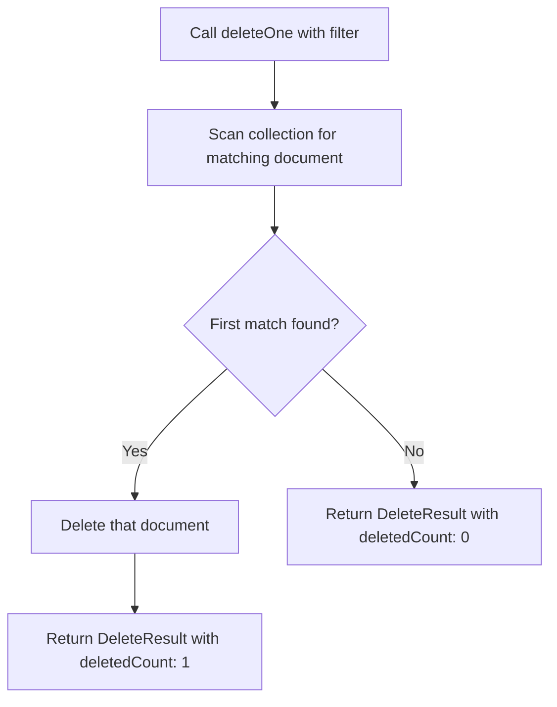

# How to Delete Documents with deleteOne() in MongoDB

Author: [nawazdhandala](https://www.github.com/nawazdhandala)

Tags: MongoDB, deleteOne, CRUD, Delete, Document

Description: Learn how to delete a single document from a MongoDB collection using deleteOne(), including filter patterns, result verification, and safe deletion practices.

---

## How deleteOne() Works

`deleteOne()` removes the first document that matches the provided filter from a collection. Even if multiple documents match the filter, only the first one (in natural order, or as determined by an index) is deleted. If no documents match, the operation succeeds with a `deletedCount` of 0.



## Syntax

```javascript
db.collection.deleteOne(filter, options)
```

- `filter` - Query to identify the document to delete
- `options` - Optional settings: `hint`, `comment`, `writeConcern`

## Deleting by _id (Most Common)

The safest way to delete a specific document is to filter by `_id`:

```javascript
db.users.deleteOne({ _id: ObjectId("64a1b2c3d4e5f6789012345a") })
```

## Deleting by a Unique Field

If you have a unique index on a field (such as email), you can safely use it:

```javascript
db.users.deleteOne({ email: "alice@example.com" })
```

## Checking the Result

The return value tells you whether a document was actually deleted:

```javascript
const result = db.users.deleteOne({ username: "alice" })

if (result.deletedCount === 0) {
  print("No document found matching the filter")
} else {
  print("Document deleted successfully")
}
```

## Deleting a Non-Existent Document

No error is thrown if no document matches:

```javascript
const result = db.users.deleteOne({ email: "nobody@example.com" })
print(result.deletedCount) // 0 - no document found, no error
```

## Safe Deletion - Verify Before Delete

For critical deletions, fetch the document first to confirm what will be deleted:

```javascript
const user = db.users.findOne({ username: "bob" })

if (user) {
  print(`About to delete user: ${user.name}, email: ${user.email}`)
  db.users.deleteOne({ _id: user._id })
  print("Deleted successfully")
} else {
  print("User not found")
}
```

## Soft Delete Pattern

Instead of actually deleting, mark the document as deleted:

```javascript
// Soft delete - preserves data for audit purposes
db.users.updateOne(
  { _id: ObjectId("64a1b2c3d4e5f6789012345a") },
  {
    $set: {
      deletedAt: new Date(),
      deletedBy: "admin"
    }
  }
)

// Query active users (not soft-deleted)
db.users.find({ deletedAt: { $exists: false } })
```

## Deleting with Complex Filters

You can use any valid query as the filter:

```javascript
// Delete the most recently created temp user
db.users.deleteOne({
  role: "temp",
  createdAt: { $lt: new Date("2024-01-01") }
})
```

## Write Concern Option

Control acknowledgment level for critical deletes:

```javascript
db.criticalData.deleteOne(
  { _id: 1 },
  { writeConcern: { w: "majority", j: true } }
)
```

## deleteOne() vs findOneAndDelete()

```text
deleteOne()                       findOneAndDelete()
--------------------------------  --------------------------------
Returns DeleteResult (counts)     Returns the deleted document
Cannot sort to select a document  Supports sort to select document
Slightly faster                   Slightly more overhead
Use when you don't need the doc   Use when you need the document
```

## Use Cases

- Removing a user account by ID
- Deleting a specific record identified by a unique field
- Removing an expired session or token
- Deleting a draft document by its identifier
- Removing a single queue item after processing

## Summary

`deleteOne()` safely removes one document matching the provided filter. Always prefer filtering by `_id` or a unique indexed field to ensure exactly one document is targeted. The operation returns a `DeleteResult` with `deletedCount` indicating whether a document was removed. For cases where you need the deleted document's content, use `findOneAndDelete()` instead. Consider soft deletes (updating a `deletedAt` field) over hard deletes when data needs to be preserved for auditing or recovery.
