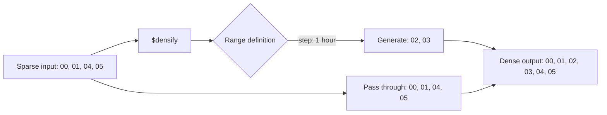

# How to Use $densify to Fill Gaps in Time-Series Data in MongoDB

Author: OneUptime Team

Tags: MongoDB, Aggregation, Time-series, Densify, Pipeline

Description: Learn how to use MongoDB's $densify stage to generate missing documents in time-series and numeric sequences, filling gaps so every interval is represented in results.

---

When working with time-series data, there are often missing intervals -- no reading for 3 AM, no sales on a holiday, no metric during downtime. The `$densify` stage, added in MongoDB 5.1, generates synthetic documents to fill those gaps.

## The Problem: Gaps in Time-Series Data

```javascript
// Sensor readings -- missing 02:00 and 03:00
db.readings.insertMany([
  { sensor: "S1", hour: ISODate("2026-03-01T00:00:00Z"), temp: 22.1 },
  { sensor: "S1", hour: ISODate("2026-03-01T01:00:00Z"), temp: 22.4 },
  // 02:00 missing
  // 03:00 missing
  { sensor: "S1", hour: ISODate("2026-03-01T04:00:00Z"), temp: 23.0 },
  { sensor: "S1", hour: ISODate("2026-03-01T05:00:00Z"), temp: 23.2 }
]);
```

Without gap-filling, charts render jagged lines or skip over periods entirely. `$densify` ensures every expected interval has a document.

## How $densify Works



## Basic Hourly Densification

```javascript
db.readings.aggregate([
  {
    $densify: {
      field: "hour",
      range: {
        step: 1,
        unit: "hour",
        bounds: [
          ISODate("2026-03-01T00:00:00Z"),
          ISODate("2026-03-01T06:00:00Z")
        ]
      }
    }
  }
]);
// Generates documents at 02:00 and 03:00 with only the "hour" field set
```

## Densify with Partitions

Use `partitionByFields` to densify per sensor, per region, or per category independently:

```javascript
db.readings.aggregate([
  {
    $densify: {
      field: "hour",
      partitionByFields: ["sensor"],   // densify independently per sensor
      range: {
        step: 1,
        unit: "hour",
        bounds: "partition"            // use min/max within each partition
      }
    }
  }
]);
```

Using `bounds: "full"` fills to the global min/max across all partitions:

```javascript
db.readings.aggregate([
  {
    $densify: {
      field: "hour",
      partitionByFields: ["sensor"],
      range: {
        step: 1,
        unit: "hour",
        bounds: "full"    // all sensors share the same time range
      }
    }
  }
]);
```

## Filling Values After Densification with $fill

Densified documents have `null` for all fields except the densified field and partition fields. Chain `$fill` to populate those nulls:

```javascript
db.readings.aggregate([
  {
    $densify: {
      field: "hour",
      partitionByFields: ["sensor"],
      range: {
        step: 1,
        unit: "hour",
        bounds: "partition"
      }
    }
  },
  {
    $fill: {
      partitionByFields: ["sensor"],
      sortBy: { hour: 1 },
      output: {
        temp: { method: "linear" }    // interpolate missing temperatures
      }
    }
  }
]);
```

## Daily Sales Gap-Filling

```javascript
// Ensure every day in the range has a document, even days with no sales
db.dailySales.aggregate([
  {
    $densify: {
      field: "date",
      partitionByFields: ["storeId"],
      range: {
        step: 1,
        unit: "day",
        bounds: [
          ISODate("2026-01-01T00:00:00Z"),
          ISODate("2026-04-01T00:00:00Z")
        ]
      }
    }
  },
  {
    $fill: {
      partitionByFields: ["storeId"],
      sortBy: { date: 1 },
      output: {
        revenue: { value: 0 },        // fill missing sales with 0
        transactions: { value: 0 }
      }
    }
  }
]);
```

## Numeric Range Densification

`$densify` works on numeric fields too, not only dates:

```javascript
// Ensure every price bucket from 0 to 1000 in steps of 50 is represented
db.priceBuckets.aggregate([
  {
    $densify: {
      field: "priceMin",
      range: {
        step: 50,
        bounds: [0, 1000]
      }
    }
  }
]);
```

## Time-Series Dashboard: Complete Pipeline

```javascript
db.metrics.aggregate([
  // Step 1: filter to the time window
  {
    $match: {
      timestamp: {
        $gte: ISODate("2026-03-01T00:00:00Z"),
        $lt:  ISODate("2026-03-02T00:00:00Z")
      }
    }
  },

  // Step 2: bucket into 5-minute intervals
  {
    $addFields: {
      bucket: {
        $dateTrunc: { date: "$timestamp", unit: "minute", binSize: 5 }
      }
    }
  },

  // Step 3: aggregate per bucket per host
  {
    $group: {
      _id: { bucket: "$bucket", host: "$host" },
      avgCpu: { $avg: "$cpuPercent" },
      maxMem: { $max: "$memMB" }
    }
  },
  {
    $replaceRoot: {
      newRoot: {
        bucket: "$_id.bucket",
        host: "$_id.host",
        avgCpu: "$avgCpu",
        maxMem: "$maxMem"
      }
    }
  },

  // Step 4: densify missing 5-min buckets per host
  {
    $densify: {
      field: "bucket",
      partitionByFields: ["host"],
      range: {
        step: 5,
        unit: "minute",
        bounds: [
          ISODate("2026-03-01T00:00:00Z"),
          ISODate("2026-03-02T00:00:00Z")
        ]
      }
    }
  },

  // Step 5: forward-fill missing values
  {
    $fill: {
      partitionByFields: ["host"],
      sortBy: { bucket: 1 },
      output: {
        avgCpu: { method: "locf" },   // last observation carried forward
        maxMem: { method: "locf" }
      }
    }
  },

  { $sort: { host: 1, bucket: 1 } }
]);
```

## Supported Time Units

| Unit | Value |
|---|---|
| `millisecond` | ms |
| `second` | s |
| `minute` | min |
| `hour` | h |
| `day` | d |
| `week` | wk |
| `month` | mo |
| `quarter` | q |
| `year` | yr |

## Important Constraints

- `$densify` only generates documents; it does not fill values in generated documents (use `$fill` for that).
- The `step` must be a positive integer.
- `bounds: "partition"` uses the min and max of the field within each partition; `bounds: "full"` uses the global min and max.
- When using `bounds: [lower, upper]`, the lower bound is inclusive and the upper bound is exclusive.

## Summary

`$densify` solves the time-series gap problem by synthesizing placeholder documents for every missing interval in a date, time, or numeric sequence. Use it with `partitionByFields` to densify each category independently, choose the right `bounds` mode for your use case, and chain `$fill` after it to populate the null values in the generated documents. Together, `$densify` and `$fill` form a complete gap-filling solution for dashboards, analytics, and reporting pipelines.
