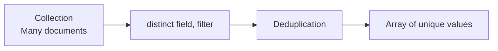
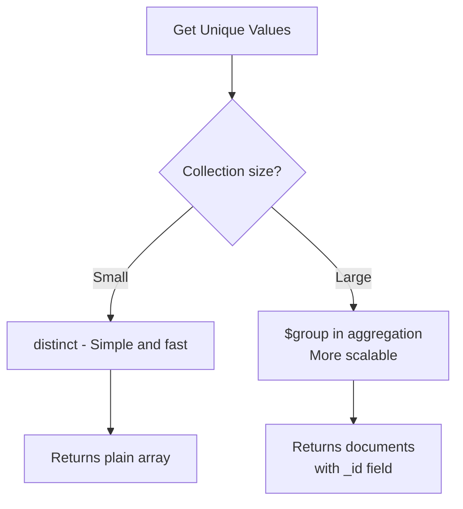

# How to Use distinct() to Get Unique Values in MongoDB

Author: [nawazdhandala](https://www.github.com/nawazdhandala)

Tags: MongoDB, Distinct, Query, Unique, Collection

Description: Learn how to use the MongoDB distinct() method to retrieve all unique values for a specific field across a collection, with optional query filters.

---

## Overview

The `distinct()` method returns an array of unique values for a specified field across all documents in a collection (or a filtered subset). It is useful for discovering the range of values in a field, building filter dropdowns, or auditing data quality.



## Syntax

```javascript
db.collection.distinct(field, query, options)
```

- `field` - the field name as a string (supports dot notation for nested fields)
- `query` - optional filter document to limit which documents are considered
- `options` - optional settings such as `collation`

## Basic Examples

### Get All Unique Values for a Field

```javascript
db.orders.distinct("status")
```

Output:

```javascript
["cancelled", "pending", "shipped"]
```

MongoDB sorts the returned array alphabetically for string values.

### Get Unique Values with a Filter

```javascript
db.orders.distinct("customerId", { status: "shipped" })
```

Returns all unique customer IDs that have at least one shipped order.

### Distinct on a Nested Field (Dot Notation)

```javascript
db.orders.distinct("address.city")
```

Returns unique city values from the nested `address.city` field across all documents.

### Distinct on an Array Field

When the field contains arrays, `distinct()` flattens the arrays and deduplicates all individual values:

```javascript
// Documents:
// { _id: 1, tags: ["mongodb", "nosql"] }
// { _id: 2, tags: ["nosql", "database"] }
// { _id: 3, tags: ["mongodb", "database"] }

db.articles.distinct("tags")
// Output: ["database", "mongodb", "nosql"]
```

## Advanced Examples

### Distinct with a Complex Filter

```javascript
db.products.distinct("category", {
  price: { $lt: 50 },
  inStock: true
})
```

Returns categories that have at least one in-stock product priced below 50.

### Distinct with Collation (Case-Insensitive)

```javascript
db.customers.distinct("country", {}, {
  collation: { locale: "en", strength: 2 }
})
```

Using `strength: 2` makes the distinct operation case-insensitive, so `"USA"` and `"usa"` are treated as the same value.

### Count Distinct Values

`distinct()` returns an array, so you can count unique values in the shell:

```javascript
db.orders.distinct("customerId").length
```

For large collections, use the aggregation pipeline instead to avoid transferring large arrays:

```javascript
db.orders.aggregate([
  { $group: { _id: "$customerId" } },
  { $count: "uniqueCustomers" }
])
```

## Comparison: distinct() vs Aggregation



| Approach | When to Use |
|---|---|
| `distinct()` | Simple field, small to medium collections |
| `$group` aggregation | Large collections, need counts or transformations |

### Aggregation Equivalent

```javascript
// distinct("status") is similar to:
db.orders.aggregate([
  { $group: { _id: "$status" } },
  { $sort: { _id: 1 } }
])
```

The aggregation version returns documents like `{ _id: "shipped" }` instead of a plain array.

## Index Usage

MongoDB can use an index to satisfy a `distinct()` query without scanning documents (a covered query). Create an index on the field you call `distinct()` on:

```javascript
db.orders.createIndex({ status: 1 })

// This distinct() can now use the index
db.orders.distinct("status")
```

Run `explain()` to confirm index usage:

```javascript
db.orders.explain().distinct("status")
```

## BSON Size Limit

The result of `distinct()` is returned as a single BSON document and is subject to the 16 MB BSON document size limit. If the array of unique values exceeds 16 MB, use the aggregation pipeline with `$group` instead.

## Summary

The `distinct()` method is the simplest way to retrieve all unique values for a field in MongoDB. It accepts an optional filter to scope the query, supports dot notation for nested fields, and automatically flattens array fields. For very large collections or when you also need counts, prefer the aggregation pipeline with `$group`. Always ensure the target field is indexed to keep `distinct()` queries fast.
