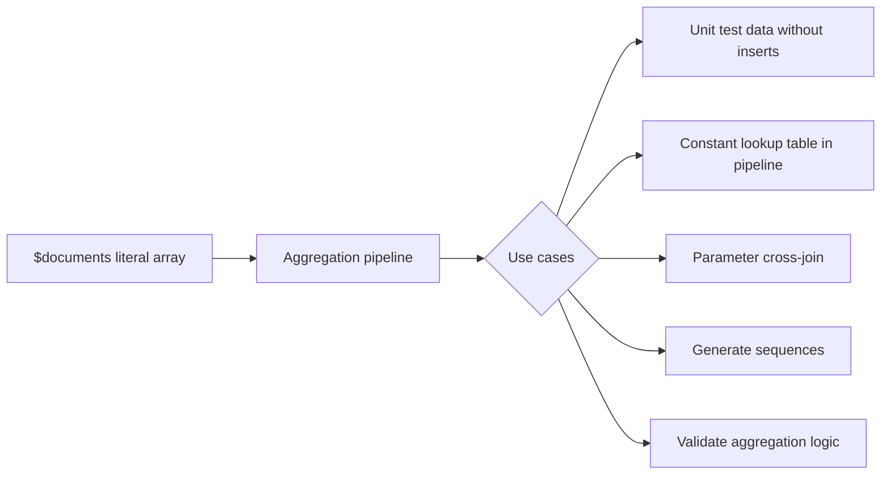

# How to Use $documents to Create Inline Documents in MongoDB 6+

Author: OneUptime Team

Tags: MongoDB, Aggregation, Pipeline, Documents stage, Query

Description: Learn how to use the $documents stage introduced in MongoDB 6.0 to create inline literal documents inside an aggregation pipeline without querying any collection.

---

The `$documents` stage, introduced in MongoDB 6.0, lets you generate a sequence of literal documents directly inside an aggregation pipeline. This allows you to create test data, constant lookup tables, cross-join values, or dynamic parameter lists without needing a real collection.

## What $documents Does

`$documents` is used at the beginning of a pipeline in place of a collection source. It produces exactly the documents you specify in an array.

```javascript
db.aggregate([
  {
    $documents: [
      { x: 1, label: "alpha" },
      { x: 2, label: "beta" },
      { x: 3, label: "gamma" }
    ]
  }
]);
```

This pipeline has no input collection -- `db.aggregate()` (not `db.collection.aggregate()`) is called directly.

## When to Use $documents



## Generating a Sequence of Numbers

```javascript
db.aggregate([
  {
    $documents: [
      { n: 0 }, { n: 1 }, { n: 2 }, { n: 3 }, { n: 4 },
      { n: 5 }, { n: 6 }, { n: 7 }, { n: 8 }, { n: 9 }
    ]
  },
  {
    $project: {
      n: 1,
      squared: { $multiply: ["$n", "$n"] },
      isEven: { $eq: [{ $mod: ["$n", 2] }, 0] }
    }
  }
]);
```

## Testing Aggregation Logic Without a Collection

Validate a complex expression before applying it to real data:

```javascript
db.aggregate([
  {
    $documents: [
      { price: 100, qty: 3, discount: 0.1 },
      { price: 250, qty: 1, discount: 0.0 },
      { price: 40,  qty: 5, discount: 0.2 }
    ]
  },
  {
    $project: {
      subtotal: { $multiply: ["$price", "$qty"] },
      discountAmount: {
        $multiply: [
          { $multiply: ["$price", "$qty"] },
          "$discount"
        ]
      },
      total: {
        $subtract: [
          { $multiply: ["$price", "$qty"] },
          { $multiply: [{ $multiply: ["$price", "$qty"] }, "$discount"] }
        ]
      }
    }
  }
]);
```

## Using $documents as a Lookup Table with $lookup

Provide a constant mapping table inline rather than storing it in a separate collection:

```javascript
db.orders.aggregate([
  {
    $lookup: {
      pipeline: [
        {
          $documents: [
            { code: "USD", symbol: "$",  rate: 1.0   },
            { code: "EUR", symbol: "€",  rate: 0.92  },
            { code: "GBP", symbol: "£",  rate: 0.79  },
            { code: "JPY", symbol: "¥",  rate: 149.5 }
          ]
        }
      ],
      as: "currencies"
    }
  },
  { $unwind: "$currencies" },
  {
    $match: {
      $expr: { $eq: ["$currencies.code", "$currencyCode"] }
    }
  },
  {
    $addFields: {
      localAmount: {
        $multiply: ["$amount", "$currencies.rate"]
      },
      currencySymbol: "$currencies.symbol"
    }
  },
  { $project: { currencies: 0 } }
]);
```

## Cross-Join: Generate Combinations

Produce the Cartesian product of two sets:

```javascript
db.aggregate([
  {
    $documents: [
      { size: "S" }, { size: "M" }, { size: "L" }, { size: "XL" }
    ]
  },
  {
    $lookup: {
      pipeline: [
        {
          $documents: [
            { color: "red" }, { color: "blue" }, { color: "green" }
          ]
        }
      ],
      as: "colors"
    }
  },
  { $unwind: "$colors" },
  {
    $project: {
      sku: { $concat: ["$size", "-", "$colors.color"] },
      size: 1,
      color: "$colors.color"
    }
  }
]);
// Produces 12 size-color combinations
```

## Dynamic Date Range Generation

Generate a list of dates for a reporting pipeline:

```javascript
db.aggregate([
  {
    $documents: [
      { day: ISODate("2026-03-25") },
      { day: ISODate("2026-03-26") },
      { day: ISODate("2026-03-27") },
      { day: ISODate("2026-03-28") },
      { day: ISODate("2026-03-29") },
      { day: ISODate("2026-03-30") },
      { day: ISODate("2026-03-31") }
    ]
  },
  {
    $lookup: {
      from: "dailySales",
      let: { d: "$day" },
      pipeline: [
        {
          $match: {
            $expr: {
              $eq: [
                { $dateTrunc: { date: "$saleDate", unit: "day" } },
                "$$d"
              ]
            }
          }
        },
        { $group: { _id: null, total: { $sum: "$amount" } } }
      ],
      as: "salesData"
    }
  },
  {
    $project: {
      day: 1,
      total: {
        $ifNull: [{ $arrayElemAt: ["$salesData.total", 0] }, 0]
      }
    }
  }
]);
```

## Parameter Injection

Pass variable parameters into a pipeline as inline documents:

```javascript
async function getProductsByCategories(categories) {
  const docs = categories.map(cat => ({ category: cat }));

  return db.aggregate([
    { $documents: docs },
    {
      $lookup: {
        from: "products",
        let: { cat: "$category" },
        pipeline: [
          { $match: { $expr: { $eq: ["$category", "$$cat"] } } },
          { $sort: { rating: -1 } },
          { $limit: 3 }
        ],
        as: "topProducts"
      }
    }
  ]).toArray();
}
```

## Combining with $setWindowFields

Generate a sequence and compute derived values with window functions:

```javascript
db.aggregate([
  {
    $documents: [
      { month: 1, revenue: 12000 },
      { month: 2, revenue: 15000 },
      { month: 3, revenue: 11000 },
      { month: 4, revenue: 18000 },
      { month: 5, revenue: 22000 },
      { month: 6, revenue: 19000 }
    ]
  },
  {
    $setWindowFields: {
      sortBy: { month: 1 },
      output: {
        runningTotal: {
          $sum: "$revenue",
          window: { documents: ["unbounded", "current"] }
        },
        movingAvg3: {
          $avg: "$revenue",
          window: { documents: [-2, 0] }
        }
      }
    }
  }
]);
```

## Requirements and Limitations

- `$documents` must be the first stage in the pipeline.
- It must be used with `db.aggregate()`, not `db.collection.aggregate()`.
- Available in MongoDB 6.0 and later.
- The array passed to `$documents` is evaluated at query time, not stored.

## Summary

`$documents` is a lightweight way to inject literal data into an aggregation pipeline without requiring a backing collection. Use it to test aggregation logic on known inputs, supply constant lookup tables via `$lookup`, generate sequences, build Cartesian products with a second `$documents` inside a `$lookup` sub-pipeline, or inject dynamic parameter sets. It is particularly valuable for prototyping and for cases where the auxiliary data is too small or too ephemeral to justify a permanent collection.
