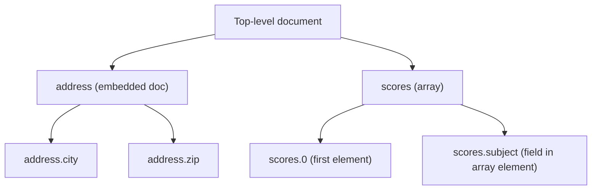

# How to Use Dot Notation in MongoDB to Query Nested Documents

Author: [nawazdhandala](https://www.github.com/nawazdhandala)

Tags: MongoDB, Dot Notation, Nested Document, Query, Embedded Document

Description: Learn how to use dot notation in MongoDB to query fields inside embedded documents and arrays, including multi-level nesting and array index access.

---

## How Dot Notation Works

MongoDB uses dot notation to access fields within embedded (nested) documents and to access elements within arrays. The syntax mirrors JavaScript object property access: `"parent.child"` or `"array.0"` for index-based access.



## Syntax

```javascript
// Access a nested field
{ "parent.child": value }

// Access a deeply nested field
{ "level1.level2.level3": value }

// Access an array element by index
{ "arrayField.0": value }

// Access a field within array elements
{ "arrayField.fieldName": value }
```

All dot notation paths must be enclosed in quotes when used as keys in a query document.

## Querying Embedded Documents

Given this collection:

```javascript
db.users.insertMany([
  {
    name: "Alice",
    address: {
      city: "San Francisco",
      state: "CA",
      zip: "94105"
    }
  },
  {
    name: "Bob",
    address: {
      city: "New York",
      state: "NY",
      zip: "10001"
    }
  }
])
```

Query by a nested field using dot notation:

```javascript
// Find users in San Francisco
db.users.find({ "address.city": "San Francisco" })

// Find users in California
db.users.find({ "address.state": "CA" })
```

## Multi-Level Nesting

Dot notation works at any depth:

```javascript
db.employees.insertOne({
  name: "Carol",
  company: {
    name: "Acme Corp",
    address: {
      country: {
        code: "US",
        name: "United States"
      }
    }
  }
})

// Query three levels deep
db.employees.find({ "company.address.country.code": "US" })
```

## Querying Fields in Array Elements

When an array contains embedded documents, dot notation applies the condition to each element of the array:

```javascript
db.students.insertMany([
  {
    name: "Alice",
    grades: [
      { subject: "Math", score: 90 },
      { subject: "English", score: 85 }
    ]
  },
  {
    name: "Bob",
    grades: [
      { subject: "Math", score: 60 },
      { subject: "English", score: 75 }
    ]
  }
])

// Find students with any grade score above 80
db.students.find({ "grades.score": { $gt: 80 } })
// Returns both Alice (90 and 85) and Bob (75 qualifies... wait: only Alice)
```

## Querying by Array Index

Access a specific element by its position in the array:

```javascript
// Find documents where the first element of scores equals 90
db.results.find({ "scores.0": 90 })

// Find documents where the second item in the cart is a specific product
db.carts.find({ "items.1.productId": "prod-001" })
```

## Combining Dot Notation with Operators

```javascript
// Find users with billing zip starting with "941"
db.users.find({ "billing.address.zip": /^941/ })

// Find products with a rating count greater than 100
db.products.find({ "rating.count": { $gt: 100 } })

// Find employees in departments with budget over 1 million
db.employees.find({ "department.budget": { $gt: 1000000 } })
```

## Dot Notation in Projection

Use dot notation in projection to return only specific nested fields:

```javascript
// Return only city and state from address
db.users.find(
  {},
  { name: 1, "address.city": 1, "address.state": 1, _id: 0 }
)
```

## Dot Notation in Updates

Dot notation is also used in update operations to target specific nested fields:

```javascript
// Update only the city field inside address
db.users.updateOne(
  { name: "Alice" },
  { $set: { "address.city": "Oakland" } }
)

// Update a field in the first array element
db.students.updateOne(
  { name: "Alice" },
  { $set: { "grades.0.score": 95 } }
)
```

## Caveat - Entire Embedded Document Match

Querying without dot notation performs an exact match on the entire embedded document (including field order):

```javascript
// This requires address to match EXACTLY (same fields, same order)
db.users.find({
  address: { city: "San Francisco", state: "CA", zip: "94105" }
})

// This is flexible - matches any doc where city = "San Francisco"
db.users.find({ "address.city": "San Francisco" })
```

## Use Cases

- Filtering users by city or country in an embedded address
- Querying products by a nested brand or manufacturer object
- Accessing specific elements in an array of embedded documents
- Targeting nested fields in update operations
- Projecting only specific sub-fields of embedded documents

## Summary

Dot notation is the standard way to access and query fields within nested documents and arrays in MongoDB. Use `"parent.child"` for embedded documents, `"array.index"` for array position access, and `"array.fieldName"` to apply conditions across all array elements. Always quote dot notation paths in query documents. For multi-condition checks on the same array element, pair dot notation with `$elemMatch` to avoid false positives from independent element matching.
