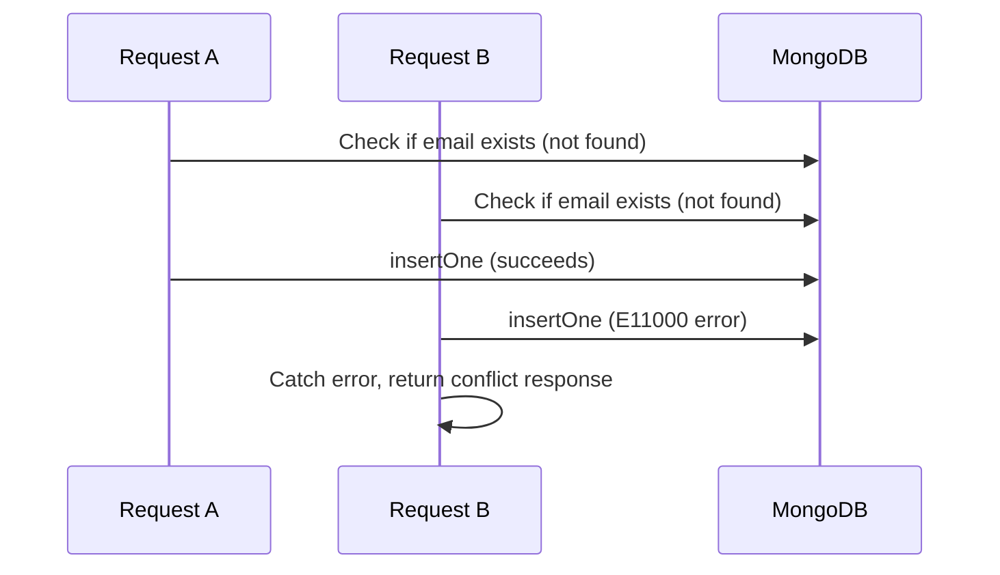

# How to Handle Duplicate Key Errors on Unique Indexes in MongoDB

MongoDB unique indexes enforce that no two documents in a collection share the same value for an indexed field. When an insert or update violates this constraint, MongoDB throws an `E11000 duplicate key error`. Understanding how to anticipate, catch, and recover from these errors is essential for building robust applications.

## What Causes Duplicate Key Errors

A duplicate key error occurs when you attempt to insert or update a document whose indexed field value already exists in the collection. This applies to single-field unique indexes, compound unique indexes, and the `_id` field (which is always unique).

```javascript
// Create a unique index on email
db.users.createIndex({ email: 1 }, { unique: true });

// First insert succeeds
db.users.insertOne({ email: "alice@example.com", name: "Alice" });

// Second insert throws E11000
db.users.insertOne({ email: "alice@example.com", name: "Alice Duplicate" });
// MongoServerError: E11000 duplicate key error collection: mydb.users
// index: email_1 dup key: { email: "alice@example.com" }
```

## Error Structure

The error object returned by the driver contains useful metadata for programmatic handling.

```javascript
try {
  await db.collection("users").insertOne({ email: "alice@example.com" });
} catch (err) {
  if (err.code === 11000) {
    console.log("Duplicate key violation");
    console.log("Key pattern:", err.keyPattern);  // { email: 1 }
    console.log("Key value:", err.keyValue);       // { email: "alice@example.com" }
  }
}
```

## Handling Errors in Node.js

Wrap write operations in try-catch blocks and check the error code.

```javascript
async function createUser(db, userData) {
  try {
    const result = await db.collection("users").insertOne(userData);
    return { success: true, id: result.insertedId };
  } catch (err) {
    if (err.code === 11000) {
      const field = Object.keys(err.keyPattern)[0];
      return { success: false, error: `A user with that ${field} already exists.` };
    }
    throw err;
  }
}
```

## Using updateOne with upsert

An `upsert` operation can silently handle duplicates by updating an existing document instead of inserting a new one.

```javascript
// Insert if not exists, update if exists
await db.collection("users").updateOne(
  { email: "alice@example.com" },
  { $set: { name: "Alice", updatedAt: new Date() } },
  { upsert: true }
);
```

The upsert uses the filter as the lookup key, so if the document exists it is updated rather than re-inserted, avoiding the duplicate error entirely.

## Using findOneAndUpdate for Atomic Check-and-Insert

For cases where you need the document back after ensuring uniqueness, use `findOneAndUpdate` with `upsert`.

```javascript
const result = await db.collection("users").findOneAndUpdate(
  { email: "alice@example.com" },
  {
    $setOnInsert: { email: "alice@example.com", name: "Alice", createdAt: new Date() }
  },
  { upsert: true, returnDocument: "after" }
);
```

`$setOnInsert` only applies fields when the document is newly created, leaving an existing document untouched.

## Bulk Write Error Handling

When using `bulkWrite`, set `ordered: false` to let MongoDB continue processing remaining operations even if some fail. Collect the write errors for inspection.

```javascript
const operations = users.map((user) => ({
  insertOne: { document: user }
}));

try {
  const result = await db.collection("users").bulkWrite(operations, { ordered: false });
  console.log("Inserted:", result.insertedCount);
} catch (err) {
  if (err.code === 65) { // BulkWriteError
    console.log("Some writes failed:");
    err.writeErrors.forEach((we) => {
      if (we.code === 11000) {
        console.log("Duplicate:", we.err.op);
      }
    });
    console.log("Successfully inserted:", err.result.nInserted);
  }
}
```

## Handling Race Conditions

In high-concurrency environments, two concurrent requests can both pass an application-level uniqueness check before either one inserts the document. Always rely on the database-level unique index rather than application-level checks.



The unique index is the only safe mechanism for enforcing uniqueness. Application-level checks only reduce the probability of conflicts -- they do not eliminate them.

## Compound Unique Index Duplicates

Compound unique indexes enforce uniqueness across a combination of fields.

```javascript
// Ensure a user can only have one active subscription per plan
db.subscriptions.createIndex(
  { userId: 1, planId: 1 },
  { unique: true }
);

// This pair already exists, so the following throws E11000
db.subscriptions.insertOne({ userId: ObjectId("..."), planId: "pro" });
```

The error keyPattern will show both fields: `{ userId: 1, planId: 1 }`.

## Sparse Unique Indexes and Null Values

By default, a unique index also enforces uniqueness on documents that are missing the indexed field (they are stored as `null`). A sparse unique index skips documents that do not contain the indexed field.

```javascript
// Allow many documents without an email field, but enforce uniqueness where present
db.users.createIndex({ email: 1 }, { unique: true, sparse: true });
```

Without `sparse: true`, only one document may omit the `email` field. With it, any number of documents may omit the field.

## Retry Logic for Transient Duplicates

In distributed systems using distributed IDs, rare hash collisions can produce transient duplicate key errors. Implement retry logic with exponential backoff.

```javascript
async function insertWithRetry(collection, doc, maxRetries = 3) {
  for (let attempt = 1; attempt <= maxRetries; attempt++) {
    try {
      return await collection.insertOne({ ...doc, _id: generateNewId() });
    } catch (err) {
      if (err.code === 11000 && attempt < maxRetries) {
        console.warn(`Duplicate _id on attempt ${attempt}, retrying...`);
        continue;
      }
      throw err;
    }
  }
}
```

## Summary

MongoDB unique indexes are enforced at the storage layer and cannot be bypassed by application code. Catch `E11000` errors by checking `err.code === 11000` and inspect `err.keyPattern` and `err.keyValue` to determine which constraint was violated. Use `upsert` or `findOneAndUpdate` with `$setOnInsert` for idempotent write patterns, and use `bulkWrite` with `ordered: false` for batch processing. Never rely solely on application-level uniqueness checks as a substitute for a database-level unique index.
