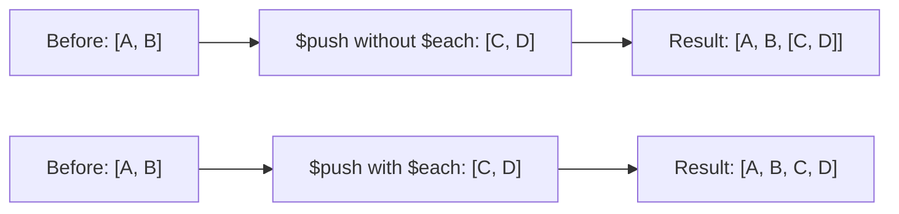

# How to Use $each with $push in MongoDB for Multiple Array Additions

Author: [nawazdhandala](https://www.github.com/nawazdhandala)

Tags: MongoDB, $each, $push, Array, Update, Operator

Description: Learn how to use MongoDB's $each modifier with $push to add multiple elements to an array in a single operation, and how to combine it with $slice, $sort, and $position.

---

## How $each Works with $push

Without `$each`, `$push` adds its argument as a single element - pushing an array would add the array as a nested array. The `$each` modifier tells MongoDB to iterate over the provided array and push each element individually.



## Syntax

```javascript
{
  $push: {
    arrayField: {
      $each: [value1, value2, ...],
      // optional modifiers:
      $slice: N,
      $sort: { field: 1 },
      $position: index
    }
  }
}
```

## Basic Usage - Pushing Multiple Values

Add multiple tags in a single update:

```javascript
// Before: { _id: 1, title: "My Post", tags: ["mongodb"] }

db.posts.updateOne(
  { _id: 1 },
  {
    $push: {
      tags: { $each: ["nosql", "database", "tutorial"] }
    }
  }
)

// After: { _id: 1, title: "My Post", tags: ["mongodb", "nosql", "database", "tutorial"] }
```

## Pushing Multiple Embedded Documents

```javascript
// Before: { _id: 2, userId: "user-123", notifications: [] }

db.users.updateOne(
  { _id: 2 },
  {
    $push: {
      notifications: {
        $each: [
          { type: "message", text: "You have a new message", read: false },
          { type: "alert", text: "Your subscription is expiring", read: false }
        ]
      }
    }
  }
)
```

## $each with $slice - Bounded Array

Combine `$each` and `$slice` to maintain a rolling window. Push new items and keep only the most recent N:

```javascript
// Keep only the last 5 activity entries
db.users.updateOne(
  { userId: "user-123" },
  {
    $push: {
      recentActivity: {
        $each: [
          { action: "login", at: new Date("2024-01-15T10:00:00Z") },
          { action: "purchase", at: new Date("2024-01-15T10:05:00Z") }
        ],
        $slice: -5
      }
    }
  }
)
```

Positive `$slice` keeps the first N; negative `$slice` keeps the last N.

## $each with $sort - Maintain Sorted Order

Push multiple elements and sort the entire array after insertion:

```javascript
// Before: { _id: 3, scores: [{ player: "Bob", score: 700 }] }

db.leaderboard.updateOne(
  { _id: 3 },
  {
    $push: {
      scores: {
        $each: [
          { player: "Alice", score: 850 },
          { player: "Carol", score: 620 }
        ],
        $sort: { score: -1 }
      }
    }
  }
)

// After: scores sorted descending: [Alice:850, Bob:700, Carol:620]
```

## $each with $position - Insert at Specific Index

```javascript
// Before: { _id: 4, steps: ["step2", "step3"] }

db.tutorials.updateOne(
  { _id: 4 },
  {
    $push: {
      steps: {
        $each: ["step0", "step1"],
        $position: 0
      }
    }
  }
)

// After: { steps: ["step0", "step1", "step2", "step3"] }
```

## Combining All Modifiers

All four modifiers can be used together:

```javascript
db.game.updateOne(
  { gameId: "game-001" },
  {
    $push: {
      topScores: {
        $each: [
          { player: "NewPlayer", score: 950 },
          { player: "AnotherPlayer", score: 875 }
        ],
        $sort: { score: -1 },  // sort descending by score
        $slice: 10,            // keep top 10 only
        $position: 0           // insert at beginning before sorting
      }
    }
  }
)
```

Note: `$position` is applied first, then `$sort`, then `$slice`.

## $each with $addToSet for Unique Batch Additions

`$each` also works with `$addToSet` to add multiple unique values:

```javascript
db.users.updateOne(
  { _id: 5 },
  {
    $addToSet: {
      roles: { $each: ["admin", "editor", "admin"] }
    }
  }
)
// "admin" appears only once in the result
```

## Use Cases

- Bulk-adding notifications to a user's inbox
- Appending multiple log entries in one operation
- Updating a leaderboard with multiple new scores and keeping it sorted and capped
- Prepending ordered steps to a workflow array
- Adding multiple tags or categories to content items

## Summary

`$each` is a modifier for `$push` and `$addToSet` that enables pushing multiple values in a single update operation. Without `$each`, pushing an array value would nest the array as a single element. Combine `$each` with `$slice` to maintain bounded arrays, `$sort` to keep arrays sorted after insertion, and `$position` to control where elements are inserted. All three modifiers can be combined in one operation, applied in the order: position, sort, slice.
