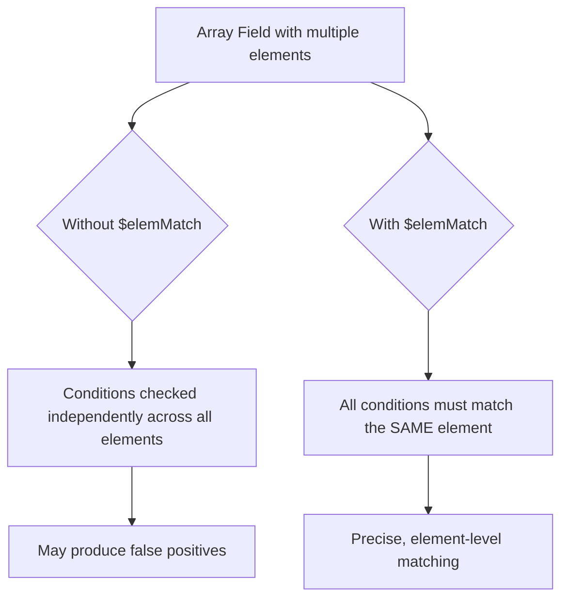

# How to Use $elemMatch in MongoDB for Array Field Queries

Author: [nawazdhandala](https://www.github.com/nawazdhandala)

Tags: MongoDB, $elemMatch, Array, Query, Operator

Description: Learn how to use MongoDB's $elemMatch operator to query documents where at least one array element satisfies multiple conditions simultaneously.

---

## How $elemMatch Works

When you query an array field in MongoDB with multiple conditions, those conditions are evaluated independently across all elements of the array. The `$elemMatch` operator changes this behavior by requiring a single array element to satisfy all specified conditions at the same time.



## Why $elemMatch is Necessary

Consider a document with an array of scores:

```javascript
// Document
{ _id: 1, scores: [{ subject: "Math", score: 85 }, { subject: "English", score: 55 }] }
```

Without `$elemMatch`, this query matches the document even though no single element has both conditions true:

```javascript
// Incorrectly matches - 85 satisfies $gt:80 from Math, 55 satisfies $lt:60 from English
db.students.find({
  "scores.score": { $gt: 80 },
  "scores.score": { $lt: 60 }
})
```

With `$elemMatch`, only one element must satisfy both conditions:

```javascript
// Correctly requires a SINGLE element to have score > 80 AND < 60 (impossible here)
db.students.find({
  scores: { $elemMatch: { score: { $gt: 80 }, score: { $lt: 60 } } }
})
```

## Syntax

```javascript
{ field: { $elemMatch: { <condition1>, <condition2>, ... } } }
```

## Basic Example - Querying Embedded Objects in Arrays

Find students who have a passing score in Math:

```javascript
// Sample documents
db.students.insertMany([
  {
    name: "Alice",
    grades: [
      { subject: "Math", score: 92 },
      { subject: "English", score: 78 }
    ]
  },
  {
    name: "Bob",
    grades: [
      { subject: "Math", score: 55 },
      { subject: "English", score: 88 }
    ]
  }
])

// Find students with a Math score above 80
db.students.find({
  grades: {
    $elemMatch: { subject: "Math", score: { $gt: 80 } }
  }
})
// Returns Alice
```

## Querying Arrays of Simple Values

For arrays of scalar values, `$elemMatch` can apply multiple conditions to a single element:

```javascript
// Find documents where at least one value in the scores array
// is both greater than 60 and less than 80
db.results.find({
  scores: { $elemMatch: { $gt: 60, $lt: 80 } }
})
```

## Using $elemMatch in Projection

`$elemMatch` can also be used in the projection stage to return only the first matching array element:

```javascript
// Return only the Math grade for each student
db.students.find(
  { "grades.subject": "Math" },
  {
    name: 1,
    grades: { $elemMatch: { subject: "Math" } }
  }
)
```

Result:

```javascript
{
  _id: ObjectId("..."),
  name: "Alice",
  grades: [{ subject: "Math", score: 92 }]
}
```

## Nested Array Queries

```javascript
// Find orders with at least one item costing more than $100 with quantity > 2
db.orders.find({
  items: {
    $elemMatch: {
      price: { $gt: 100 },
      quantity: { $gt: 2 }
    }
  }
})
```

## $elemMatch with Logical Operators Inside

```javascript
// Find students with any grade that is either below 50 or above 95
db.students.find({
  grades: {
    $elemMatch: {
      score: {
        $or: [{ $lt: 50 }, { $gt: 95 }]
      }
    }
  }
})
```

## When $elemMatch is Not Needed

If you only have one condition on an array field, `$elemMatch` is not necessary:

```javascript
// Single condition - no need for $elemMatch
db.students.find({ "grades.score": { $gt: 80 } })

// Equivalent with $elemMatch (unnecessary verbosity)
db.students.find({ grades: { $elemMatch: { score: { $gt: 80 } } } })
```

## Use Cases

- Finding students with a failing score in a specific subject
- Locating orders with items above a certain price AND quantity
- Querying log entries where severity and timestamp match in the same entry
- Filtering users with a specific permission level in their role array
- Checking inventory records where a batch has both low stock and a near expiry date

## Summary

`$elemMatch` is essential when you need to match multiple conditions against the same array element. Without it, MongoDB evaluates each condition independently across all array elements, which can produce false positives. Use `$elemMatch` in your query filter when working with arrays of objects, and also in projections to return only the first matching array element. When you have only a single condition on an array field, `$elemMatch` is not required.
