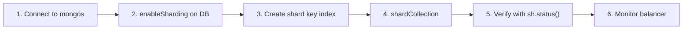

# How to Enable Sharding on a Database and Collection in MongoDB

Author: [OneUptime](https://www.github.com/oneuptime)

Tags: MongoDB, Sharding, Collection, Database, Scalability

Description: Learn how to enable sharding on a MongoDB database and collection, choose the right shard key, and verify chunk distribution across shards.

---

## Introduction

Sharding in MongoDB distributes data across multiple shards. Before a collection can be sharded, you must enable sharding on its database. Choosing the right shard key is the most important decision - it affects data distribution, query routing, and cluster performance.

## Sharding Workflow



## Prerequisites

- A running sharded cluster with mongos and at least one shard
- The data you want to shard should have a field suitable for a shard key
- Connect to mongos (not directly to a shard)

## Step 1: Enable Sharding on the Database

```javascript
// Connect to mongos
use admin
db.adminCommand({ enableSharding: "ecommerce" })
```

Verify:

```javascript
use config
db.databases.find({ _id: "ecommerce" }).pretty()
// Look for: "partitioned": true
```

## Step 2: Choosing a Shard Key

The shard key determines how MongoDB splits and distributes data. Key considerations:

| Shard Key Type | Pros | Cons |
|---|---|---|
| High-cardinality field | Even distribution | May cause scatter-gather queries |
| Compound key | Flexible routing | More complex queries |
| Hashed key | Very even distribution | Range queries always scatter |
| Monotonically increasing (e.g., timestamp) | Simple | Hot shard problem |

## Step 3: Create an Index on the Shard Key

MongoDB requires an index (or a compound index prefix) matching the shard key before sharding the collection:

```javascript
use ecommerce

// Example 1: Range-based sharding on customerId
db.orders.createIndex({ customerId: 1 })

// Example 2: Compound shard key
db.orders.createIndex({ region: 1, customerId: 1 })

// Example 3: Hashed shard key (creates the index automatically in shardCollection)
db.orders.createIndex({ _id: "hashed" })
```

## Step 4: Shard the Collection

```javascript
// Range-based on a single field
db.adminCommand({
  shardCollection: "ecommerce.orders",
  key: { customerId: 1 }
})

// Hashed sharding for even distribution
db.adminCommand({
  shardCollection: "ecommerce.events",
  key: { _id: "hashed" }
})

// Compound shard key with zone support
db.adminCommand({
  shardCollection: "ecommerce.products",
  key: { region: 1, productId: 1 }
})
```

## Step 5: Verify Sharding Is Enabled

```javascript
sh.status()
```

Look for the collection under the database section:

```
databases:
  {  "_id" : "ecommerce",  "primary" : "rs-shard1",  "partitioned" : true }
    ecommerce.orders
      shard key: { "customerId" : 1 }
      chunks:
        rs-shard1    2
        rs-shard2    2
      ...
```

Check the number of chunks:

```javascript
use config
db.chunks.countDocuments({ ns: "ecommerce.orders" })
```

## Step 6: Pre-splitting Chunks (Optional)

For large existing datasets, pre-split chunks to avoid an initial imbalance:

```javascript
// Split at specific shard key values
for (var i = 0; i < 10; i++) {
  db.adminCommand({
    split: "ecommerce.orders",
    middle: { customerId: "CUST-" + (i * 10000) }
  })
}
```

Then move chunks to specific shards:

```javascript
db.adminCommand({
  moveChunk: "ecommerce.orders",
  find: { customerId: "CUST-0" },
  to: "rs-shard2"
})
```

## Step 7: Verify Query Routing

Use `explain()` to confirm that targeted queries use the shard key and do not scatter:

```javascript
db.orders.find({ customerId: "CUST-12345" }).explain("executionStats")
// Look for: "winningPlan.stage" === "SINGLE_SHARD" (targeted)
// Avoid: "SHARD_MERGE" with many shards (scatter-gather)
```

## Step 8: Monitor Chunk Distribution

```javascript
// Chunks per shard
use config
db.chunks.aggregate([
  { $match: { ns: "ecommerce.orders" } },
  { $group: { _id: "$shard", count: { $sum: 1 } } },
  { $sort: { count: -1 } }
])

// Check balancer history
db.changelog.find({
  what: { $in: ["moveChunk.from", "moveChunk.to"] },
  ns: "ecommerce.orders"
}).sort({ time: -1 }).limit(10)
```

## Disabling Sharding for a Collection (Unshard)

MongoDB 6.0+ supports unsharding a collection:

```javascript
// MongoDB 6.0+
db.adminCommand({
  unshardCollection: "ecommerce.orders",
  toShard: "rs-shard1"
})
```

## Summary

To shard a MongoDB collection: first enable sharding on the database with `enableSharding`, create an index on your chosen shard key fields, then run `shardCollection`. Use hashed shard keys for even distribution when range queries are not critical, and compound keys for workloads that benefit from zone-based data routing. Always verify distribution with `sh.status()` and use `explain()` to confirm queries are targeted rather than scatter-gather.
