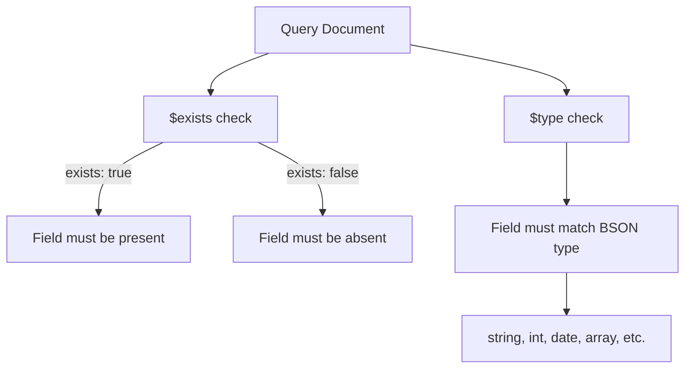

# How to Use $exists and $type Operators in MongoDB

Author: [nawazdhandala](https://www.github.com/nawazdhandala)

Tags: MongoDB, $exists, $type, Query, Operator, Schema

Description: Learn how to use MongoDB's $exists and $type operators to query documents based on field presence and BSON data type for flexible schema validation queries.

---

## How $exists and $type Work

MongoDB's flexible schema means documents in the same collection can have different fields and different data types for the same field. The `$exists` operator lets you query documents based on whether a field is present or absent. The `$type` operator filters documents based on the BSON data type of a field's value.



## $exists Operator

### Syntax

```javascript
{ field: { $exists: <boolean> } }
```

`$exists: true` matches documents that contain the field, even if the field's value is `null`. `$exists: false` matches documents that do not contain the field.

### Finding Documents Where a Field Exists

```javascript
// Find users who have a phone number on file
db.users.find({ phone: { $exists: true } })

// Find orders that have been shipped (have a shippedAt timestamp)
db.orders.find({ shippedAt: { $exists: true } })
```

### Finding Documents Where a Field is Missing

```javascript
// Find users missing a profile photo
db.users.find({ profilePhoto: { $exists: false } })

// Find products without a discount price
db.products.find({ discountPrice: { $exists: false } })
```

### $exists vs Null Check

There is an important difference between `$exists: false` and checking for null:

```javascript
// { _id: 1, name: "Alice", phone: null }  - has phone field, value is null
// { _id: 2, name: "Bob" }                 - no phone field at all

// Matches BOTH documents (phone is null OR phone doesn't exist)
db.users.find({ phone: null })

// Matches ONLY the document without a phone field
db.users.find({ phone: { $exists: false } })

// Matches ONLY the document where phone is null
db.users.find({ phone: { $exists: true, $eq: null } })
```

## $type Operator

### Syntax

```javascript
{ field: { $type: <BSON type> } }
```

You can specify the type by number or alias string.

### Common BSON Type Aliases

```text
Type        | Alias String  | Number
------------|---------------|-------
Double      | "double"      | 1
String      | "string"      | 2
Object      | "object"      | 3
Array       | "array"       | 4
Binary      | "binData"     | 5
ObjectId    | "objectId"    | 7
Boolean     | "bool"        | 8
Date        | "date"        | 9
Null        | "null"        | 10
RegEx       | "regex"       | 11
Int32       | "int"         | 16
Int64       | "long"        | 18
Decimal128  | "decimal"     | 19
```

### Querying by Type

```javascript
// Find documents where price is stored as a string (data quality issue)
db.products.find({ price: { $type: "string" } })

// Find documents where age is an integer
db.users.find({ age: { $type: "int" } })

// Find documents where tags is an array
db.articles.find({ tags: { $type: "array" } })

// Find documents where createdAt is a proper Date type
db.events.find({ createdAt: { $type: "date" } })
```

### Using Numeric Type Codes

```javascript
// 2 = string type
db.products.find({ price: { $type: 2 } })
```

### $type with Multiple Types

Pass an array to match any of the specified types:

```javascript
// Match fields that are either int or double (any numeric)
db.products.find({ quantity: { $type: ["int", "double"] } })

// Use the "number" alias to match all numeric types
db.products.find({ price: { $type: "number" } })
```

## Combining $exists and $type

```javascript
// Find documents where phone exists AND is a string
db.users.find({
  phone: { $exists: true, $type: "string" }
})
```

## Practical Use Case - Data Quality Audits

Find documents with inconsistent field types after a migration:

```javascript
// Audit: find all products where price was accidentally stored as string
const badPrices = db.products.find({
  price: { $type: "string" }
}).toArray()

print(`Found ${badPrices.length} products with string price values`)
badPrices.forEach(p => print(`ID: ${p._id}, price: "${p.price}"`))
```

## Use Cases

- Data quality audits to find type inconsistencies
- Schema validation queries before migrations
- Finding partially filled documents missing optional fields
- Detecting null vs missing field distinctions
- Filtering arrays vs scalar values on polymorphic fields

## Summary

`$exists` and `$type` are powerful tools for querying MongoDB's schema-flexible documents. Use `$exists: true` to find documents containing a field and `$exists: false` to find documents missing one, keeping in mind that `$exists: true` also matches fields with null values. Use `$type` to filter by BSON data type, which is invaluable for data quality audits and schema validation. You can pass an array of types to `$type` or use the special `"number"` alias to match all numeric types.
