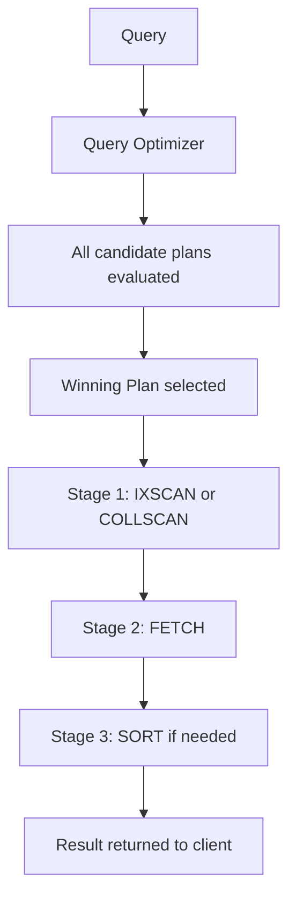

# How to Use MongoDB Explain Plans to Optimize Queries

Author: [nawazdhandala](https://www.github.com/nawazdhandala)

Tags: MongoDB, Query Optimization, Explain Plan, Index, Performance

Description: Learn how to read and interpret MongoDB explain() output to identify collection scans, evaluate index usage, and optimize queries for better performance.

---

## What is an Explain Plan

An explain plan shows how MongoDB executes a query: which indexes it uses (if any), how many documents it examines, and how long each stage takes. It is the primary tool for diagnosing slow queries and validating that indexes are being used correctly.



## The Three Explain Verbosity Modes

```javascript
// queryPlanner (default) - shows the winning plan but does not run the query
db.orders.find({ status: "pending" }).explain("queryPlanner")

// executionStats - runs the query and shows timing and document counts
db.orders.find({ status: "pending" }).explain("executionStats")

// allPlansExecution - runs the query and shows stats for all candidate plans
db.orders.find({ status: "pending" }).explain("allPlansExecution")
```

Use `executionStats` in most cases - it gives real timing data while running the query.

## Reading a queryPlanner Result

The key section is `winningPlan`:

```javascript
db.orders.find({ status: "pending", customerId: "c123" }).explain("queryPlanner").queryPlanner.winningPlan
```

Output with no index (bad):

```text
{
  stage: "COLLSCAN",
  filter: { status: { $eq: "pending" }, customerId: { $eq: "c123" } },
  direction: "forward"
}
```

Output with an index (good):

```text
{
  stage: "FETCH",
  filter: { status: { $eq: "pending" } },
  inputStage: {
    stage: "IXSCAN",
    keyPattern: { customerId: 1, status: 1 },
    indexName: "customerId_1_status_1",
    direction: "forward",
    indexBounds: {
      customerId: ["[\"c123\", \"c123\"]"],
      status: ["[\"pending\", \"pending\"]"]
    }
  }
}
```

Stage glossary:

| Stage | Meaning |
|-------|---------|
| `COLLSCAN` | Full collection scan - no index used |
| `IXSCAN` | Index scan - an index was used |
| `FETCH` | Fetching documents from collection after an index scan |
| `SORT` | In-memory sort - may indicate a missing sort index |
| `SORT_MERGE` | Merging sorted streams - used for index intersection |
| `PROJECTION_COVERED` | Query answered entirely from index (no FETCH needed) |
| `SHARD_MERGE` | Merging results from multiple shards |

## Reading executionStats

```javascript
const exp = db.orders.find({ status: "pending" }).explain("executionStats");
const stats = exp.executionStats;

print("Execution time (ms):    " + stats.executionTimeMillis);
print("Documents returned:     " + stats.nReturned);
print("Documents examined:     " + stats.totalDocsExamined);
print("Index keys examined:    " + stats.totalKeysExamined);
print("Winning plan stage:     " + stats.executionStages.stage);
```

## Key Metrics to Evaluate

### Examine-to-Return Ratio

The ratio of `totalDocsExamined` to `nReturned` shows how efficient the query is.

- Ratio = 1 : perfect (every document examined is returned)
- Ratio = 1000 : very inefficient (examines 1000 documents to return 1)

```javascript
const ratio = stats.totalDocsExamined / Math.max(stats.nReturned, 1);
print("Examine-to-return ratio: " + ratio.toFixed(1));
if (ratio > 10) print("WARNING: Consider adding an index");
```

### Execution Time

High execution time with a low ratio means the query is slow even with an index. Check for:
- SORT stage without an index sort
- Very large result set
- Index not covering the query (requires FETCH from disk)

### Index Keys Examined vs Documents Returned

`totalKeysExamined` should be close to `nReturned`. A high key-to-return ratio means the index is not very selective for this query.

## Common Patterns and Fixes

### Pattern 1: COLLSCAN on a filtered field

```javascript
db.orders.find({ status: "pending" }).explain("executionStats")
// Shows: stage: "COLLSCAN", totalDocsExamined: 500000, nReturned: 1200

// Fix: create an index
db.orders.createIndex({ status: 1 })
```

### Pattern 2: SORT without an index

```javascript
db.orders.find({ customerId: "c123" }).sort({ createdAt: -1 }).explain("executionStats")
// Shows: SORT stage in the plan (in-memory sort)

// Fix: create an index that supports both the filter and the sort
db.orders.createIndex({ customerId: 1, createdAt: -1 })
```

### Pattern 3: Covered query (no FETCH)

A covered query is served entirely from the index without touching documents. This is the fastest possible query.

```javascript
// Create a covering index
db.orders.createIndex({ status: 1, customerId: 1, total: 1 })

// Query only fields in the index, with matching projection
db.orders.find(
  { status: "pending" },
  { customerId: 1, total: 1, _id: 0 }  // exclude _id to avoid FETCH
).explain("queryPlanner")
// Should show: stage: "PROJECTION_COVERED" with IXSCAN, no FETCH
```

### Pattern 4: Index intersection vs compound index

MongoDB can intersect two indexes but a compound index is almost always faster:

```javascript
// Two separate indexes MongoDB might intersect:
db.orders.createIndex({ status: 1 })
db.orders.createIndex({ customerId: 1 })

// Better: one compound index
db.orders.createIndex({ status: 1, customerId: 1 })
```

## Explaining Aggregation Pipelines

```javascript
db.orders.explain("executionStats").aggregate([
  { $match: { status: "pending" } },
  { $group: { _id: "$customerId", total: { $sum: "$amount" } } }
])
```

Look for `COLLSCAN` in the `$match` stage - adding an index on `status` will speed up the `$match`.

## Explain in Node.js

```javascript
const plan = await db.collection("orders")
  .find({ status: "pending" })
  .explain("executionStats");

const stats = plan.executionStats;
console.log("nReturned:", stats.nReturned);
console.log("totalDocsExamined:", stats.totalDocsExamined);
console.log("executionTimeMillis:", stats.executionTimeMillis);
console.log("winningPlan stage:", stats.executionStages.stage);
```

## Checking Index Usage Over Time

See which indexes are being used:

```javascript
db.orders.aggregate([{ $indexStats: {} }])
```

Output:

```text
[
  { name: "status_1", accesses: { ops: 124567, since: ISODate("2026-01-01") } },
  { name: "customerId_1_createdAt_-1", accesses: { ops: 45231, since: ISODate("2026-01-01") } },
  { name: "old_unused_index", accesses: { ops: 0, since: ISODate("2026-01-01") } }
]
```

Drop indexes with zero accesses to reduce write overhead:

```javascript
db.orders.dropIndex("old_unused_index")
```

## Best Practices

- Always run `explain("executionStats")` on any query that appears in the slow query log.
- Target a examine-to-return ratio of 1:1 or as close to it as possible.
- A `SORT` stage is acceptable for small datasets but becomes a bottleneck as data grows.
- Create compound indexes that match the ESR rule: Equality, Sort, Range fields in that order.
- Use `$indexStats` to identify unused indexes and drop them.
- Test explain plans in staging with production-like data volumes.

## Summary

MongoDB's `explain("executionStats")` reveals how queries execute. Look for `COLLSCAN` (add an index), `SORT` without an index (add a sort-supporting compound index), and high `totalDocsExamined/nReturned` ratios (improve index selectivity). Covered queries (served entirely from the index) are the fastest. Use `$indexStats` to audit index usage and drop unused indexes to reduce write overhead.
