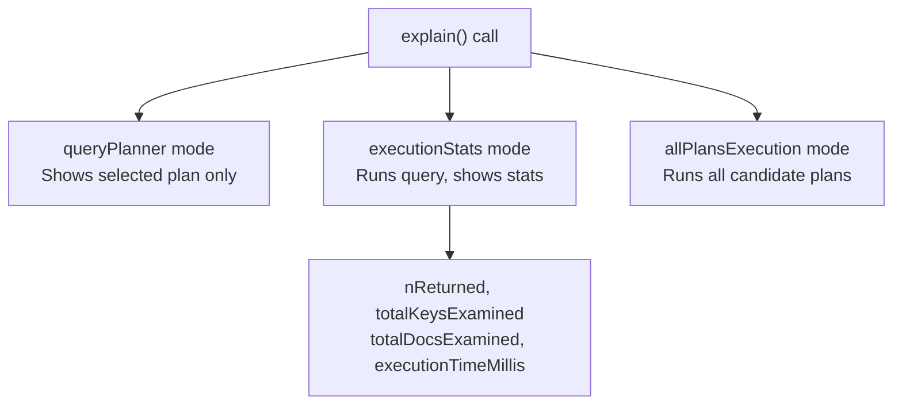

# How to Use explain() in MongoDB to Analyze Query Performance

Author: [nawazdhandala](https://www.github.com/nawazdhandala)

Tags: MongoDB, Performance, Query Optimization, EXPLAIN, Index

Description: Learn how to use MongoDB's explain() method to analyze query execution plans, identify missing indexes, and optimize slow queries with actionable metrics.

---

## How explain() Works

`explain()` returns detailed information about how MongoDB executes a query. It shows which index is used, how many documents and keys were examined, execution time, and the stages the query went through.

Three verbosity modes are available:

- `"queryPlanner"` (default) - Shows the winning plan chosen by the query planner, without executing the query.
- `"executionStats"` - Executes the query and returns runtime statistics.
- `"allPlansExecution"` - Executes the query and returns stats for all candidate plans considered.



## Syntax

```javascript
// On a find cursor
db.collection.find(filter).explain(verbosity)

// On an aggregate pipeline
db.collection.explain(verbosity).aggregate(pipeline)

// On a count or update
db.collection.explain(verbosity).count(filter)
db.collection.explain(verbosity).update(filter, update)
```

## Key Fields to Look For

After running `explain("executionStats")`, examine these fields:

```text
Field                       What to Look For
----------------------------------------------------------------------
winningPlan.stage           IXSCAN (good) vs COLLSCAN (bad)
nReturned                   Number of documents returned
totalKeysExamined           Should be close to nReturned
totalDocsExamined           Should be close to nReturned
executionTimeMillis         Query execution time in ms
indexName                   Which index was used
```

A low selectivity index or a missing index shows `totalDocsExamined >> nReturned`, meaning MongoDB examined many documents to find few matches.

## Examples

### Basic Query Planner

```javascript
db.orders.find({ status: "active" }).explain()
```

Look for the `winningPlan` in the output:

```javascript
{
  "queryPlanner": {
    "winningPlan": {
      "stage": "COLLSCAN",  // No index used
      "filter": { "status": { "$eq": "active" } }
    }
  }
}
```

A `COLLSCAN` means MongoDB scanned the entire collection. Create an index to fix this.

### Execution Stats

```javascript
db.orders.find({ status: "active" }).explain("executionStats")
```

Sample output after adding an index:

```javascript
{
  "executionStats": {
    "nReturned": 150,
    "executionTimeMillis": 2,
    "totalKeysExamined": 150,
    "totalDocsExamined": 150,
    "executionStages": {
      "stage": "FETCH",
      "inputStage": {
        "stage": "IXSCAN",
        "indexName": "status_1",
        "keysExamined": 150
      }
    }
  }
}
```

Here `nReturned` equals `totalKeysExamined` and `totalDocsExamined` - a well-optimized query.

### Detecting a Missing Index

Before adding an index:

```javascript
db.users.createIndex({})  // no index on email

db.users.find({ email: "alice@example.com" }).explain("executionStats")
```

Output shows a collection scan:

```javascript
{
  "executionStats": {
    "nReturned": 1,
    "totalDocsExamined": 100000,  // scanned all 100K documents
    "executionStages": {
      "stage": "COLLSCAN"
    }
  }
}
```

After creating the index:

```javascript
db.users.createIndex({ email: 1 })
db.users.find({ email: "alice@example.com" }).explain("executionStats")
```

Now the index is used and `totalDocsExamined` drops to 1.

### Analyzing Aggregation Pipeline Performance

```javascript
db.orders.explain("executionStats").aggregate([
  { $match: { status: "shipped", customerId: "cust_001" } },
  { $group: { _id: "$productId", total: { $sum: "$amount" } } }
])
```

Look for the `$cursor` stage within `stages` to see which index was used for the `$match` filter.

### All Plans Execution

```javascript
db.products.find({ category: "electronics", price: { $lt: 500 } })
  .explain("allPlansExecution")
```

This shows every candidate index plan MongoDB considered and why it chose the winning plan. Useful for understanding why MongoDB picks one index over another.

### Node.js Example

```javascript
const { MongoClient } = require("mongodb");

async function analyzeQuery() {
  const client = new MongoClient("mongodb://localhost:27017");
  await client.connect();

  const orders = client.db("shop").collection("orders");

  // Create sample index
  await orders.createIndex({ status: 1, createdAt: -1 });

  // Analyze query
  const plan = await orders.find({
    status: "active"
  }).sort({ createdAt: -1 }).explain("executionStats");

  const stats = plan.executionStats;
  console.log("Execution time (ms):", stats.executionTimeMillis);
  console.log("Documents returned:", stats.nReturned);
  console.log("Documents examined:", stats.totalDocsExamined);
  console.log("Keys examined:", stats.totalKeysExamined);

  const winningStage = plan.queryPlanner.winningPlan;
  console.log("Winning plan stage:", winningStage.stage);

  // Helper to find IXSCAN or COLLSCAN in nested plan
  function findStage(plan, stageName) {
    if (!plan) return null;
    if (plan.stage === stageName) return plan;
    return findStage(plan.inputStage, stageName) ||
           (plan.inputStages || []).reduce((found, s) => found || findStage(s, stageName), null);
  }

  const ixscan = findStage(winningStage, "IXSCAN");
  if (ixscan) {
    console.log("Index used:", ixscan.indexName);
  } else {
    console.log("WARNING: No index used (COLLSCAN)");
  }

  await client.close();
}

analyzeQuery().catch(console.error);
```

### Reading Execution Stages

Common stage types in `explain()` output:

```text
Stage         Meaning
-----------------------------------------
COLLSCAN      Full collection scan (no index)
IXSCAN        Index scan (good)
FETCH         Fetch documents using index results
SORT          In-memory sort (no index for sort)
SORT_KEY_GENERATOR  Sort using index (efficient)
PROJECTION_COVERED  Covered query - no doc fetch needed
PROJECTION_DEFAULT  Projection from fetched documents
EOF           End of file - no results
```

## Common Diagnoses

```text
Symptom                           Diagnosis
-------------------------------------------------
COLLSCAN                          Add an index on filter fields
totalDocsExamined >> nReturned    Poor index selectivity
SORT stage (not SORT_KEY_GENERATOR)  Add sort field to index
executionTimeMillis is high       Check all of the above
IXSCAN but still slow             Index may not be selective enough
```

## Best Practices

- **Run `explain("executionStats")`** on every new query in development to verify index usage.
- **Target `totalDocsExamined / nReturned` close to 1.** A ratio much higher than 1 indicates poor index selection.
- **Watch for `SORT` stages.** An in-memory sort means your index does not cover the sort direction; add the sort field to the index.
- **Use `allPlansExecution`** when the query planner is choosing a suboptimal index to understand why.
- **Monitor slow queries in production** with the MongoDB profiler (`db.setProfilingLevel(1, { slowms: 100 })`).
- **Re-run `explain()` after adding indexes** to confirm the planner picks the new index.

## Summary

`explain()` is MongoDB's query analysis tool. Run it with `"executionStats"` verbosity to see which index is used, how many documents were examined versus returned, and total execution time. A healthy query shows `IXSCAN` in the winning plan with `totalDocsExamined` close to `nReturned`. A `COLLSCAN` or a high examination-to-return ratio signals a missing or suboptimal index.
