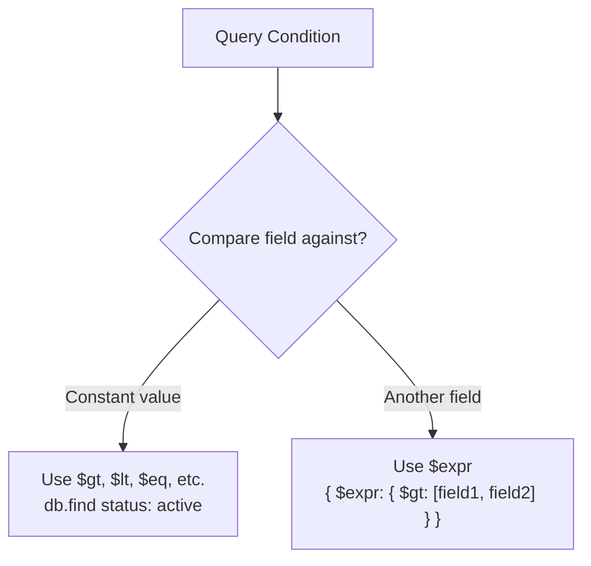
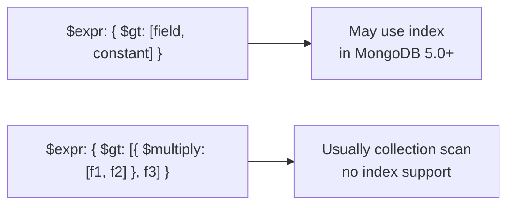

# How to Use $expr to Compare Two Fields in the Same Document

Author: [nawazdhandala](https://www.github.com/nawazdhandala)

Tags: MongoDB, $expr, Query, Aggregation, Operator

Description: Learn how to use MongoDB's $expr operator to write query conditions that compare two fields within the same document using aggregation expressions.

---

## Overview

Standard MongoDB query operators like `$gt`, `$lt`, and `$eq` compare a field against a constant value. They cannot compare one field against another field in the same document. The `$expr` operator solves this by allowing aggregation expressions inside a query filter.



## Syntax

```javascript
{ $expr: { <aggregation expression> } }
```

The aggregation expression inside `$expr` must evaluate to a boolean. When it evaluates to `true`, the document matches.

## Basic Examples

### Find Documents Where One Field Is Greater Than Another

```javascript
// Find orders where the actual amount exceeds the quoted amount
db.orders.find({
  $expr: { $gt: ["$actualAmount", "$quotedAmount"] }
})
```

Field names inside `$expr` aggregation expressions are referenced with a `$` prefix and quoted as strings.

### Find Documents Where Two Fields Are Equal

```javascript
// Find users whose username equals their email prefix
db.users.find({
  $expr: { $eq: ["$username", "$emailAlias"] }
})
```

### Find Documents Where One Date Is Before Another

```javascript
// Find tasks completed before their due date
db.tasks.find({
  $expr: { $lt: ["$completedAt", "$dueAt"] }
})
```

## Combining $expr with Other Operators

### $expr Inside $and

```javascript
// Orders where discount is applied AND actual total is less than budget
db.orders.find({
  $and: [
    { discountApplied: true },
    { $expr: { $lt: ["$totalAfterDiscount", "$budget"] } }
  ]
})
```

### $expr with Arithmetic

Use arithmetic aggregation operators inside `$expr` to create derived comparisons:

```javascript
// Find products where (price * quantity) exceeds totalRevenue
db.products.find({
  $expr: {
    $gt: [
      { $multiply: ["$price", "$quantity"] },
      "$totalRevenue"
    ]
  }
})
```

### $expr with String Comparison

```javascript
// Find documents where the firstName field comes alphabetically before lastName
db.contacts.find({
  $expr: { $lt: ["$firstName", "$lastName"] }
})
```

## Real-World Examples

### Overdue Orders

Find orders where `shippedAt` is null or `shippedAt` is after `expectedDelivery`:

```javascript
db.orders.find({
  $expr: {
    $gt: ["$shippedAt", "$expectedDelivery"]
  }
})
```

### Budget Exceeded

Find projects where `actualCost` exceeds `budget`:

```javascript
db.projects.find({
  $expr: { $gt: ["$actualCost", "$budget"] }
})
```

### Stock Below Reorder Point

```javascript
db.inventory.find({
  $expr: { $lte: ["$currentStock", "$reorderPoint"] }
})
```

## Using $expr in Aggregation

`$expr` can also be used in aggregation `$match` stages:

```javascript
db.orders.aggregate([
  {
    $match: {
      $expr: { $gt: ["$actualAmount", "$quotedAmount"] }
    }
  },
  {
    $project: {
      orderId: 1,
      overcharge: { $subtract: ["$actualAmount", "$quotedAmount"] }
    }
  }
])
```

## $expr with Conditional Logic

```javascript
// Match documents where price is lower than msrp only if inStock is true
db.products.find({
  $expr: {
    $and: [
      { $eq: ["$inStock", true] },
      { $lt: ["$price", "$msrp"] }
    ]
  }
})
```

## Index Usage with $expr

`$expr` queries can use indexes in MongoDB 5.0+ for simple comparisons involving a single indexed field. However, complex `$expr` expressions with arithmetic operators often cannot use indexes and may require a collection scan.



For queries that must be fast on large collections, consider storing the computed value as a separate field and indexing that field.

## Comparison: $expr vs JavaScript $where

| Feature | $expr | $where |
|---|---|---|
| Uses aggregation expressions | Yes | No |
| Index use | Partial (MongoDB 5.0+) | No |
| Performance | Good | Slow (JavaScript eval) |
| Recommended | Yes | No (deprecated pattern) |

## Summary

The `$expr` operator allows you to compare two fields within the same document inside a `find()` or aggregation `$match` filter. It accepts any aggregation expression and supports arithmetic, date, string, and conditional operations. Use `$expr` when standard query operators are insufficient because they only support constant comparisons. For best performance, keep `$expr` expressions simple and index the fields involved where possible.
