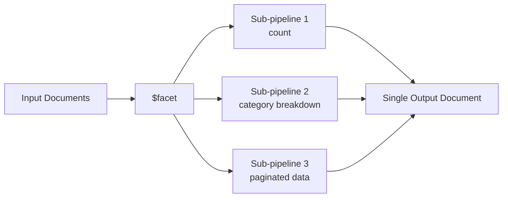

# How to Use $facet in MongoDB Aggregation for Multi-Faceted Queries

Author: [nawazdhandala](https://www.github.com/nawazdhandala)

Tags: MongoDB, Aggregation, $facet, Pipeline, Stage, Facet

Description: Learn how to use $facet in MongoDB aggregation to run multiple sub-pipelines on the same set of input documents and return combined results.

---

## How $facet Works

The `$facet` stage processes multiple aggregation pipelines within a single stage on the same set of input documents. Each sub-pipeline has its own field in the output document containing its results as an array. This is ideal for building faceted search pages where you need counts, ranges, and paginated results in a single database round trip.



## Syntax

```javascript
{
  $facet: {
    <outputField1>: [ <pipeline stage>, ... ],
    <outputField2>: [ <pipeline stage>, ... ],
    ...
  }
}
```

Each sub-pipeline receives the same input documents from the stage preceding `$facet`. Sub-pipelines cannot include `$facet`, `$out`, or `$merge` stages.

## Examples

### Input Documents

```javascript
[
  { _id: 1, name: "Laptop",  category: "Electronics", price: 1200, inStock: true  },
  { _id: 2, name: "Phone",   category: "Electronics", price: 800,  inStock: true  },
  { _id: 3, name: "Desk",    category: "Furniture",   price: 450,  inStock: false },
  { _id: 4, name: "Chair",   category: "Furniture",   price: 250,  inStock: true  },
  { _id: 5, name: "Monitor", category: "Electronics", price: 600,  inStock: true  },
  { _id: 6, name: "Lamp",    category: "Furniture",   price: 80,   inStock: true  }
]
```

### Example 1 - Faceted Product Page

Return total count, category breakdown, and the top 3 products by price in one query:

```javascript
db.products.aggregate([
  {
    $facet: {
      totalCount: [
        { $count: "count" }
      ],
      byCategory: [
        { $group: { _id: "$category", count: { $sum: 1 } } },
        { $sort: { count: -1 } }
      ],
      topProducts: [
        { $sort: { price: -1 } },
        { $limit: 3 },
        { $project: { _id: 0, name: 1, price: 1 } }
      ]
    }
  }
])
```

Output:

```javascript
[
  {
    totalCount: [{ count: 6 }],
    byCategory: [
      { _id: "Electronics", count: 3 },
      { _id: "Furniture",   count: 3 }
    ],
    topProducts: [
      { name: "Laptop",  price: 1200 },
      { name: "Phone",   price: 800  },
      { name: "Monitor", price: 600  }
    ]
  }
]
```

### Example 2 - Pagination with Total Count

Combine paginated results and total count for a REST API response:

```javascript
const page = 1;
const pageSize = 2;

db.products.aggregate([
  { $match: { inStock: true } },
  {
    $facet: {
      metadata: [{ $count: "total" }],
      products: [
        { $sort: { price: -1 } },
        { $skip: (page - 1) * pageSize },
        { $limit: pageSize }
      ]
    }
  }
])
```

Output:

```javascript
[
  {
    metadata: [{ total: 5 }],
    products: [
      { _id: 1, name: "Laptop",  category: "Electronics", price: 1200, inStock: true },
      { _id: 2, name: "Phone",   category: "Electronics", price: 800,  inStock: true }
    ]
  }
]
```

### Example 3 - Price Range Buckets

Combine `$bucket` for price ranges with a category count:

```javascript
db.products.aggregate([
  {
    $facet: {
      priceRanges: [
        {
          $bucket: {
            groupBy: "$price",
            boundaries: [0, 200, 500, 1000, 2000],
            default: "Other",
            output: { count: { $sum: 1 }, items: { $push: "$name" } }
          }
        }
      ],
      stockStatus: [
        { $group: { _id: "$inStock", count: { $sum: 1 } } }
      ]
    }
  }
])
```

Output:

```javascript
[
  {
    priceRanges: [
      { _id: 0,    count: 1, items: ["Lamp"]    },
      { _id: 200,  count: 1, items: ["Chair"]   },
      { _id: 500,  count: 2, items: ["Monitor", "Desk"] },
      { _id: 1000, count: 2, items: ["Laptop", "Phone"] }
    ],
    stockStatus: [
      { _id: false, count: 1 },
      { _id: true,  count: 5 }
    ]
  }
]
```

### Example 4 - Pre-filter Before $facet

Stages before `$facet` reduce the input for all sub-pipelines:

```javascript
db.products.aggregate([
  { $match: { category: "Electronics" } },  // runs once, feeds all facets
  {
    $facet: {
      count: [{ $count: "total" }],
      priceStats: [
        {
          $group: {
            _id: null,
            minPrice: { $min: "$price" },
            maxPrice: { $max: "$price" },
            avgPrice: { $avg: "$price" }
          }
        }
      ],
      items: [
        { $sort: { price: -1 } },
        { $project: { name: 1, price: 1, _id: 0 } }
      ]
    }
  }
])
```

## Performance Considerations

- All sub-pipelines receive the same input documents; a `$match` before `$facet` runs once and benefits all sub-pipelines.
- `$facet` holds the entire input in memory. For very large result sets, apply `$match` and `$limit` before `$facet` where possible.
- The 16 MB document size limit applies to the single output document produced by `$facet`.

## Use Cases

- E-commerce product listing pages with filters, counts, and pagination
- Dashboard views combining statistics, charts data, and tabular results
- Search results pages with category counts, price histograms, and paginated items
- Reporting APIs that need multiple metrics from the same query

## Summary

The `$facet` stage runs multiple independent aggregation sub-pipelines against the same input documents and returns all results in a single output document. This eliminates the need for multiple database round trips when building complex views like faceted search. Always place `$match` before `$facet` to pre-filter documents for all sub-pipelines simultaneously.
