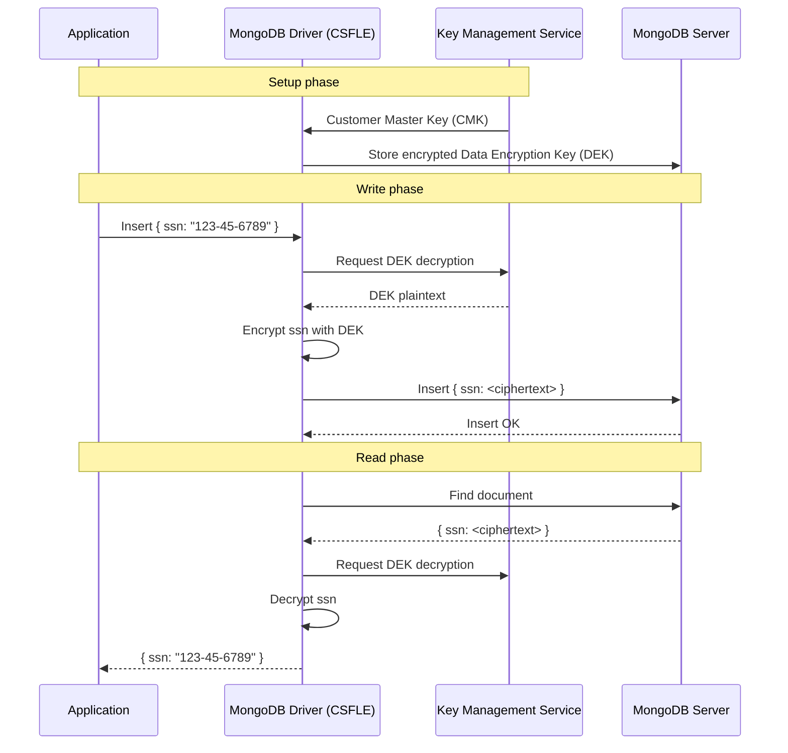

# How to Configure MongoDB Field-Level Encryption

Author: [OneUptime](https://www.github.com/oneuptime)

Tags: MongoDB, Encryption, Security, Field-Level Encryption, Privacy

Description: Learn how to use MongoDB Client-Side Field Level Encryption (CSFLE) to encrypt sensitive document fields before they reach the server, protecting data from DBAs and breaches.

---

## Introduction

MongoDB Client-Side Field Level Encryption (CSFLE) encrypts specified document fields in the driver before data is sent to the server. The MongoDB server stores and retrieves only ciphertext - it never sees the plaintext values. Even a DBA with full database access cannot read encrypted field values without the encryption key. This is ideal for PII, healthcare data, payment card numbers, and other sensitive fields.

## How CSFLE Works



## Prerequisites

- MongoDB 4.2+ (Community for explicit encryption, Enterprise or Atlas for automatic encryption)
- `libmongocrypt` (installed automatically by the driver)
- A Key Management Service (AWS KMS, GCP KMS, Azure Key Vault, or local key for dev)

## Step 1: Install Driver with CSFLE Support

```bash
# Node.js
npm install mongodb mongodb-client-encryption

# Python
pip install pymongo[encryption]
```

## Step 2: Create a Customer Master Key (Local - Development)

For development, use a local key. For production, use AWS KMS, GCP KMS, or Azure Key Vault.

```javascript
const crypto = require("crypto")
const fs = require("fs")

// Generate a 96-byte local master key
const localMasterKey = crypto.randomBytes(96)
fs.writeFileSync("./master-key.bin", localMasterKey)
console.log("Master key written to master-key.bin")
```

## Step 3: Create a Key Vault and Data Encryption Key (DEK)

```javascript
const { MongoClient } = require("mongodb")
const { ClientEncryption } = require("mongodb-client-encryption")
const fs = require("fs")

async function createDataKey() {
  const localMasterKey = fs.readFileSync("./master-key.bin")

  const client = new MongoClient("mongodb://localhost:27017/")
  await client.connect()

  // Create the key vault collection with a unique index
  const keyVaultDb = client.db("encryption")
  const keyVaultCol = keyVaultDb.collection("__keyVault")
  await keyVaultCol.createIndex(
    { keyAltNames: 1 },
    { unique: true, partialFilterExpression: { keyAltNames: { $exists: true } } }
  )

  const encryption = new ClientEncryption(client, {
    keyVaultNamespace: "encryption.__keyVault",
    kmsProviders: {
      local: { key: localMasterKey }
    }
  })

  // Create a DEK with an alternative name
  const dataKeyId = await encryption.createDataKey("local", {
    keyAltNames: ["patientSSNKey"]
  })

  console.log("Data key created:", dataKeyId.toString("hex"))
  await client.close()
  return dataKeyId
}

createDataKey()
```

## Step 4: Configure Automatic Encryption Schema

```javascript
const { MongoClient } = require("mongodb")
const fs = require("fs")
const { BSON } = require("bson")

const localMasterKey = fs.readFileSync("./master-key.bin")

// The _id of the DEK you created in Step 3
const keyId = BSON.Binary.createFromHexString("your-data-key-id-hex", 0)

const schemaMap = {
  "healthcare.patients": {
    bsonType: "object",
    encryptMetadata: {
      keyId: [keyId]
    },
    properties: {
      ssn: {
        encrypt: {
          bsonType: "string",
          algorithm: "AEAD_AES_256_CBC_HMAC_SHA_512-Deterministic"
          // Use Deterministic for equality queries
          // Use Random for fields you don't need to query
        }
      },
      dob: {
        encrypt: {
          bsonType: "date",
          algorithm: "AEAD_AES_256_CBC_HMAC_SHA_512-Random"
        }
      },
      diagnosis: {
        encrypt: {
          bsonType: "string",
          algorithm: "AEAD_AES_256_CBC_HMAC_SHA_512-Random"
        }
      }
    }
  }
}

const client = new MongoClient("mongodb://localhost:27017/", {
  autoEncryption: {
    keyVaultNamespace: "encryption.__keyVault",
    kmsProviders: { local: { key: localMasterKey } },
    schemaMap: schemaMap
  }
})
```

## Step 5: Write and Read Encrypted Data

```javascript
async function run() {
  await client.connect()
  const db = client.db("healthcare")
  const patients = db.collection("patients")

  // Insert - ssn, dob, and diagnosis are encrypted automatically
  await patients.insertOne({
    name: "Jane Smith",
    ssn: "123-45-6789",    // Encrypted before reaching server
    dob: new Date("1985-07-20"),  // Encrypted
    diagnosis: "Hypertension",    // Encrypted
    ward: "B"                     // NOT encrypted - stored as plaintext
  })

  // Query by encrypted deterministic field (SSN)
  const patient = await patients.findOne({ ssn: "123-45-6789" })
  console.log(patient.name, patient.ssn)  // Decrypted automatically
  // Output: Jane Smith 123-45-6789

  await client.close()
}
```

## Step 6: Verify Encryption on the Server

Connect without encryption to confirm the server sees ciphertext:

```javascript
// Plain client - no autoEncryption configured
const plainClient = new MongoClient("mongodb://localhost:27017/")
await plainClient.connect()
const raw = await plainClient.db("healthcare").collection("patients").findOne({})
console.log(raw.ssn)  // Output: Binary { ... } (ciphertext - unreadable)
await plainClient.close()
```

## Using AWS KMS for Production

```javascript
const client = new MongoClient("mongodb://localhost:27017/", {
  autoEncryption: {
    keyVaultNamespace: "encryption.__keyVault",
    kmsProviders: {
      aws: {
        accessKeyId: process.env.AWS_ACCESS_KEY_ID,
        secretAccessKey: process.env.AWS_SECRET_ACCESS_KEY
      }
    }
  }
})

// Create a DEK using AWS KMS
const dataKeyId = await encryption.createDataKey("aws", {
  masterKey: {
    region: "us-east-1",
    key: "arn:aws:kms:us-east-1:123456789:key/your-cmk-id"
  },
  keyAltNames: ["patientSSNKey-prod"]
})
```

## Encryption Algorithms

| Algorithm | Supports Equality Queries | Use Case |
|---|---|---|
| Deterministic | Yes | SSN, email, ID lookup |
| Random | No | Free text, blobs, non-queryable PII |

## Summary

MongoDB Client-Side Field Level Encryption keeps sensitive data encrypted end-to-end. Configure a key vault, create a Data Encryption Key, define a schema map marking which fields to encrypt and with which algorithm, and pass the `autoEncryption` options to `MongoClient`. The driver handles encryption on write and decryption on read transparently. Use deterministic encryption for fields you need to query by exact match, and random encryption for all other sensitive fields. In production, always store master keys in a dedicated KMS (AWS, GCP, Azure) rather than a local file.
