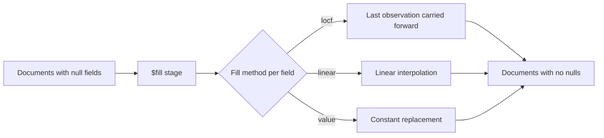

# How to Use $fill to Populate Missing Values in MongoDB

Author: OneUptime Team

Tags: MongoDB, Aggregation, Fill, Time-series, Pipeline

Description: Learn how to use MongoDB's $fill aggregation stage to populate null and missing field values using forward-fill, backward-fill, linear interpolation, or fixed values.

---

The `$fill` stage, introduced in MongoDB 5.3, lets you replace `null` or missing field values using several strategies: carry the last known value forward, carry the next value backward, interpolate linearly between known points, or use a fixed constant.

## When Do You Need $fill?

Null values appear in time-series data after a `$densify` pass, in sensor readings when a device was offline, in surveys where respondents skipped questions, and in any dataset where values are not uniformly collected.



## Basic Syntax

```javascript
db.collection.aggregate([
  {
    $fill: {
      sortBy: { date: 1 },           // required when method is locf or linear
      output: {
        fieldName: { method: "locf" }
      }
    }
  }
]);
```

## Sample Data with Gaps

```javascript
db.temps.insertMany([
  { sensor: "A", ts: ISODate("2026-03-01T00:00:00Z"), temp: 20.0 },
  { sensor: "A", ts: ISODate("2026-03-01T01:00:00Z"), temp: null },
  { sensor: "A", ts: ISODate("2026-03-01T02:00:00Z"), temp: null },
  { sensor: "A", ts: ISODate("2026-03-01T03:00:00Z"), temp: 21.5 },
  { sensor: "B", ts: ISODate("2026-03-01T00:00:00Z"), temp: 18.0 },
  { sensor: "B", ts: ISODate("2026-03-01T01:00:00Z"), temp: null },
  { sensor: "B", ts: ISODate("2026-03-01T02:00:00Z"), temp: 19.0 }
]);
```

## Method: locf (Last Observation Carried Forward)

The most common fill strategy -- each null inherits the value from the nearest preceding non-null document:

```javascript
db.temps.aggregate([
  {
    $fill: {
      partitionByFields: ["sensor"],
      sortBy: { ts: 1 },
      output: {
        temp: { method: "locf" }
      }
    }
  }
]);
// sensor A: 20.0, 20.0, 20.0, 21.5
// sensor B: 18.0, 18.0, 19.0
```

## Method: linear (Linear Interpolation)

Fills null values by computing the straight-line value between the surrounding known points:

```javascript
db.temps.aggregate([
  {
    $fill: {
      partitionByFields: ["sensor"],
      sortBy: { ts: 1 },
      output: {
        temp: { method: "linear" }
      }
    }
  }
]);
// sensor A: 20.0, 20.5 (halfway), 21.0 (halfway), 21.5
```

## Method: value (Constant Replacement)

Replace every null with a fixed value, useful for zeroing out missing counters:

```javascript
db.dailySales.aggregate([
  {
    $fill: {
      output: {
        revenue:      { value: 0 },
        transactions: { value: 0 },
        returns:      { value: 0 }
      }
    }
  }
]);
```

## Filling Multiple Fields with Different Methods

Each field can use a different fill strategy in the same stage:

```javascript
db.sensorReadings.aggregate([
  {
    $fill: {
      partitionByFields: ["deviceId"],
      sortBy: { timestamp: 1 },
      output: {
        temperature:  { method: "linear" },    // interpolate smooth changes
        humidity:     { method: "locf" },      // carry last reading forward
        batteryLevel: { method: "locf" },      // carry last reading forward
        errorCode:    { value: null }          // keep null for error fields
      }
    }
  }
]);
```

## Combining $densify and $fill

The typical pattern is to first generate missing time slots with `$densify`, then fill values with `$fill`:

```javascript
db.stockPrices.aggregate([
  // Step 1: generate a row for every trading hour
  {
    $densify: {
      field: "tradeHour",
      partitionByFields: ["ticker"],
      range: {
        step: 1,
        unit: "hour",
        bounds: [
          ISODate("2026-03-01T09:00:00Z"),
          ISODate("2026-03-01T17:00:00Z")
        ]
      }
    }
  },

  // Step 2: fill missing prices forward
  {
    $fill: {
      partitionByFields: ["ticker"],
      sortBy: { tradeHour: 1 },
      output: {
        price:  { method: "locf" },
        volume: { value: 0 }
      }
    }
  }
]);
```

## Partitioned Fill

Without `partitionByFields`, `$fill` treats all documents as one group. Use partitioning to fill per entity:

```javascript
// Fill missing scores per student per subject
db.scores.aggregate([
  {
    $fill: {
      partitionByFields: ["studentId", "subject"],
      sortBy: { examDate: 1 },
      output: {
        score: { method: "locf" }
      }
    }
  }
]);
```

## Using $fill After $lookup to Handle Missing Joined Data

```javascript
db.orders.aggregate([
  {
    $lookup: {
      from: "discounts",
      localField: "discountCode",
      foreignField: "code",
      as: "discount"
    }
  },
  {
    $addFields: {
      discountPercent: {
        $ifNull: [{ $arrayElemAt: ["$discount.percent", 0] }, null]
      }
    }
  },
  {
    $fill: {
      output: {
        discountPercent: { value: 0 }
      }
    }
  }
]);
```

## Real-World: Health Metrics Dashboard

```javascript
db.healthMetrics.aggregate([
  { $match: { userId: "user_123" } },
  { $sort: { recordedAt: 1 } },

  // Densify to ensure every day is present
  {
    $densify: {
      field: "recordedAt",
      range: {
        step: 1,
        unit: "day",
        bounds: [
          ISODate("2026-01-01T00:00:00Z"),
          ISODate("2026-04-01T00:00:00Z")
        ]
      }
    }
  },

  // Fill missing metrics
  {
    $fill: {
      sortBy: { recordedAt: 1 },
      output: {
        heartRate:  { method: "locf" },
        steps:      { value: 0 },
        sleepHours: { method: "linear" },
        weight:     { method: "locf" }
      }
    }
  }
]);
```

## Null vs. Missing Fields

`$fill` treats both `null` values and absent fields the same way -- both are filled. If a document does not have a field at all, `$fill` will add it with the computed value.

## Summary

`$fill` closes the gap between sparse real-world data and the continuous sequences that dashboards and analytics require. Use `locf` to forward-carry sensor readings or prices, `linear` to smoothly interpolate between measurement points, and `value` to zero out missing counters. Pair it with `$densify` for complete time-series gap filling and use `partitionByFields` to apply fill strategies independently per entity such as per device, user, or store.
