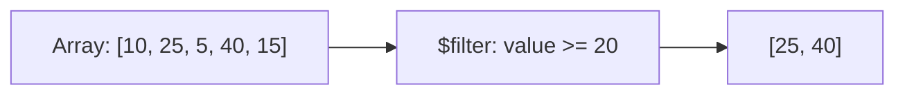

# How to Use $filter in MongoDB Aggregation for Array Processing

Author: [nawazdhandala](https://www.github.com/nawazdhandala)

Tags: MongoDB, Aggregation, $filter, Array, Pipeline

Description: Learn how to use $filter in MongoDB aggregation to return a subset of an array based on a condition, filtering elements inline within a document.

---

## How $filter Works

`$filter` selects a subset of an array field based on a condition and returns the filtered array. It is applied within a single document - it does not affect the number of documents in the pipeline. Each element is tested against the condition expression.



## Syntax

```javascript
{
  $filter: {
    input: <array expression>,
    as: <variable name>,    // optional, default "this"
    cond: <boolean expression>,
    limit: <number>         // optional, MongoDB 5.2+
  }
}
```

- `input` - the array to filter
- `as` - the variable name for the current element (accessed as `$$variableName`)
- `cond` - a boolean expression; elements where this is true are included
- `limit` - optionally cap the number of returned elements

## Examples

### Input Documents

```javascript
[
  {
    _id: 1,
    name: "Alice",
    scores: [45, 82, 91, 60, 73],
    purchases: [
      { product: "Laptop",  price: 1200, inStock: true  },
      { product: "Phone",   price: 800,  inStock: false },
      { product: "Monitor", price: 600,  inStock: true  }
    ]
  },
  {
    _id: 2,
    name: "Bob",
    scores: [55, 62, 48, 70, 90],
    purchases: [
      { product: "Desk",  price: 450, inStock: true  },
      { product: "Chair", price: 250, inStock: false },
      { product: "Lamp",  price: 80,  inStock: true  }
    ]
  }
]
```

### Example 1 - Filter Scores Above a Threshold

Return only scores greater than 70:

```javascript
db.students.aggregate([
  {
    $project: {
      name: 1,
      highScores: {
        $filter: {
          input: "$scores",
          as: "score",
          cond: { $gt: ["$$score", 70] }
        }
      }
    }
  }
])
```

Output:

```javascript
[
  { _id: 1, name: "Alice", highScores: [82, 91, 73] },
  { _id: 2, name: "Bob",   highScores: [70, 90] }
]
```

Note: `$$score` references the current element using the variable defined in `as`.

### Example 2 - Filter Array of Objects

Return only in-stock purchases:

```javascript
db.students.aggregate([
  {
    $project: {
      name: 1,
      inStockItems: {
        $filter: {
          input: "$purchases",
          as: "item",
          cond: { $eq: ["$$item.inStock", true] }
        }
      }
    }
  }
])
```

Output:

```javascript
[
  {
    _id: 1, name: "Alice",
    inStockItems: [
      { product: "Laptop",  price: 1200, inStock: true },
      { product: "Monitor", price: 600,  inStock: true }
    ]
  },
  {
    _id: 2, name: "Bob",
    inStockItems: [
      { product: "Desk", price: 450, inStock: true },
      { product: "Lamp", price: 80,  inStock: true }
    ]
  }
]
```

### Example 3 - Multiple Conditions

Filter purchases that are in stock AND cost more than 400:

```javascript
db.students.aggregate([
  {
    $project: {
      name: 1,
      premiumInStock: {
        $filter: {
          input: "$purchases",
          as: "item",
          cond: {
            $and: [
              { $eq: ["$$item.inStock", true] },
              { $gt: ["$$item.price", 400] }
            ]
          }
        }
      }
    }
  }
])
```

Output:

```javascript
[
  { _id: 1, name: "Alice", premiumInStock: [{ product: "Laptop", price: 1200, inStock: true }] },
  { _id: 2, name: "Bob",   premiumInStock: [{ product: "Desk",   price: 450,  inStock: true }] }
]
```

### Example 4 - Using limit (MongoDB 5.2+)

Return up to 2 scores that are greater than 60:

```javascript
db.students.aggregate([
  {
    $project: {
      topTwoPassingScores: {
        $filter: {
          input: "$scores",
          as: "s",
          cond: { $gt: ["$$s", 60] },
          limit: 2
        }
      }
    }
  }
])
```

### Example 5 - $filter Then $size

Count how many scores are passing (above 60):

```javascript
db.students.aggregate([
  {
    $project: {
      name: 1,
      passingCount: {
        $size: {
          $filter: {
            input: "$scores",
            as: "s",
            cond: { $gt: ["$$s", 60] }
          }
        }
      }
    }
  }
])
```

Output:

```javascript
[
  { _id: 1, name: "Alice", passingCount: 3 },
  { _id: 2, name: "Bob",   passingCount: 3 }
]
```

### Example 6 - $filter Combined with $sum

Sum only the prices of in-stock items:

```javascript
db.students.aggregate([
  {
    $project: {
      inStockTotal: {
        $sum: {
          $map: {
            input: {
              $filter: {
                input: "$purchases",
                as: "item",
                cond: { $eq: ["$$item.inStock", true] }
              }
            },
            as: "item",
            in: "$$item.price"
          }
        }
      }
    }
  }
])
```

## Use Cases

- Returning only relevant elements from an embedded array (active items, high scores)
- Pre-filtering array fields before passing to `$map` or `$reduce`
- Computing conditional sums or counts on array elements
- Building lean API responses by stripping unwanted array entries

## Summary

`$filter` returns a subset of an array by evaluating each element against a condition. Use `$$variableName` (double dollar sign) to reference the current element inside the condition. Combine `$filter` with `$size` to count matching elements, with `$sum` after `$map` to aggregate filtered values, or with `$match` on array element conditions for whole-document filtering.
