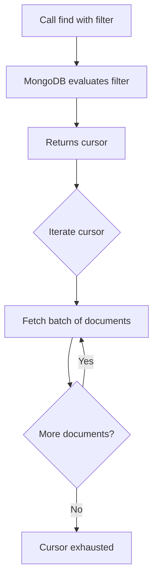

# How to Find Documents in MongoDB with find()

Author: [nawazdhandala](https://www.github.com/nawazdhandala)

Tags: MongoDB, Find, Query, CRUD, Cursor

Description: Learn how to query documents in MongoDB using find(), including filter expressions, projections, sorting, limiting, and cursor iteration techniques.

---

## How find() Works

`find()` retrieves documents from a MongoDB collection that match a given filter. It returns a cursor, not an array - a cursor is a pointer to the result set that you can iterate over. This lazy evaluation means MongoDB does not load all matching documents into memory at once.



## Syntax

```javascript
db.collection.find(filter, projection)
```

- `filter` - Query criteria. Pass `{}` to match all documents
- `projection` - Optional. Specifies which fields to return

## Finding All Documents

Pass an empty filter object to retrieve every document in the collection:

```javascript
db.users.find({})
```

In mongosh, this displays up to 20 documents by default and prompts "Type 'it' for more".

## Finding Documents with a Simple Filter

Match documents where a field equals a specific value:

```javascript
db.users.find({ status: "active" })
```

Multiple fields in the filter act as an implicit AND:

```javascript
db.users.find({ status: "active", role: "admin" })
```

## Using Comparison Operators

Find documents using comparison operators:

```javascript
// Greater than
db.products.find({ price: { $gt: 100 } })

// Less than or equal to
db.products.find({ price: { $lte: 50 } })

// Not equal
db.orders.find({ status: { $ne: "cancelled" } })
```

## Applying Projection

Limit the returned fields using projection. Use `1` to include a field and `0` to exclude it:

```javascript
// Include only name and email fields (plus _id by default)
db.users.find({ status: "active" }, { name: 1, email: 1 })

// Exclude password field, return everything else
db.users.find({}, { password: 0 })
```

## Sorting Results

Chain `.sort()` to order the cursor results:

```javascript
// Sort by price ascending
db.products.find({}).sort({ price: 1 })

// Sort by price descending
db.products.find({}).sort({ price: -1 })

// Multi-field sort
db.orders.find({}).sort({ status: 1, createdAt: -1 })
```

## Limiting and Skipping Results

Use `.limit()` and `.skip()` for pagination:

```javascript
const page = 2
const pageSize = 10

db.products.find({})
  .sort({ name: 1 })
  .skip((page - 1) * pageSize)
  .limit(pageSize)
```

## Counting Matched Documents

Use `.count()` or `countDocuments()` to count results:

```javascript
// Count all active users
db.users.countDocuments({ status: "active" })
```

## Iterating a Cursor Manually

Use `forEach()` to process each document in the cursor:

```javascript
db.orders.find({ status: "pending" }).forEach(order => {
  print(`Order ${order._id}: $${order.total}`)
})
```

Convert to an array when you need all results at once (use with caution on large collections):

```javascript
const activeUsers = db.users.find({ status: "active" }).toArray()
```

## Chaining Cursor Methods

```javascript
db.products
  .find({ category: "Electronics", inStock: true })
  .projection({ name: 1, price: 1, brand: 1 })
  .sort({ price: 1 })
  .limit(20)
```

## Use Cases

- Listing all records in a collection for display
- Filtering users by role, status, or other attributes
- Building paginated API responses
- Searching products by category and price range
- Retrieving audit logs within a time window

## Summary

`find()` is the foundational read operation in MongoDB. It accepts a filter document and an optional projection, returning a cursor that you iterate over. Chain `.sort()`, `.limit()`, and `.skip()` for sorting and pagination. For large result sets, always use cursor iteration rather than converting the entire result to an array. Use `countDocuments()` for accurate count queries rather than loading all documents just to count them.
