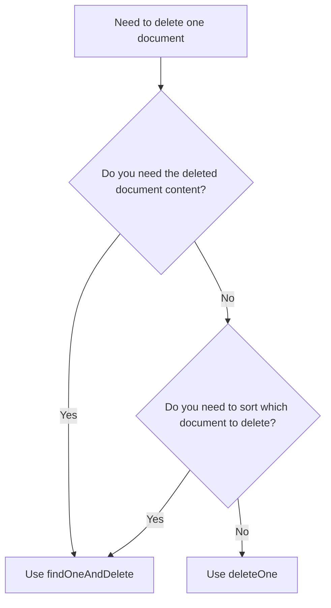

# How to Use findOneAndDelete() vs deleteOne() in MongoDB

Author: [nawazdhandala](https://www.github.com/nawazdhandala)

Tags: MongoDB, findOneAndDelete, deleteOne, CRUD, Delete, Comparison

Description: Learn the key differences between MongoDB's findOneAndDelete() and deleteOne(), when to use each method, and how they behave with sorting and return values.

---

## Overview

Both `findOneAndDelete()` and `deleteOne()` remove a single document from a MongoDB collection, but they differ in what they return, what options they support, and the use cases they are best suited for.



## deleteOne() - Simple Deletion

`deleteOne()` is the straightforward method when you only need to know whether a deletion occurred.

### Syntax

```javascript
db.collection.deleteOne(filter, options)
```

### Return Value

Returns a `DeleteResult` object:

```javascript
{
  acknowledged: true,
  deletedCount: 1  // 0 if no document matched
}
```

### Example

```javascript
const result = db.users.deleteOne({ email: "alice@example.com" })

print("Deleted:", result.deletedCount, "document(s)")
```

## findOneAndDelete() - Delete and Return

`findOneAndDelete()` is the method to use when you need the content of the document that was deleted.

### Syntax

```javascript
db.collection.findOneAndDelete(filter, options)
```

### Return Value

Returns the deleted document itself (or `null` if no match):

```javascript
{
  _id: ObjectId("..."),
  name: "Alice",
  email: "alice@example.com",
  role: "admin"
}
```

### Example

```javascript
const deleted = db.users.findOneAndDelete({ email: "alice@example.com" })

if (deleted) {
  print("Deleted user:", deleted.name)
  // Can use deleted.role, deleted.email, etc.
} else {
  print("No user found")
}
```

## Side-by-Side Comparison

```text
Feature                     deleteOne()          findOneAndDelete()
--------------------------  -------------------  --------------------
Returns                     DeleteResult (count) Deleted document or null
Sort option                 Not supported        Supported
Projection option           Not supported        Supported
Performance overhead        Lower                Slightly higher
Use when...                 Count is enough      Document content needed
Null on no match            No (deletedCount: 0) Yes (returns null)
```

## Sort - Only Available in findOneAndDelete()

`findOneAndDelete()` accepts a `sort` option to control which document is selected when multiple match. `deleteOne()` does not support sorting - it deletes the first document found in natural order.

```javascript
// Delete the oldest pending order
const deletedOrder = db.orders.findOneAndDelete(
  { status: "pending" },
  { sort: { createdAt: 1 } }
)
// Guarantees the oldest is deleted

// deleteOne has no sort - which "pending" order is deleted is unspecified
db.orders.deleteOne({ status: "pending" })
```

## Projection - Only Available in findOneAndDelete()

```javascript
// Return only name and email from the deleted document
const deleted = db.users.findOneAndDelete(
  { _id: ObjectId("64a1b2c3d4e5f6789012345a") },
  { projection: { name: 1, email: 1, _id: 0 } }
)
```

## When to Use deleteOne()

Use `deleteOne()` when:
- You only need to confirm whether a document was deleted
- The deletion is by a unique field like `_id` or email
- You do not need to process the deleted document's data
- Maximum performance with minimum overhead is required

```javascript
// Simple case - just delete, don't need the content
db.sessions.deleteOne({ token: "abc123" })
```

## When to Use findOneAndDelete()

Use `findOneAndDelete()` when:
- You need to read the document's data after deleting it
- You need to sort which document is deleted
- You are building queue consumption patterns
- You want to return the deleted resource to an API caller

```javascript
// Queue consumer - need the task content to process it
const task = db.taskQueue.findOneAndDelete(
  { status: "queued" },
  { sort: { priority: -1, createdAt: 1 } }
)

if (task) {
  processTask(task)
}
```

## Practical Patterns

### Pattern 1 - Delete and Confirm (use deleteOne)

```javascript
const result = db.tokens.deleteOne({ value: req.headers.authorization })
if (result.deletedCount === 0) {
  return { error: "Token not found or already revoked" }
}
return { success: true }
```

### Pattern 2 - Delete and Return for API Response (use findOneAndDelete)

```javascript
const deleted = db.products.findOneAndDelete({ _id: req.params.id })
if (!deleted) {
  return res.status(404).json({ error: "Product not found" })
}
return res.json({ message: "Deleted", product: deleted })
```

## Use Cases

- `deleteOne()`: revoking tokens, removing a known record, cleanup jobs
- `findOneAndDelete()`: task queues, REST DELETE endpoints returning the deleted resource, audit patterns

## Summary

`deleteOne()` and `findOneAndDelete()` both delete a single document, but serve different needs. Choose `deleteOne()` for simple deletions when the operation result (count) is sufficient. Choose `findOneAndDelete()` when you need the deleted document's content, when you need to sort among multiple matches, or when building queue-consumption patterns. The performance difference is minimal, so the deciding factor is always whether you need the document itself.
