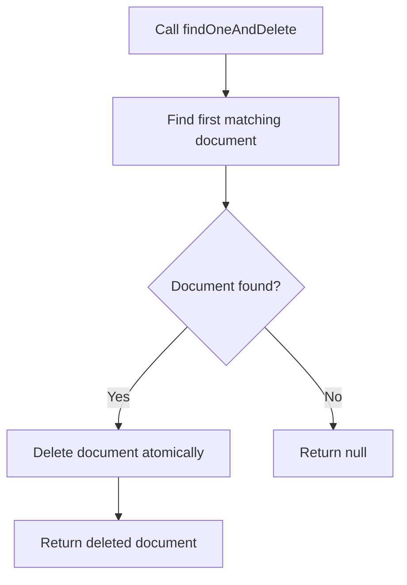

# How to Use findOneAndDelete() in MongoDB

Author: [nawazdhandala](https://www.github.com/nawazdhandala)

Tags: MongoDB, findOneAndDelete, CRUD, Delete, Atomic

Description: Learn how to use MongoDB's findOneAndDelete() to atomically find and delete a document while returning it, perfect for queue processing and atomic removal patterns.

---

## How findOneAndDelete() Works

`findOneAndDelete()` finds the first document matching a filter, deletes it, and returns the deleted document - all in one atomic operation. This is ideal for patterns where you need to both remove and process a document, such as consuming tasks from a queue.



## Syntax

```javascript
db.collection.findOneAndDelete(filter, options)
```

Key options:

```text
sort       - Sort order to select among multiple matching documents
projection - Fields to include/exclude in the returned document
hint       - Index hint for the query
comment    - Arbitrary comment for operation tracing
```

## Basic Example

Delete a user by email and return the deleted document:

```javascript
// Before: { _id: 1, name: "Alice", email: "alice@example.com", status: "inactive" }

const deleted = db.users.findOneAndDelete({ email: "alice@example.com" })

print("Deleted user:", deleted.name)
print("Was status:", deleted.status)

// The document is now removed from the collection
```

## Handling null Return Value

If no document matches the filter, the method returns `null`:

```javascript
const result = db.users.findOneAndDelete({ email: "unknown@example.com" })

if (result === null) {
  print("No user found to delete")
} else {
  print("Deleted:", result.name)
}
```

## Using Projection

Return only specific fields from the deleted document:

```javascript
const deleted = db.users.findOneAndDelete(
  { status: "temp" },
  { projection: { name: 1, email: 1, _id: 0 } }
)

// Returns only { name: "...", email: "..." } even though the full document was deleted
```

## Using Sort

Control which document is deleted when multiple documents match:

```javascript
// Delete the oldest pending task
const task = db.tasks.findOneAndDelete(
  { status: "pending" },
  { sort: { createdAt: 1 } }
)

if (task) {
  print("Processing task:", task._id, task.type)
}
```

## Practical Use Case - Queue Consumer

Atomically consume the next item from a task queue:

```javascript
function claimNextTask(workerId) {
  const task = db.taskQueue.findOneAndDelete(
    { status: "queued" },
    { sort: { priority: -1, createdAt: 1 } }
  )

  if (!task) {
    return null
  }

  // Optionally log the claimed task
  db.processedTasks.insertOne({
    ...task,
    processedBy: workerId,
    processedAt: new Date()
  })

  return task
}
```

## Atomic Delete and Archive Pattern

Delete from the main collection and insert into an archive collection:

```javascript
const session = db.getMongo().startSession()
session.startTransaction()

try {
  const doc = db.activeOrders.findOneAndDelete(
    { orderId: "ORD-001", status: "completed" },
    { session }
  )

  if (doc) {
    db.archivedOrders.insertOne({ ...doc, archivedAt: new Date() }, { session })
  }

  session.commitTransaction()
} catch (err) {
  session.abortTransaction()
  throw err
}
```

## findOneAndDelete() vs deleteOne()

```text
findOneAndDelete()               deleteOne()
-------------------------------  --------------------------------
Returns the deleted document     Returns DeleteResult with counts
Slightly more overhead           Slightly faster (no doc return)
Use when you need the document   Use when counts are enough
Supports sort and projection     No sort or projection support
```

## Deleting by _id

The most common pattern - delete a specific document by its ID:

```javascript
const deletedProduct = db.products.findOneAndDelete(
  { _id: ObjectId("64a1b2c3d4e5f6789012345a") }
)

if (deletedProduct) {
  print(`Deleted product: ${deletedProduct.name}`)
} else {
  print("Product not found")
}
```

## Use Cases

- Consuming tasks from a priority queue without duplicates
- Deleting a document and returning its data for a response body
- Implementing "claim and remove" patterns in distributed systems
- Archiving a document by deleting from one collection and inserting into another
- Removing and logging sessions or temporary records

## Summary

`findOneAndDelete()` is the atomic find-and-remove operation in MongoDB. It returns the deleted document, making it essential for queue processing, claim-and-delete patterns, and any scenario where you need the document content after removal. Use `sort` to control which document is selected when multiple match, and `projection` to limit which fields are returned. For cases where you only need the deletion count and not the document, use the simpler `deleteOne()`.
