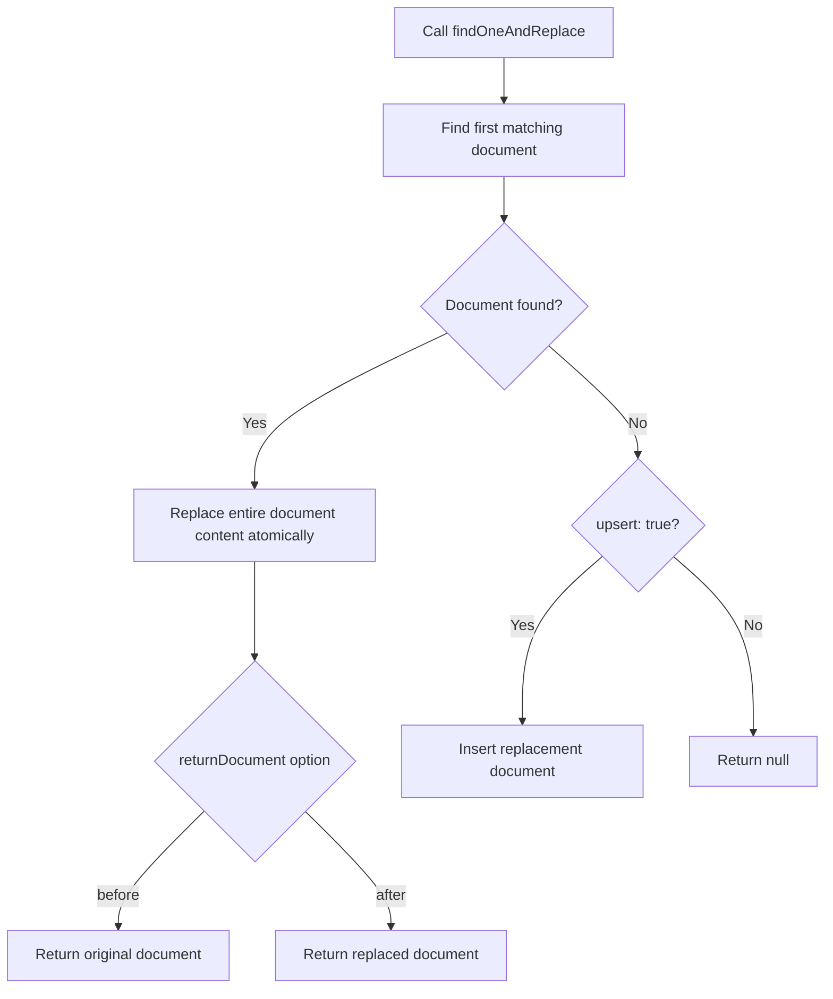

# How to Use findOneAndReplace() in MongoDB

Author: [nawazdhandala](https://www.github.com/nawazdhandala)

Tags: MongoDB, findOneAndReplace, CRUD, Update, Atomic

Description: Learn how to use MongoDB's findOneAndReplace() to atomically find, replace, and return a document in a single operation, with before/after document options.

---

## How findOneAndReplace() Works

`findOneAndReplace()` finds the first document matching a filter, replaces its entire content with a new document (preserving the `_id`), and returns the document. Like `findOneAndUpdate()`, it is atomic - find and replace happen together. Unlike `findOneAndUpdate()`, the second argument is a complete replacement document rather than an update operator document.



## Syntax

```javascript
db.collection.findOneAndReplace(filter, replacement, options)
```

Key options:

```text
returnDocument  - "before" (default) or "after"
sort            - Sort order to select among multiple matches
projection      - Fields to include/exclude in returned document
upsert          - Insert replacement if no match found (default: false)
```

## Basic Example

Replace a user document and return the original (before) version:

```javascript
// Before: { _id: 1, name: "Alice", status: "inactive", legacyField: "old" }

const original = db.users.findOneAndReplace(
  { name: "Alice" },
  {
    name: "Alice Johnson",
    email: "alice@example.com",
    status: "active",
    updatedAt: new Date()
  }
)

print(original.status)      // "inactive" (before replacement)
print(original.legacyField) // "old" (before replacement - field now removed)
```

## Returning the Replaced Document

Use `returnDocument: "after"` to get the document as it looks after replacement:

```javascript
const replaced = db.products.findOneAndReplace(
  { sku: "ELEC-001" },
  {
    sku: "ELEC-001",
    name: "Updated Laptop",
    price: 1299.99,
    category: "Electronics",
    inStock: true,
    updatedAt: new Date()
  },
  { returnDocument: "after" }
)

print("New name:", replaced.name)
print("New price:", replaced.price)
```

## Using Projection on the Returned Document

Return only specific fields from the document:

```javascript
const result = db.users.findOneAndReplace(
  { _id: ObjectId("64a1b2c3d4e5f6789012345a") },
  {
    name: "Updated Name",
    email: "updated@example.com",
    role: "admin"
  },
  {
    returnDocument: "after",
    projection: { name: 1, email: 1, _id: 0 }
  }
)
```

## Using Sort

When the filter matches multiple documents, sort selects which one to replace:

```javascript
// Replace the oldest draft article
const replaced = db.articles.findOneAndReplace(
  { status: "draft" },
  {
    title: "Published Article",
    content: "Full content here...",
    status: "published",
    publishedAt: new Date()
  },
  { sort: { createdAt: 1 }, returnDocument: "after" }
)
```

## Upsert Behavior

When `upsert: true` is set and no document matches:

```javascript
const result = db.configs.findOneAndReplace(
  { key: "appSettings" },
  {
    key: "appSettings",
    theme: "light",
    version: 1,
    createdAt: new Date()
  },
  {
    upsert: true,
    returnDocument: "after"
  }
)
```

When upserting, `returnDocument: "before"` returns `null` (nothing existed before).

## findOneAndReplace() vs replaceOne()

```text
findOneAndReplace()              replaceOne()
-------------------------------  --------------------------------
Returns the document             Returns UpdateResult with counts
Supports returnDocument option   No document returned
Slightly more overhead           Slightly faster (no doc return)
Use when you need the document   Use when counts are enough
```

## findOneAndReplace() vs findOneAndUpdate()

```text
findOneAndReplace()              findOneAndUpdate()
-------------------------------  --------------------------------
Second arg is full replacement   Second arg uses update operators
All unmentioned fields removed   Unmentioned fields preserved
Good for full document swap      Good for partial field updates
```

## Practical Use Case - Document Snapshots

Save a complete new snapshot of a configuration and retrieve the old one for auditing:

```javascript
const oldConfig = db.configurations.findOneAndReplace(
  { key: "systemConfig" },
  {
    key: "systemConfig",
    version: 5,
    settings: { timeout: 30, retries: 3, debug: false },
    updatedAt: new Date(),
    updatedBy: "admin"
  },
  { returnDocument: "before" }
)

if (oldConfig) {
  // Archive the old config
  db.configHistory.insertOne({
    ...oldConfig,
    archivedAt: new Date()
  })
}
```

## Use Cases

- Replacing an entire configuration document and returning the old version for auditing
- Atomic full-document swap in a state machine
- Replacing a processed queue item and returning the original for logging
- Overwriting a draft with a finalized version and returning the draft
- Resetting a document to a new state and returning what it was

## Summary

`findOneAndReplace()` atomically replaces a document's content and returns either the original or the replaced version. The replacement document overwrites all fields except `_id`. Use `returnDocument: "after"` to get the post-replacement state or the default `"before"` to get the pre-replacement state. This method is ideal when you need both the replacement effect and the returned document in a single atomic call, eliminating the need for a separate find query. Use it over `replaceOne()` whenever you need the document itself, not just modification counts.
