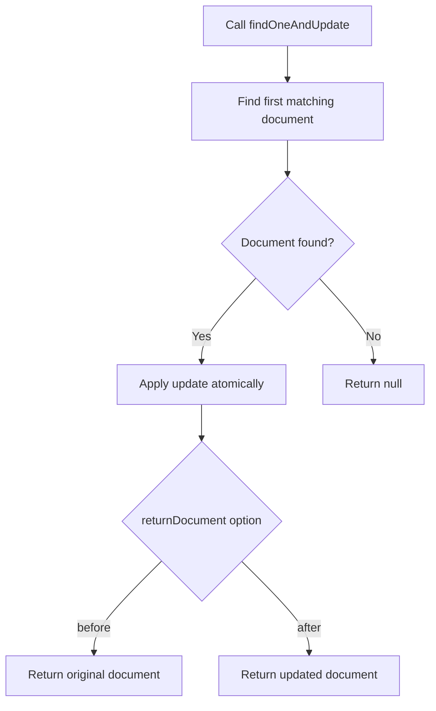

# How to Use findOneAndUpdate() in MongoDB

Author: [nawazdhandala](https://www.github.com/nawazdhandala)

Tags: MongoDB, findOneAndUpdate, CRUD, Update, Atomic

Description: Learn how to use MongoDB's findOneAndUpdate() to atomically find, update, and return a document in a single operation, with options for returning the old or new document.

---

## How findOneAndUpdate() Works

`findOneAndUpdate()` finds a single document matching a filter, applies an update, and returns the document - all in a single atomic operation. The key distinction from `updateOne()` is that it returns the document itself (not just counts). You can choose to return the document as it was before the update or as it looks after the update.



## Syntax

```javascript
db.collection.findOneAndUpdate(filter, update, options)
```

Key options:

```text
returnDocument  - "before" (default) or "after"
sort            - Sort order when multiple documents match
projection      - Fields to include/exclude in the returned document
upsert          - Create document if not found (default: false)
```

## Basic Example - Return Document Before Update

By default, `findOneAndUpdate()` returns the document as it was before the update:

```javascript
// Before: { _id: 1, name: "Alice", status: "inactive", loginCount: 5 }

const original = db.users.findOneAndUpdate(
  { name: "Alice" },
  { $set: { status: "active" }, $inc: { loginCount: 1 } }
)

print(original.status)     // "inactive" (before the update)
print(original.loginCount) // 5 (before the update)
```

## Returning the Updated Document

Set `returnDocument: "after"` to receive the document with the update applied:

```javascript
const updated = db.users.findOneAndUpdate(
  { name: "Alice" },
  { $set: { status: "active" }, $inc: { loginCount: 1 } },
  { returnDocument: "after" }
)

print(updated.status)     // "active" (after the update)
print(updated.loginCount) // 6 (after the update)
```

## Using Projection

Return only specific fields from the document:

```javascript
const result = db.users.findOneAndUpdate(
  { email: "alice@example.com" },
  { $set: { lastLoginAt: new Date() } },
  {
    returnDocument: "after",
    projection: { name: 1, email: 1, lastLoginAt: 1, _id: 0 }
  }
)
```

## Using Sort to Control Which Document is Updated

When the filter matches multiple documents, use `sort` to control which one is selected:

```javascript
// Update the oldest pending order first
const order = db.orders.findOneAndUpdate(
  { status: "pending" },
  { $set: { status: "processing", startedAt: new Date() } },
  {
    sort: { createdAt: 1 },
    returnDocument: "after"
  }
)

print("Processing order:", order._id)
```

## Upsert with findOneAndUpdate()

Create the document if it does not exist:

```javascript
const counter = db.counters.findOneAndUpdate(
  { name: "pageViews" },
  { $inc: { count: 1 } },
  {
    upsert: true,
    returnDocument: "after"
  }
)

print("Current view count:", counter.count)
```

## Handling null Return Value

When no document matches and `upsert: false`, the method returns `null`:

```javascript
const result = db.users.findOneAndUpdate(
  { email: "nonexistent@example.com" },
  { $set: { status: "active" } }
)

if (result === null) {
  print("No user found with that email")
}
```

## Practical Use Case - Claim a Task

A common pattern for distributed task queues - atomically claim the next available task:

```javascript
const task = db.tasks.findOneAndUpdate(
  { status: "pending", assignedTo: { $exists: false } },
  {
    $set: {
      status: "in-progress",
      assignedTo: "worker-001",
      startedAt: new Date()
    }
  },
  {
    sort: { priority: -1, createdAt: 1 },
    returnDocument: "after"
  }
)

if (task) {
  print(`Worker claimed task: ${task._id}`)
} else {
  print("No tasks available")
}
```

## findOneAndUpdate() vs updateOne()

```text
findOneAndUpdate()               updateOne()
-------------------------------  -------------------------------
Returns the document             Returns UpdateResult with counts
Supports returnDocument option   No document returned
Slightly more overhead           Slightly faster (no doc return)
Use when you need the document   Use when you only need counts
Atomic find + modify + return    Atomic find + modify only
```

## Use Cases

- Claiming the next item in a work queue (check-and-claim)
- Incrementing a counter and reading the new value in one call
- Updating a document and immediately returning it to an API client
- Implementing atomic state transitions
- Read-modify-return patterns without extra round trips

## Summary

`findOneAndUpdate()` combines find, update, and return into a single atomic operation. Use `returnDocument: "after"` to get the updated document, `returnDocument: "before"` (default) to get the pre-update state, and `sort` to control which document is selected when multiple match. Combine with `upsert: true` for create-or-update semantics. It is the right tool whenever you need both the update and the document in the same atomic step, eliminating race conditions that would arise from separate find and update calls.
