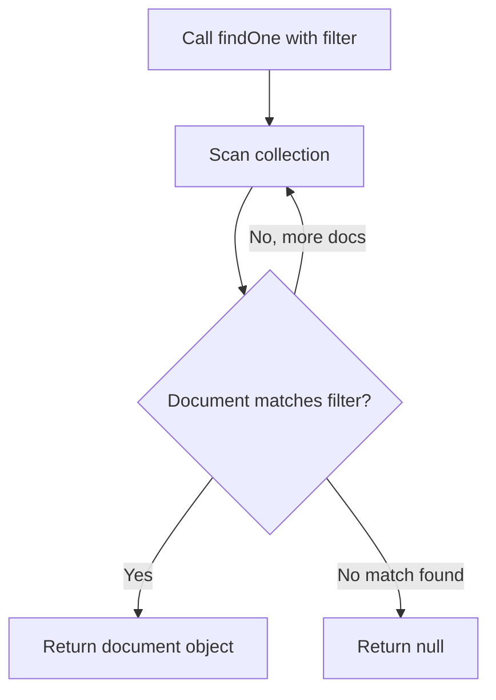

# How to Find a Single Document in MongoDB with findOne()

Author: [nawazdhandala](https://www.github.com/nawazdhandala)

Tags: MongoDB, findOne, Query, CRUD, Document

Description: Learn how to retrieve a single document from a MongoDB collection using findOne(), with filter expressions, projections, and sort options.

---

## How findOne() Works

`findOne()` retrieves the first document that matches the given filter criteria. Unlike `find()`, it returns a single document object (not a cursor), or `null` if no matching document exists. MongoDB stops scanning as soon as it finds the first match, making it efficient for lookups by unique fields like `_id` or email.



## Syntax

```javascript
db.collection.findOne(filter, projection)
```

- `filter` - Query criteria document
- `projection` - Optional. Specifies which fields to include or exclude

## Finding a Document by _id

The most common use of `findOne()` is looking up a document by its unique identifier:

```javascript
db.users.findOne({ _id: ObjectId("64a1b2c3d4e5f6789012345a") })
```

Example result:

```javascript
{
  _id: ObjectId("64a1b2c3d4e5f6789012345a"),
  name: "Alice Johnson",
  email: "alice@example.com",
  role: "admin",
  createdAt: ISODate("2024-01-15T10:00:00Z")
}
```

## Finding by a Unique Field

You can also find by any unique field, such as email or username:

```javascript
db.users.findOne({ email: "alice@example.com" })
```

## Using Projection with findOne()

Limit the returned fields to only what you need:

```javascript
// Return only name and email, suppress _id
db.users.findOne(
  { email: "alice@example.com" },
  { name: 1, email: 1, _id: 0 }
)
```

Result:

```javascript
{ name: "Alice Johnson", email: "alice@example.com" }
```

## Handling the null Return Value

Always check for `null` to avoid errors when no document matches:

```javascript
const user = db.users.findOne({ email: "unknown@example.com" })

if (user === null) {
  print("User not found")
} else {
  print(`Found user: ${user.name}`)
}
```

## Finding the First Document (No Filter)

Calling `findOne()` with an empty filter or no arguments returns the first document in natural order:

```javascript
// Returns first document in the collection
db.users.findOne()

// Equivalent
db.users.findOne({})
```

## Comparison with find()

```text
findOne()                          find()
---------------------------------  ---------------------------------
Returns a single document object   Returns a cursor
Returns null if not found          Returns empty cursor if not found
Stops after first match            Scans all matching documents
Cannot chain .sort() or .limit()   Supports .sort(), .limit(), .skip()
Best for unique lookups            Best for multiple results
```

## Practical Use Case - Login Check

A typical authentication query:

```javascript
const credentials = {
  email: "alice@example.com",
  passwordHash: "abc123hash"
}

const user = db.users.findOne(
  { email: credentials.email },
  { name: 1, email: 1, role: 1, passwordHash: 1 }
)

if (!user) {
  print("No account found with that email")
} else if (user.passwordHash !== credentials.passwordHash) {
  print("Incorrect password")
} else {
  print(`Welcome, ${user.name}! Role: ${user.role}`)
}
```

## Use Cases

- Looking up a user by email or username
- Fetching a product by its SKU
- Retrieving a configuration document by name
- Checking if a record exists before inserting
- Getting the latest version of a document by a natural sort

## Summary

`findOne()` is the go-to method when you expect a single result, such as a lookup by a unique identifier or email. It returns the document directly (not a cursor), making it simpler to work with than `find()` for single-record operations. Always handle the `null` return case to prevent null pointer errors. For cases where you want the first document from a sorted result, consider using `find().sort().limit(1)` since `findOne()` does not support cursor chaining.
