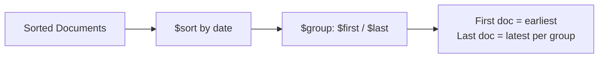

# How to Use $first and $last Accumulators in MongoDB Aggregation

Author: [nawazdhandala](https://www.github.com/nawazdhandala)

Tags: MongoDB, Aggregation, $first, $last, Accumulator, $group

Description: Learn how to use $first and $last accumulators in MongoDB aggregation to retrieve the first or last value from each group of documents.

---

## How $first and $last Work

`$first` and `$last` are accumulator operators used in the `$group` stage. They return the value of an expression from the first or last document in each group, based on document order in the pipeline.

Since document order in a group is only meaningful after a `$sort` stage, always use `$sort` before `$group` when relying on `$first` or `$last` to get meaningful results (such as the earliest or most recent document per group).



## Syntax

```javascript
{
  $group: {
    _id: "<groupKey>",
    firstValue: { $first: "$field" },
    lastValue:  { $last: "$field" }
  }
}
```

Both operators accept any expression.

## Examples

### Input Documents

```javascript
[
  { _id: 1, customerId: "C1", product: "Laptop",  amount: 1200, date: ISODate("2026-01-05") },
  { _id: 2, customerId: "C2", product: "Phone",   amount: 800,  date: ISODate("2026-01-10") },
  { _id: 3, customerId: "C1", product: "Monitor", amount: 400,  date: ISODate("2026-02-15") },
  { _id: 4, customerId: "C2", product: "Keyboard", amount: 100, date: ISODate("2026-01-20") },
  { _id: 5, customerId: "C1", product: "Phone",   amount: 800,  date: ISODate("2026-03-01") }
]
```

### Example 1 - Get the First and Last Purchase Per Customer

Sort by date ascending, then group to get the first (earliest) and last (most recent) purchase per customer:

```javascript
db.orders.aggregate([
  { $sort: { date: 1 } },
  {
    $group: {
      _id: "$customerId",
      firstPurchase: { $first: "$product" },
      firstDate:     { $first: "$date" },
      lastPurchase:  { $last: "$product" },
      lastDate:      { $last: "$date" }
    }
  }
])
```

Output:

```javascript
[
  {
    _id: "C1",
    firstPurchase: "Laptop",
    firstDate: ISODate("2026-01-05"),
    lastPurchase: "Phone",
    lastDate: ISODate("2026-03-01")
  },
  {
    _id: "C2",
    firstPurchase: "Phone",
    firstDate: ISODate("2026-01-10"),
    lastPurchase: "Keyboard",
    lastDate: ISODate("2026-01-20")
  }
]
```

### Example 2 - Most Recent Order Per Customer (Descending Sort)

Sort descending to use `$first` as "most recent":

```javascript
db.orders.aggregate([
  { $sort: { date: -1 } },
  {
    $group: {
      _id: "$customerId",
      mostRecentProduct: { $first: "$product" },
      mostRecentDate:    { $first: "$date" },
      mostRecentAmount:  { $first: "$amount" }
    }
  }
])
```

Output:

```javascript
[
  { _id: "C1", mostRecentProduct: "Phone",    mostRecentDate: ISODate("2026-03-01"), mostRecentAmount: 800 },
  { _id: "C2", mostRecentProduct: "Keyboard", mostRecentDate: ISODate("2026-01-20"), mostRecentAmount: 100 }
]
```

### Example 3 - Capture the Full First Document

Push the whole document object as the first:

```javascript
db.orders.aggregate([
  { $sort: { date: 1 } },
  {
    $group: {
      _id: "$customerId",
      firstOrder: {
        $first: {
          product: "$product",
          amount: "$amount",
          date: "$date"
        }
      }
    }
  }
])
```

Output:

```javascript
[
  { _id: "C1", firstOrder: { product: "Laptop",  amount: 1200, date: ISODate("2026-01-05") } },
  { _id: "C2", firstOrder: { product: "Phone",   amount: 800,  date: ISODate("2026-01-10") } }
]
```

### Example 4 - $first / $last on String Fields

Get the lexicographically first and last product names per customer (no pre-sort needed for this use case):

```javascript
db.orders.aggregate([
  {
    $group: {
      _id: "$customerId",
      alphabeticallyFirst: { $min: "$product" },
      alphabeticallyLast:  { $max: "$product" }
    }
  }
])
```

Note: for alphabetical ordering, `$min` and `$max` are more appropriate than `$first` and `$last` since they consider all documents in the group.

### Example 5 - Deduplication: Keep Only the First Document Per Key

Effectively deduplicate documents by keeping only the first record per group key:

```javascript
db.orders.aggregate([
  { $sort: { date: 1 } },
  {
    $group: {
      _id: "$customerId",
      product:  { $first: "$product" },
      amount:   { $first: "$amount" },
      date:     { $first: "$date" }
    }
  }
])
```

## Important: Order Dependency

Without `$sort` before `$group`, the document selected by `$first` or `$last` is not deterministic. Always sort explicitly when you need a specific document from each group.

```javascript
// NOT reliable - no sort before group
db.orders.aggregate([
  { $group: { _id: "$customerId", anyProduct: { $first: "$product" } } }
])

// Reliable - sort establishes order before grouping
db.orders.aggregate([
  { $sort: { date: 1 } },
  { $group: { _id: "$customerId", earliestProduct: { $first: "$product" } } }
])
```

## Use Cases

- Finding the first and last purchase dates per customer
- Getting the opening and closing value of a time series per day
- Deduplicating documents by keeping only the earliest or latest version per key
- Capturing the most recent status or state of an entity per group

## Summary

`$first` returns the field value from the first document in each group, and `$last` returns the value from the last document. Since the result depends on document order, always precede `$group` with a `$sort` stage to ensure deterministic results. Use `$first` after a descending date sort to get the most recent document per group.
