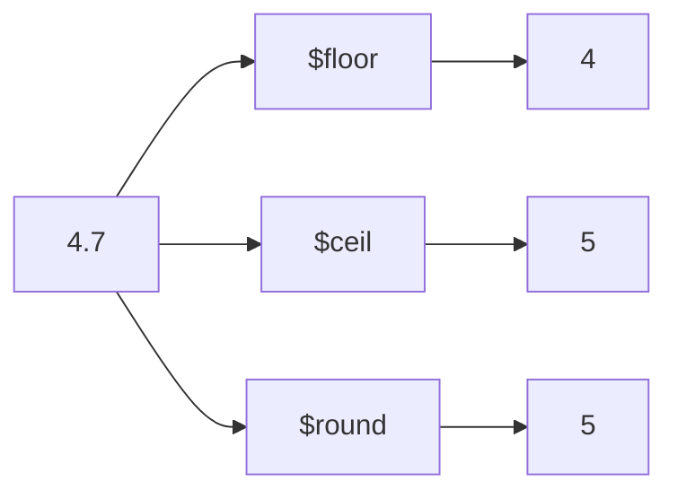

# How to Use $floor, $ceil, $round in MongoDB Aggregation

Author: [nawazdhandala](https://www.github.name/nawazdhandala)

Tags: MongoDB, Aggregation, $floor, $ceil, $round, Pipeline, Math

Description: Learn how to use $floor, $ceil, and $round in MongoDB aggregation to apply rounding operations to numeric fields in the pipeline.

---

## How $floor, $ceil, and $round Work

These are mathematical expression operators that round numeric values:

- `$floor` - rounds down to the nearest integer (truncates towards negative infinity)
- `$ceil` - rounds up to the nearest integer (ceiling function)
- `$round` - rounds to the nearest integer or to a specified number of decimal places



## Syntax

```javascript
{ $floor: <numeric expression> }
{ $ceil:  <numeric expression> }
{ $round: [ <numeric expression>, <place> ] }
```

For `$round`:
- `<place>` specifies the decimal position. `0` = nearest integer, `1` = one decimal place, `-1` = nearest ten, etc.
- If `<place>` is omitted, it defaults to `0`.

## Examples

### Input Documents

```javascript
[
  { _id: 1, product: "A", price: 10.75,  quantity: 3.7,  discount: 0.15 },
  { _id: 2, product: "B", price: 25.20,  quantity: 1.5,  discount: 0.10 },
  { _id: 3, product: "C", price: 99.99,  quantity: 0.8,  discount: 0.25 },
  { _id: 4, product: "D", price: -7.3,   quantity: 2.0,  discount: 0.05 }
]
```

### Example 1 - Apply $floor

Round prices down to the nearest dollar:

```javascript
db.products.aggregate([
  {
    $project: {
      product: 1,
      price: 1,
      floorPrice: { $floor: "$price" }
    }
  }
])
```

Output:

```javascript
[
  { _id: 1, product: "A", price: 10.75, floorPrice: 10  },
  { _id: 2, product: "B", price: 25.20, floorPrice: 25  },
  { _id: 3, product: "C", price: 99.99, floorPrice: 99  },
  { _id: 4, product: "D", price: -7.3,  floorPrice: -8  }  // floor of -7.3 is -8
]
```

### Example 2 - Apply $ceil

Round quantities up to the nearest whole unit (for minimum order calculations):

```javascript
db.products.aggregate([
  {
    $project: {
      product: 1,
      quantity: 1,
      minOrderUnits: { $ceil: "$quantity" }
    }
  }
])
```

Output:

```javascript
[
  { _id: 1, product: "A", quantity: 3.7, minOrderUnits: 4 },
  { _id: 2, product: "B", quantity: 1.5, minOrderUnits: 2 },
  { _id: 3, product: "C", quantity: 0.8, minOrderUnits: 1 },
  { _id: 4, product: "D", quantity: 2.0, minOrderUnits: 2 }
]
```

### Example 3 - Apply $round to Nearest Integer

```javascript
db.products.aggregate([
  {
    $project: {
      product: 1,
      price: 1,
      roundedPrice: { $round: ["$price", 0] }
    }
  }
])
```

Output:

```javascript
[
  { _id: 1, product: "A", price: 10.75, roundedPrice: 11  },
  { _id: 2, product: "B", price: 25.20, roundedPrice: 25  },
  { _id: 3, product: "C", price: 99.99, roundedPrice: 100 },
  { _id: 4, product: "D", price: -7.3,  roundedPrice: -7  }
]
```

### Example 4 - $round to Decimal Places

Round to 1 decimal place:

```javascript
db.products.aggregate([
  {
    $project: {
      product: 1,
      price: 1,
      roundedPrice: { $round: ["$price", 1] }
    }
  }
])
```

Output:

```javascript
[
  { _id: 1, product: "A", price: 10.75, roundedPrice: 10.8 },
  { _id: 2, product: "B", price: 25.20, roundedPrice: 25.2 },
  { _id: 3, product: "C", price: 99.99, roundedPrice: 100.0 },
  { _id: 4, product: "D", price: -7.3,  roundedPrice: -7.3 }
]
```

### Example 5 - $round with Negative Place

Round to the nearest 10 (place = -1):

```javascript
db.products.aggregate([
  {
    $project: {
      product: 1,
      price: 1,
      roundedToTen: { $round: ["$price", -1] }
    }
  }
])
```

Output:

```javascript
[
  { _id: 1, product: "A", price: 10.75, roundedToTen: 10 },
  { _id: 2, product: "B", price: 25.20, roundedToTen: 30 },
  { _id: 3, product: "C", price: 99.99, roundedToTen: 100 },
  { _id: 4, product: "D", price: -7.3,  roundedToTen: -10 }
]
```

### Example 6 - Rounding a Computed Value

Compute final price (after discount) and round to 2 decimal places:

```javascript
db.products.aggregate([
  {
    $project: {
      product: 1,
      finalPrice: {
        $round: [
          { $multiply: ["$price", { $subtract: [1, "$discount"] }] },
          2
        ]
      }
    }
  }
])
```

Output:

```javascript
[
  { _id: 1, product: "A", finalPrice: 9.14  },  // 10.75 * 0.85 = 9.1375 -> 9.14
  { _id: 2, product: "B", finalPrice: 22.68 },  // 25.20 * 0.90 = 22.68
  { _id: 3, product: "C", finalPrice: 74.99 },  // 99.99 * 0.75 = 74.9925 -> 74.99
  { _id: 4, product: "D", finalPrice: -6.94 }   // -7.3  * 0.95 = -6.935 -> -6.94
]
```

### Example 7 - $floor for Pagination Offset

Calculate the page number from a document index:

```javascript
db.items.aggregate([
  {
    $project: {
      pageNumber: {
        $add: [
          { $floor: { $divide: [{ $subtract: ["$_id", 1] }, 10] } },
          1
        ]
      }
    }
  }
])
```

## Behavior with Negative Numbers

| Value | $floor | $ceil | $round (0) |
|---|---|---|---|
| 4.5 | 4 | 5 | 4 (banker's rounding) |
| 4.7 | 4 | 5 | 5 |
| -4.7 | -5 | -4 | -5 |
| -4.5 | -5 | -4 | -4 (banker's rounding) |

Note: `$round` uses banker's rounding (round half to even) at the midpoint.

## Use Cases

- Rounding monetary values to 2 decimal places for display or storage
- Calculating minimum order quantities using `$ceil`
- Floor-dividing values for bucket assignment or pagination logic
- Rounding statistical results (averages, rates) for reporting

## Summary

`$floor` rounds down to the nearest integer, `$ceil` rounds up, and `$round` rounds to the nearest value at a specified decimal place. Use `$round` for most formatting needs, `$ceil` for minimum quantity or capacity calculations, and `$floor` for safe downward truncation. MongoDB's `$round` uses banker's rounding at exact midpoints.
