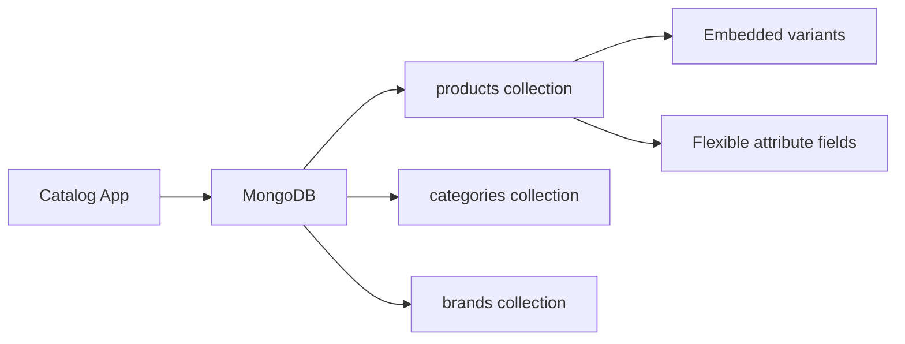

# How to Use MongoDB for Catalog Management

Author: [nawazdhandala](https://www.github.com/nawazdhandala)

Tags: MongoDB, Catalog, E-Commerce, Schema, Search

Description: Learn how to design a MongoDB schema for product catalog management with flexible attributes, category hierarchies, faceted search, and variant handling.

---

## Why MongoDB for Product Catalogs

Product catalogs have highly variable attributes across categories: an electronics product needs voltage and connectivity specs while a clothing product needs size and material. In a relational database this requires either a wide nullable table or a complex EAV (Entity-Attribute-Value) schema. MongoDB's document model lets each product carry exactly the attributes it needs.



## Base Product Schema

```javascript
db.products.insertOne({
  productId: "prod-001",
  sku: "LAPTOP-PRO-15-SLV",
  slug: "laptop-pro-15-silver",
  name: "LaptopPro 15 - Silver",
  brand: "TechBrand",
  brandId: "brand-001",

  category: {
    id: "cat-electronics-laptops",
    path: ["Electronics", "Computers", "Laptops"],
    slug: "electronics/computers/laptops"
  },

  status: "active",    // "active", "inactive", "discontinued", "draft"
  visibility: "public",

  description: "High-performance 15-inch laptop for professionals.",
  shortDescription: "15-inch pro laptop, 16GB RAM, 512GB SSD",

  // Pricing
  price: 1299.99,
  compareAtPrice: 1499.99,  // Original/strike-through price
  currency: "USD",

  // Category-specific attributes (flexible)
  attributes: {
    screenSize: "15.6 inches",
    resolution: "1920x1080",
    processorModel: "Intel Core i7-1280P",
    ram: "16GB DDR5",
    storage: "512GB NVMe SSD",
    graphics: "Intel Iris Xe",
    batteryLife: "10 hours",
    weight: "1.8 kg",
    color: "Silver",
    operatingSystem: "Windows 11 Pro",
    ports: ["USB-C x2", "USB-A x2", "HDMI", "SD Card"],
    wireless: ["WiFi 6E", "Bluetooth 5.3"]
  },

  // Product images
  images: [
    {
      url: "https://cdn.example.com/products/laptop-pro-15-slv-main.jpg",
      alt: "LaptopPro 15 Silver - Front view",
      isPrimary: true,
      sortOrder: 0
    },
    {
      url: "https://cdn.example.com/products/laptop-pro-15-slv-side.jpg",
      alt: "LaptopPro 15 Silver - Side view",
      isPrimary: false,
      sortOrder: 1
    }
  ],

  // Tags for search and filtering
  tags: ["laptop", "windows", "intel", "professional", "15-inch"],

  // SEO
  meta: {
    title: "LaptopPro 15 Silver - High Performance Laptop",
    description: "Buy LaptopPro 15 Silver with Intel i7, 16GB RAM, 512GB SSD"
  },

  // Inventory (can also be in separate inventory collection)
  inventory: {
    trackQuantity: true,
    quantity: 45,
    reservedQuantity: 3
  },

  // Ratings
  ratingAverage: 4.6,
  ratingCount: 238,

  createdAt: new Date(),
  updatedAt: new Date(),
  publishedAt: new Date()
});
```

## Product Variants

For products with size/color variants, embed them in the parent product:

```javascript
db.products.insertOne({
  productId: "prod-100",
  sku: "TSHIRT-CLASSIC",
  name: "Classic Cotton T-Shirt",
  category: {
    id: "cat-clothing-shirts",
    path: ["Clothing", "T-Shirts"],
    slug: "clothing/t-shirts"
  },

  // Base price (variant prices may override)
  price: 29.99,
  currency: "USD",

  attributes: {
    material: "100% Cotton",
    fit: "Regular",
    careInstructions: "Machine wash cold"
  },

  // Variants define specific SKUs with their own price and stock
  variants: [
    {
      variantId: "var-001",
      sku: "TSHIRT-CLASSIC-BLK-S",
      options: { color: "Black", size: "S" },
      price: 29.99,
      compareAtPrice: null,
      inventory: { quantity: 120, reservedQuantity: 5 },
      images: [
        { url: "https://cdn.example.com/tshirt-black-s.jpg", isPrimary: true }
      ],
      status: "active"
    },
    {
      variantId: "var-002",
      sku: "TSHIRT-CLASSIC-BLK-M",
      options: { color: "Black", size: "M" },
      price: 29.99,
      inventory: { quantity: 200, reservedQuantity: 12 },
      status: "active"
    },
    {
      variantId: "var-003",
      sku: "TSHIRT-CLASSIC-WHT-L",
      options: { color: "White", size: "L" },
      price: 29.99,
      inventory: { quantity: 0, reservedQuantity: 0 },
      status: "sold_out"
    }
  ],

  // Available option values (for building variant selectors in UI)
  variantOptions: [
    { name: "color", values: ["Black", "White", "Navy"] },
    { name: "size", values: ["XS", "S", "M", "L", "XL", "XXL"] }
  ],

  createdAt: new Date(),
  updatedAt: new Date()
});
```

## Category Hierarchy

```javascript
db.categories.insertOne({
  categoryId: "cat-electronics-laptops",
  slug: "electronics/computers/laptops",
  name: "Laptops",
  parentId: "cat-electronics-computers",
  path: ["Electronics", "Computers", "Laptops"],
  level: 3,
  isLeaf: true,
  productCount: 145,
  sortOrder: 1,
  image: "https://cdn.example.com/categories/laptops.jpg",
  createdAt: new Date()
});

db.categories.createIndex({ slug: 1 }, { unique: true });
db.categories.createIndex({ parentId: 1 });
```

## Faceted Search Queries

```javascript
// Find laptops with facets for filtering
db.products.aggregate([
  {
    $match: {
      "category.id": "cat-electronics-laptops",
      status: "active",
      price: { $gte: 500, $lte: 2000 }
    }
  },
  {
    $facet: {
      // Filtered results
      results: [
        { $sort: { ratingAverage: -1 } },
        { $skip: 0 },
        { $limit: 20 },
        { $project: {
          name: 1, sku: 1, price: 1, ratingAverage: 1,
          "images": { $first: "$images" }
        }}
      ],
      // Count by brand
      brandFacets: [
        { $group: { _id: "$brand", count: { $sum: 1 } } },
        { $sort: { count: -1 } }
      ],
      // Count by RAM size
      ramFacets: [
        { $group: { _id: "$attributes.ram", count: { $sum: 1 } } },
        { $sort: { count: -1 } }
      ],
      // Total count
      total: [{ $count: "count" }]
    }
  }
])
```

## Full-Text Search

```javascript
// Create text index for catalog search
db.products.createIndex({
  name: "text",
  "attributes.processorModel": "text",
  shortDescription: "text",
  tags: "text"
}, {
  weights: {
    name: 10,
    tags: 5,
    shortDescription: 3,
    "attributes.processorModel": 2
  },
  name: "catalog_text_index"
});

// Search query
db.products.find({
  $text: { $search: "16gb laptop intel" },
  status: "active"
}, {
  score: { $meta: "textScore" }
}).sort({ score: { $meta: "textScore" } }).limit(20)
```

## Indexes for Catalog Performance

```javascript
db.products.createIndex({ productId: 1 }, { unique: true });
db.products.createIndex({ sku: 1 }, { unique: true });
db.products.createIndex({ slug: 1 }, { unique: true });
db.products.createIndex({ "category.id": 1, status: 1, price: 1 });
db.products.createIndex({ "category.id": 1, ratingAverage: -1 });
db.products.createIndex({ brand: 1, status: 1 });
db.products.createIndex({ tags: 1, status: 1 });
db.products.createIndex({ status: 1, publishedAt: -1 });
db.products.createIndex({ "variants.sku": 1 }, { sparse: true });
```

## Summary

MongoDB's flexible document model eliminates the need for a rigid relational schema when managing product catalogs with diverse attribute sets. Use a shared base schema with a flexible `attributes` object for category-specific fields. Embed variants in the parent product document for cohesive product data retrieval. Use `$facet` aggregation for faceted search UIs that show filtered results and filter option counts in a single query. Add text indexes on name, tags, and description for full-text catalog search.
