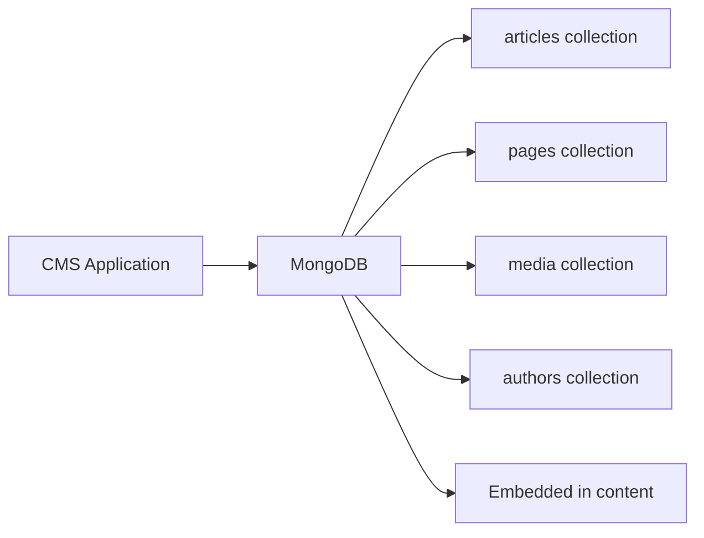

# How to Use MongoDB for Content Management Systems

Author: [nawazdhandala](https://www.github.com/nawazdhandala)

Tags: MongoDB, CMS, Schema, Content, Application

Description: Learn how to design a MongoDB schema for a content management system with flexible content types, versioning, media metadata, and full-text search.

---

## Why MongoDB for CMS

Content management systems deal with highly variable content structures: articles have different fields than product pages, landing pages differ from blog posts. MongoDB's flexible document model avoids the impedance mismatch of forcing diverse content types into a rigid relational schema. Each content type can have its own set of fields without ALTER TABLE migrations.



## Content Document Schema

A flexible content document that works for multiple content types:

```javascript
// Insert an article
db.content.insertOne({
  type: "article",
  slug: "getting-started-mongodb",
  title: "Getting Started with MongoDB",
  status: "published",
  authorId: ObjectId("..."),
  createdAt: new Date(),
  publishedAt: new Date(),
  updatedAt: new Date(),

  // Flexible body supporting different block types
  blocks: [
    { type: "heading", level: 2, text: "Introduction" },
    {
      type: "paragraph",
      text: "MongoDB is a document database..."
    },
    {
      type: "code",
      language: "javascript",
      code: "db.collection.findOne()"
    },
    {
      type: "image",
      mediaId: ObjectId("..."),
      alt: "MongoDB architecture diagram",
      caption: "Figure 1: Replica set"
    }
  ],

  // Metadata
  meta: {
    title: "Getting Started with MongoDB | Blog",
    description: "Learn the basics of MongoDB document storage",
    keywords: ["mongodb", "database", "nosql"]
  },

  tags: ["mongodb", "database", "tutorial"],
  category: "tutorials",

  // SEO and social
  featuredImage: ObjectId("..."),
  socialTitle: "Getting Started with MongoDB",
  canonicalUrl: "/blog/getting-started-mongodb",

  // Statistics
  viewCount: 0,
  commentCount: 0
});
```

## Page Schema for Different Content Types

```javascript
// A landing page with a different structure
db.content.insertOne({
  type: "landing_page",
  slug: "product-pricing",
  title: "MongoDB Pricing - Choose Your Plan",
  status: "published",
  createdAt: new Date(),

  // Page-specific sections
  hero: {
    headline: "Scale with Confidence",
    subheadline: "Choose the MongoDB plan that grows with your business",
    ctaText: "Get Started Free",
    ctaUrl: "/signup"
  },

  pricingTiers: [
    {
      name: "Free",
      price: 0,
      features: ["512 MB storage", "Shared clusters"],
      ctaText: "Start Free"
    },
    {
      name: "Pro",
      price: 57,
      features: ["10 GB storage", "Dedicated cluster", "Backups"],
      ctaText: "Start Pro"
    }
  ],

  meta: {
    title: "MongoDB Pricing",
    description: "Choose the right MongoDB plan"
  }
});
```

## Author Schema

```javascript
db.authors.insertOne({
  name: "Alice Johnson",
  slug: "alice-johnson",
  email: "alice@example.com",
  bio: "Alice is a MongoDB specialist with 8 years of experience.",
  avatar: ObjectId("..."),
  social: {
    twitter: "@alicej",
    github: "alicej"
  },
  roles: ["author", "editor"],
  createdAt: new Date()
});
```

## Media Management

```javascript
db.media.insertOne({
  filename: "mongodb-architecture.png",
  originalName: "architecture.png",
  mimeType: "image/png",
  size: 245678,
  width: 1920,
  height: 1080,

  // Storage paths
  storage: {
    original: "https://cdn.example.com/media/mongodb-architecture.png",
    thumbnail: "https://cdn.example.com/media/mongodb-architecture-thumb.png",
    medium: "https://cdn.example.com/media/mongodb-architecture-medium.png"
  },

  alt: "MongoDB replica set architecture",
  uploadedBy: ObjectId("..."),
  createdAt: new Date(),
  tags: ["diagram", "architecture"]
});
```

## Content Versioning

Store previous versions of content to enable rollback:

```javascript
// Save current version before updating
async function updateContentWithVersion(db, contentId, updates, userId) {
  const existing = await db.collection("content").findOne(
    { _id: ObjectId(contentId) }
  );

  if (!existing) throw new Error("Content not found");

  // Archive the current version
  await db.collection("content_versions").insertOne({
    contentId: existing._id,
    version: existing.version || 1,
    snapshot: { ...existing },
    savedBy: ObjectId(userId),
    savedAt: new Date()
  });

  // Update content and increment version
  await db.collection("content").updateOne(
    { _id: ObjectId(contentId) },
    {
      $set: { ...updates, updatedAt: new Date() },
      $inc: { version: 1 }
    }
  );
}
```

## Querying Content

List published articles by category:

```javascript
// Published articles in the tutorials category, sorted by date
db.content.find({
  type: "article",
  status: "published",
  category: "tutorials"
}).sort({ publishedAt: -1 }).limit(10)
```

Get article by slug:

```javascript
db.content.findOne({ slug: "getting-started-mongodb", status: "published" })
```

Find articles by tag:

```javascript
db.content.find({ tags: "mongodb", status: "published" })
  .sort({ publishedAt: -1 })
  .limit(20)
```

Full-text search (requires text index):

```javascript
// Create text index
db.content.createIndex({ title: "text", "blocks.text": "text" });

// Search
db.content.find({
  $text: { $search: "replica set failover" },
  status: "published"
}, {
  score: { $meta: "textScore" }
}).sort({ score: { $meta: "textScore" } })
```

## Aggregation for CMS Analytics

```javascript
// Top 10 most viewed articles this month
const startOfMonth = new Date(new Date().getFullYear(), new Date().getMonth(), 1);

db.content.aggregate([
  {
    $match: {
      type: "article",
      status: "published",
      publishedAt: { $gte: startOfMonth }
    }
  },
  { $sort: { viewCount: -1 } },
  { $limit: 10 },
  {
    $project: {
      title: 1,
      slug: 1,
      viewCount: 1,
      publishedAt: 1
    }
  }
])

// Articles per category
db.content.aggregate([
  { $match: { type: "article", status: "published" } },
  { $group: { _id: "$category", count: { $sum: 1 } } },
  { $sort: { count: -1 } }
])
```

## Indexes for CMS Performance

```javascript
// Core indexes
db.content.createIndex({ slug: 1 }, { unique: true });
db.content.createIndex({ type: 1, status: 1, publishedAt: -1 });
db.content.createIndex({ tags: 1, status: 1 });
db.content.createIndex({ authorId: 1, status: 1, publishedAt: -1 });
db.content.createIndex({ category: 1, status: 1, publishedAt: -1 });

// Text search index
db.content.createIndex({ title: "text", "blocks.text": "text" });

// Media indexes
db.media.createIndex({ mimeType: 1, createdAt: -1 });
db.media.createIndex({ tags: 1 });
```

## Summary

MongoDB is a natural fit for CMS applications because diverse content types can coexist in the same collection with different field structures. Use a `type` field to distinguish content types, embed blocks for flexible page composition, and store versions in a separate collection for rollback capability. Create compound indexes on `type`, `status`, and `publishedAt` for efficient listing queries, and add a text index on title and body fields for full-text search.
