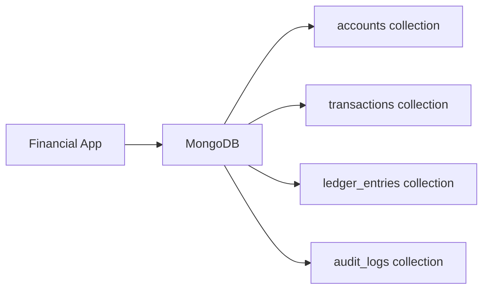

# How to Use MongoDB for Financial Applications

Author: [nawazdhandala](https://www.github.com/nawazdhandala)

Tags: MongoDB, Finance, Transaction, Schema, Decimal128

Description: Learn how to design MongoDB schemas for financial applications including account ledgers, transaction history, double-entry bookkeeping, and Decimal128 for monetary values.

---

## MongoDB in Financial Applications

Financial applications require precise decimal arithmetic, atomic multi-document operations, auditability, and high-throughput transaction recording. MongoDB provides ACID multi-document transactions, the Decimal128 type for exact monetary arithmetic, and schema validation for data integrity.



## Using Decimal128 for Monetary Values

Never use floating-point (Double) for money. Use `Decimal128` to avoid rounding errors:

```javascript
const { Decimal128 } = require("mongodb");

// Always store monetary values as Decimal128
const amount = Decimal128.fromString("149.99");

db.transactions.insertOne({
  accountId: "ACC-001",
  amount: Decimal128.fromString("149.99"),
  currency: "USD",
  type: "debit",
  description: "Purchase - Widget Pro",
  createdAt: new Date()
});

// Arithmetic: use aggregation with $sum on Decimal128
db.transactions.aggregate([
  { $match: { accountId: "ACC-001" } },
  { $group: {
    _id: "$currency",
    total: { $sum: "$amount" }
  }}
])
```

## Account Schema

```javascript
db.accounts.insertOne({
  accountNumber: "ACC-001",
  type: "checking",          // "checking", "savings", "credit", "investment"
  ownerId: ObjectId("..."),
  currency: "USD",
  balance: Decimal128.fromString("5000.00"),
  availableBalance: Decimal128.fromString("4800.00"),
  status: "active",
  openedAt: new Date(),
  metadata: {
    institution: "FirstBank",
    routingNumber: "021000021",
    interestRate: Decimal128.fromString("0.0150")
  },
  createdAt: new Date(),
  updatedAt: new Date()
});
```

## Transaction Schema with Idempotency

Financial transactions require idempotency keys to prevent duplicate processing:

```javascript
db.transactions.insertOne({
  // Idempotency key - unique per transaction attempt
  idempotencyKey: "txn-2025-abc123",
  type: "transfer",
  status: "completed",       // "pending", "completed", "failed", "reversed"

  // Parties
  fromAccountId: "ACC-001",
  toAccountId: "ACC-002",

  // Amount
  amount: Decimal128.fromString("500.00"),
  currency: "USD",
  fee: Decimal128.fromString("0.00"),

  // Reference
  reference: "Monthly transfer",
  externalReference: "WIRE-20250615-001",

  // Timestamps
  initiatedAt: new Date(),
  settledAt: new Date(),

  // Audit
  initiatedBy: "USER-00123",
  ipAddress: "10.0.1.5",

  // Metadata
  tags: ["internal-transfer"],
  metadata: {}
});

// Create unique index on idempotency key to prevent duplicates
db.transactions.createIndex(
  { idempotencyKey: 1 },
  { unique: true }
);
```

## Double-Entry Bookkeeping with Ledger Entries

For accounting accuracy, use double-entry bookkeeping where every transaction creates two ledger entries (debit and credit):

```javascript
async function recordTransfer(db, fromAccountId, toAccountId, amount, description) {
  const session = db.getMongo().startSession();
  session.startTransaction({
    readConcern: { level: "snapshot" },
    writeConcern: { w: "majority" }
  });

  try {
    const decimalAmount = Decimal128.fromString(amount.toString());
    const transactionId = new ObjectId();
    const now = new Date();

    // Check sufficient funds
    const fromAccount = await db.collection("accounts").findOne(
      { accountNumber: fromAccountId },
      { session }
    );

    if (!fromAccount) throw new Error("Source account not found");

    const fromBalance = parseFloat(fromAccount.balance.toString());
    if (fromBalance < amount) throw new Error("Insufficient funds");

    // Debit the source account
    await db.collection("accounts").updateOne(
      { accountNumber: fromAccountId },
      {
        $inc: { balance: Decimal128.fromString((-amount).toString()) },
        $set: { updatedAt: now }
      },
      { session }
    );

    // Credit the destination account
    await db.collection("accounts").updateOne(
      { accountNumber: toAccountId },
      {
        $inc: { balance: decimalAmount },
        $set: { updatedAt: now }
      },
      { session }
    );

    // Create double-entry ledger entries
    await db.collection("ledger_entries").insertMany([
      {
        transactionId,
        accountNumber: fromAccountId,
        entryType: "debit",
        amount: decimalAmount,
        balance: Decimal128.fromString((fromBalance - amount).toString()),
        description,
        createdAt: now
      },
      {
        transactionId,
        accountNumber: toAccountId,
        entryType: "credit",
        amount: decimalAmount,
        description,
        createdAt: now
      }
    ], { session });

    // Record the transaction
    await db.collection("transactions").insertOne({
      _id: transactionId,
      type: "transfer",
      status: "completed",
      fromAccountId,
      toAccountId,
      amount: decimalAmount,
      currency: "USD",
      description,
      createdAt: now
    }, { session });

    await session.commitTransaction();
    return { success: true, transactionId };
  } catch (err) {
    await session.abortTransaction();
    throw err;
  } finally {
    session.endSession();
  }
}
```

## Account Balance History

Store periodic balance snapshots for regulatory reporting:

```javascript
db.balance_snapshots.insertOne({
  accountNumber: "ACC-001",
  snapshotDate: new Date("2025-06-30"),
  snapshotType: "end_of_month",
  balance: Decimal128.fromString("4750.00"),
  currency: "USD",
  createdAt: new Date()
});
```

## Financial Aggregations

Month-over-month transaction volume:

```javascript
db.transactions.aggregate([
  {
    $match: {
      fromAccountId: "ACC-001",
      status: "completed",
      createdAt: { $gte: new Date("2025-01-01") }
    }
  },
  {
    $group: {
      _id: {
        year: { $year: "$createdAt" },
        month: { $month: "$createdAt" }
      },
      count: { $sum: 1 },
      totalVolume: { $sum: "$amount" }
    }
  },
  { $sort: { "_id.year": 1, "_id.month": 1 } }
])
```

## Schema Validation

Enforce financial data integrity with JSON Schema validation:

```javascript
db.runCommand({
  collMod: "transactions",
  validator: {
    $jsonSchema: {
      bsonType: "object",
      required: ["idempotencyKey", "type", "amount", "currency", "status"],
      properties: {
        amount: {
          bsonType: "decimal",
          description: "Amount must be a Decimal128 value"
        },
        currency: {
          bsonType: "string",
          enum: ["USD", "EUR", "GBP", "JPY"],
          description: "Must be a supported currency code"
        },
        status: {
          bsonType: "string",
          enum: ["pending", "completed", "failed", "reversed"]
        }
      }
    }
  },
  validationLevel: "strict",
  validationAction: "error"
});
```

## Indexes for Financial Queries

```javascript
db.transactions.createIndex({ idempotencyKey: 1 }, { unique: true });
db.transactions.createIndex({ fromAccountId: 1, createdAt: -1 });
db.transactions.createIndex({ toAccountId: 1, createdAt: -1 });
db.transactions.createIndex({ status: 1, createdAt: -1 });
db.transactions.createIndex({ externalReference: 1 }, { sparse: true });

db.ledger_entries.createIndex({ accountNumber: 1, createdAt: -1 });
db.ledger_entries.createIndex({ transactionId: 1 });

db.accounts.createIndex({ accountNumber: 1 }, { unique: true });
db.accounts.createIndex({ ownerId: 1 });
```

## Summary

MongoDB financial applications should use Decimal128 for all monetary values to avoid floating-point precision errors. Use multi-document ACID transactions for atomic balance updates and double-entry ledger recording. Enforce idempotency keys with unique indexes to prevent duplicate transaction processing. Add JSON Schema validation to enforce currency codes, valid status values, and required fields. Create compound indexes on account ID and date for efficient transaction history queries.
