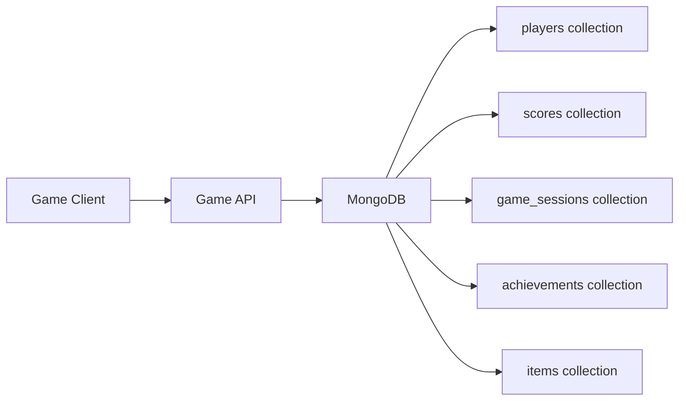

# How to Use MongoDB for Gaming Application Backends

Author: [nawazdhandala](https://www.github.com/nawazdhandala)

Tags: MongoDB, Gaming, Leaderboard, Schema, Real-time

Description: Learn how to design MongoDB schemas and queries for gaming backends including player profiles, leaderboards, game state persistence, and achievement tracking.

---

## Why MongoDB for Gaming Backends

Games generate highly variable data: player profiles have different attributes across game modes, game state is hierarchical, and leaderboards require high-read throughput. MongoDB's flexible documents, fast indexed reads, and aggregation pipeline are well-suited for these workloads.



## Player Profile Schema

```javascript
db.players.insertOne({
  playerId: "player-uuid-001",
  username: "dragonslayer99",
  email: "player@example.com",
  displayName: "DragonSlayer99",
  avatarUrl: "https://cdn.game.com/avatars/001.png",
  createdAt: new Date(),
  lastLoginAt: new Date(),

  // Progress
  level: 42,
  experience: 185500,
  experienceToNextLevel: 200000,

  // Currency
  gold: 12500,
  gems: 250,

  // Stats (game-specific)
  stats: {
    gamesPlayed: 1245,
    gamesWon: 789,
    winRate: 0.634,
    totalKills: 34500,
    highScore: 98500,
    playtimeMinutes: 8920
  },

  // Equipped items
  loadout: {
    weapon: "item-sword-legendary-001",
    armor: "item-plate-epic-003",
    accessories: ["item-ring-001", "item-amulet-005"]
  },

  // Unlocked achievements
  achievements: [
    { achievementId: "ACH-001", unlockedAt: new Date("2025-01-10") },
    { achievementId: "ACH-005", unlockedAt: new Date("2025-02-20") }
  ],

  // Friends list
  friendIds: ["player-uuid-002", "player-uuid-007"],

  // Settings
  settings: {
    soundEnabled: true,
    notifications: true,
    language: "en"
  }
});
```

## Leaderboard Design

For global leaderboards, store scores in a dedicated collection with an index on score:

```javascript
// Insert or update a player's score
db.leaderboards.updateOne(
  { leaderboardId: "global_weekly", playerId: "player-uuid-001" },
  {
    $set: {
      username: "dragonslayer99",
      avatarUrl: "https://cdn.game.com/avatars/001.png",
      score: 98500,
      updatedAt: new Date()
    },
    $setOnInsert: {
      createdAt: new Date()
    }
  },
  { upsert: true }
);

// Create index for leaderboard queries (sorted by score desc)
db.leaderboards.createIndex({ leaderboardId: 1, score: -1 });

// Get top 100 global scores
db.leaderboards.find({ leaderboardId: "global_weekly" })
  .sort({ score: -1 })
  .limit(100)
  .project({ username: 1, avatarUrl: 1, score: 1 })

// Get a player's rank using aggregation
db.leaderboards.aggregate([
  { $match: { leaderboardId: "global_weekly" } },
  { $sort: { score: -1 } },
  {
    $group: {
      _id: null,
      players: { $push: { playerId: "$playerId", score: "$score" } }
    }
  },
  {
    $project: {
      rank: {
        $add: [
          { $indexOfArray: ["$players.playerId", "player-uuid-001"] },
          1
        ]
      }
    }
  }
])
```

## Game Session Recording

```javascript
db.game_sessions.insertOne({
  sessionId: "sess-2025-abc123",
  gameMode: "ranked",
  mapId: "map-001",
  startedAt: new Date(),
  endedAt: new Date(Date.now() + 20 * 60 * 1000),
  durationSeconds: 1200,

  players: [
    {
      playerId: "player-uuid-001",
      username: "dragonslayer99",
      team: 1,
      score: 4500,
      kills: 12,
      deaths: 3,
      assists: 8,
      outcome: "win"
    },
    {
      playerId: "player-uuid-002",
      username: "shadowblade",
      team: 2,
      score: 2800,
      kills: 7,
      deaths: 8,
      assists: 5,
      outcome: "loss"
    }
  ],

  winner: 1,
  finalScore: { team1: 4500, team2: 2800 }
});
```

## Item and Inventory System

```javascript
// Item catalog
db.items.insertOne({
  itemId: "item-sword-legendary-001",
  type: "weapon",
  subtype: "sword",
  rarity: "legendary",
  name: "Excalibur",
  description: "The legendary sword of kings",

  stats: {
    attack: 250,
    critChance: 0.15,
    speed: 1.2
  },

  requirements: {
    level: 40,
    class: ["warrior", "paladin"]
  },

  dropSource: "boss-dragon-001",
  craftable: false,
  tradeable: true,
  maxStack: 1
});

// Player inventory
db.inventories.updateOne(
  { playerId: "player-uuid-001" },
  {
    $push: {
      items: {
        itemId: "item-sword-legendary-001",
        quantity: 1,
        acquiredAt: new Date(),
        acquiredFrom: "boss-dragon-001"
      }
    }
  },
  { upsert: true }
);
```

## Achievement System

```javascript
async function unlockAchievement(db, playerId, achievementId) {
  // Check if already unlocked
  const player = await db.collection("players").findOne({
    playerId,
    "achievements.achievementId": achievementId
  });

  if (player) {
    return { alreadyUnlocked: true };
  }

  // Add achievement
  const result = await db.collection("players").updateOne(
    { playerId },
    {
      $push: {
        achievements: {
          achievementId,
          unlockedAt: new Date()
        }
      }
    }
  );

  // Record achievement event
  await db.collection("achievement_events").insertOne({
    playerId,
    achievementId,
    unlockedAt: new Date()
  });

  return { unlocked: true, modifiedCount: result.modifiedCount };
}
```

## Player Statistics with Aggregation

Win rate by game mode:

```javascript
db.game_sessions.aggregate([
  { $unwind: "$players" },
  { $match: { "players.playerId": "player-uuid-001" } },
  {
    $group: {
      _id: "$gameMode",
      totalGames: { $sum: 1 },
      wins: {
        $sum: { $cond: [{ $eq: ["$players.outcome", "win"] }, 1, 0] }
      },
      avgScore: { $avg: "$players.score" },
      avgKills: { $avg: "$players.kills" }
    }
  },
  {
    $project: {
      totalGames: 1,
      wins: 1,
      winRate: { $divide: ["$wins", "$totalGames"] },
      avgScore: { $round: ["$avgScore", 0] },
      avgKills: { $round: ["$avgKills", 1] }
    }
  }
])
```

## Indexes for Gaming Performance

```javascript
db.players.createIndex({ playerId: 1 }, { unique: true });
db.players.createIndex({ username: 1 }, { unique: true });
db.players.createIndex({ level: -1 });

db.leaderboards.createIndex({ leaderboardId: 1, score: -1 });
db.leaderboards.createIndex({ leaderboardId: 1, playerId: 1 }, { unique: true });

db.game_sessions.createIndex({ "players.playerId": 1, startedAt: -1 });
db.game_sessions.createIndex({ gameMode: 1, startedAt: -1 });

// TTL: expire game sessions after 90 days
db.game_sessions.createIndex(
  { endedAt: 1 },
  { expireAfterSeconds: 60 * 60 * 24 * 90 }
);
```

## Summary

MongoDB is a strong fit for gaming backends because player profiles, game state, and inventory are naturally hierarchical documents. Use a dedicated scores collection with an index on score for leaderboard queries. Record game sessions with embedded player outcome data for match history and statistics. Track achievements with embedded arrays in player documents. Use TTL indexes on session data to manage storage of historical match records automatically.
