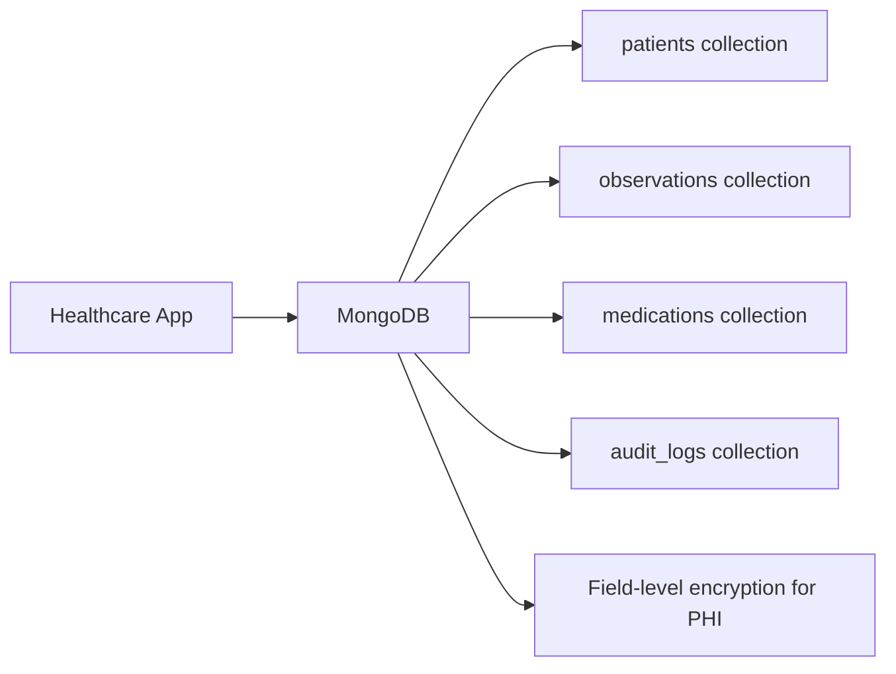

# How to Use MongoDB for Healthcare Data Storage

Author: [nawazdhandala](https://www.github.com/nawazdhandala)

Tags: MongoDB, Healthcare, Schema, Security, HIPAA

Description: Learn how to design MongoDB schemas for healthcare data including patient records, clinical observations, and audit logs with HIPAA-relevant security controls.

---

## Why MongoDB for Healthcare

Healthcare data is inherently hierarchical and variable. A patient record may contain demographics, a list of diagnoses (each with codes and dates), a list of medications, vital sign observations, and clinical notes. MongoDB's document model maps naturally to this hierarchical structure without the complex joins required in a relational schema.



## Patient Record Schema

```javascript
db.patients.insertOne({
  // Patient demographics
  mrn: "MRN-2025-00123",  // Medical Record Number
  firstName: "Alice",
  lastName: "Smith",
  dateOfBirth: new Date("1975-04-15"),
  gender: "F",
  contact: {
    phone: "555-0100",
    email: "alice.smith@example.com",
    address: {
      street: "123 Maple St",
      city: "Springfield",
      state: "IL",
      zip: "62701"
    }
  },

  // Insurance
  insurance: [
    {
      provider: "BlueCross",
      memberId: "BCB-987654",
      groupNumber: "GRP-001",
      isPrimary: true
    }
  ],

  // Active problem list
  conditions: [
    {
      code: "E11",
      system: "ICD-10",
      description: "Type 2 diabetes mellitus",
      onsetDate: new Date("2018-03-01"),
      status: "active",
      recordedBy: "DR-00456"
    }
  ],

  // Current medications
  medications: [
    {
      rxNorm: "860975",
      name: "Metformin 500mg",
      dose: "500mg",
      route: "oral",
      frequency: "twice daily",
      startDate: new Date("2018-03-15"),
      prescribedBy: "DR-00456",
      status: "active"
    }
  ],

  // Allergies
  allergies: [
    {
      allergen: "Penicillin",
      reaction: "rash",
      severity: "moderate",
      recordedAt: new Date("2010-06-01")
    }
  ],

  createdAt: new Date(),
  updatedAt: new Date(),
  createdBy: "DR-00456"
});
```

## Clinical Observations (FHIR-Inspired)

Store time-series vital signs and lab results in a separate collection:

```javascript
db.observations.insertMany([
  {
    patientId: ObjectId("..."),
    mrn: "MRN-2025-00123",
    type: "vital_sign",
    code: "55284-4",      // LOINC code for blood pressure
    system: "LOINC",
    display: "Blood pressure systolic and diastolic",
    value: { systolic: 128, diastolic: 82, unit: "mmHg" },
    effectiveDateTime: new Date("2025-06-15T09:30:00Z"),
    encounterId: "ENC-2025-0456",
    recordedBy: "NURSE-001",
    status: "final"
  },
  {
    patientId: ObjectId("..."),
    mrn: "MRN-2025-00123",
    type: "lab_result",
    code: "4548-4",       // HbA1c
    system: "LOINC",
    display: "Hemoglobin A1c/Hemoglobin.total in Blood",
    value: { numeric: 7.2, unit: "%" },
    referenceRange: { low: 4.0, high: 5.6, unit: "%" },
    interpretation: "HIGH",
    effectiveDateTime: new Date("2025-06-15T08:00:00Z"),
    encounterId: "ENC-2025-0456",
    recordedBy: "LAB-001",
    status: "final"
  }
]);
```

## Audit Logging for HIPAA Compliance

HIPAA requires logging all access to Protected Health Information (PHI). Use a dedicated audit collection with a TTL index for retention:

```javascript
async function auditAccess(db, event) {
  await db.collection("audit_logs").insertOne({
    eventType: event.type,              // "read", "write", "delete", "export"
    resourceType: event.resourceType,  // "patient", "observation", "medication"
    resourceId: event.resourceId,
    patientMrn: event.patientMrn,
    userId: event.userId,
    userRole: event.userRole,
    action: event.action,
    ipAddress: event.ipAddress,
    userAgent: event.userAgent,
    outcome: event.outcome,            // "success", "denied"
    timestamp: new Date()
  });
}

// Example: log a patient record access
await auditAccess(db, {
  type: "read",
  resourceType: "patient",
  resourceId: "MRN-2025-00123",
  patientMrn: "MRN-2025-00123",
  userId: "DR-00456",
  userRole: "physician",
  action: "view_chart",
  ipAddress: "10.0.1.55",
  userAgent: "EHR-Client/2.1",
  outcome: "success"
});

// TTL: retain audit logs for 6 years (HIPAA requirement)
db.audit_logs.createIndex(
  { timestamp: 1 },
  { expireAfterSeconds: 60 * 60 * 24 * 365 * 6 }
);
```

## Encrypting PHI Fields

Use MongoDB Client-Side Field Level Encryption for PHI fields:

```javascript
const encryptedFieldsMap = {
  "healthcare.patients": {
    fields: [
      { path: "dateOfBirth", bsonType: "date" },
      { path: "contact.phone", bsonType: "string" },
      { path: "contact.email", bsonType: "string" },
      { path: "contact.address.street", bsonType: "string" }
    ]
  }
};

const client = new MongoClient(uri, {
  autoEncryption: {
    keyVaultNamespace: "encryption.__keyVault",
    kmsProviders: { aws: { accessKeyId: process.env.AWS_ACCESS_KEY_ID, secretAccessKey: process.env.AWS_SECRET_ACCESS_KEY } },
    encryptedFieldsMap
  }
});
```

## Role-Based Access Control

Create roles that restrict access to PHI:

```javascript
// Clinical staff role - can read patient records
db.getSiblingDB("admin").createRole({
  role: "clinician",
  privileges: [
    {
      resource: { db: "healthcare", collection: "patients" },
      actions: ["find", "update"]
    },
    {
      resource: { db: "healthcare", collection: "observations" },
      actions: ["find", "insert"]
    }
  ],
  roles: []
});

// Billing role - can see MRN and insurance but not clinical details
db.getSiblingDB("admin").createRole({
  role: "billing",
  privileges: [
    {
      resource: { db: "healthcare", collection: "patients" },
      actions: ["find"]
    }
  ],
  roles: []
});
```

## Querying Patient Data

Get all active conditions for a patient:

```javascript
db.patients.findOne(
  { mrn: "MRN-2025-00123" },
  { conditions: 1, medications: 1 }
)
```

Get recent vital signs for a patient:

```javascript
db.observations.find({
  mrn: "MRN-2025-00123",
  type: "vital_sign",
  effectiveDateTime: { $gte: new Date("2025-01-01") }
}).sort({ effectiveDateTime: -1 }).limit(10)
```

Population health query - find patients with uncontrolled HbA1c:

```javascript
db.observations.aggregate([
  {
    $match: {
      code: "4548-4",
      "value.numeric": { $gt: 8.0 },
      effectiveDateTime: { $gte: new Date("2025-01-01") }
    }
  },
  {
    $group: {
      _id: "$patientId",
      latestHbA1c: { $max: "$value.numeric" }
    }
  },
  { $match: { latestHbA1c: { $gt: 8.0 } } },
  { $count: "patientsWithPoorControl" }
])
```

## Indexes

```javascript
db.patients.createIndex({ mrn: 1 }, { unique: true });
db.patients.createIndex({ lastName: 1, firstName: 1, dateOfBirth: 1 });
db.patients.createIndex({ "conditions.code": 1 });

db.observations.createIndex({ patientId: 1, effectiveDateTime: -1 });
db.observations.createIndex({ mrn: 1, code: 1, effectiveDateTime: -1 });
db.observations.createIndex({ encounterId: 1 });

db.audit_logs.createIndex({ patientMrn: 1, timestamp: -1 });
db.audit_logs.createIndex({ userId: 1, timestamp: -1 });
```

## Summary

MongoDB's document model is well-suited for healthcare data where patient records are hierarchical with variable structures across individuals. Design patient demographics, problem lists, and medications as embedded documents. Store time-series observations separately for efficient range queries. Implement field-level encryption for PHI fields such as date of birth, phone, and address. Maintain a dedicated audit log collection with a TTL index for HIPAA retention compliance and use role-based access control to enforce least-privilege access to clinical data.
