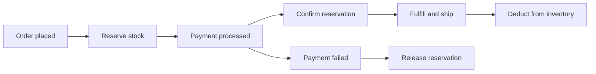

# How to Use MongoDB for Real-Time Inventory Management

Author: [nawazdhandala](https://www.github.com/nawazdhandala)

Tags: MongoDB, Inventory, E-commerce, Transaction, Schema

Description: Learn how to design a MongoDB schema for real-time inventory management with atomic stock updates, reservation patterns, and multi-warehouse tracking.

---

## Inventory Management Requirements

A real-time inventory system needs to:
- Track stock levels across one or more warehouses
- Handle concurrent purchase requests without overselling
- Reserve stock during checkout before payment confirmation
- Record inventory movements for auditing



## Product Inventory Schema

```javascript
db.inventory.insertOne({
  productId: "prod-001",
  sku: "WIDGET-PRO-BLK-L",
  name: "Widget Pro - Black - Large",
  barcode: "012345678901",

  // Stock levels
  totalQuantity: 250,
  availableQuantity: 220,   // totalQuantity - reservedQuantity
  reservedQuantity: 30,     // held during pending orders
  soldQuantity: 1500,       // lifetime sold

  // Reorder
  reorderPoint: 50,
  reorderQuantity: 200,

  // Physical
  weight: 0.85,             // kg
  dimensions: { l: 20, w: 15, h: 10, unit: "cm" },

  // Location
  warehouseLocations: [
    {
      warehouseId: "WH-US-EAST",
      aisle: "A",
      shelf: "3",
      bin: "15",
      quantity: 150
    },
    {
      warehouseId: "WH-US-WEST",
      aisle: "B",
      shelf: "1",
      bin: "02",
      quantity: 100
    }
  ],

  updatedAt: new Date()
});
```

## Atomic Stock Reservation

Use `$inc` with a condition to atomically reserve stock without overselling:

```javascript
async function reserveStock(db, productId, quantity, orderId) {
  // Atomically check and reserve - findOneAndUpdate with condition
  const result = await db.collection("inventory").findOneAndUpdate(
    {
      productId,
      availableQuantity: { $gte: quantity }  // Only succeed if enough stock
    },
    {
      $inc: {
        availableQuantity: -quantity,
        reservedQuantity: quantity
      },
      $push: {
        reservations: {
          orderId,
          quantity,
          reservedAt: new Date(),
          expiresAt: new Date(Date.now() + 15 * 60 * 1000)  // 15-minute hold
        }
      },
      $set: { updatedAt: new Date() }
    },
    { returnDocument: "after" }
  );

  if (!result) {
    throw new Error(`Insufficient stock for product ${productId}`);
  }

  return {
    success: true,
    availableQuantity: result.availableQuantity,
    reservedQuantity: result.reservedQuantity
  };
}
```

## Confirming a Reservation (After Payment)

```javascript
async function confirmReservation(db, productId, orderId, quantity) {
  const result = await db.collection("inventory").updateOne(
    {
      productId,
      "reservations.orderId": orderId
    },
    {
      $inc: {
        reservedQuantity: -quantity,
        totalQuantity: -quantity,
        soldQuantity: quantity
      },
      $pull: {
        reservations: { orderId }
      },
      $set: { updatedAt: new Date() }
    }
  );

  // Record movement
  await db.collection("inventory_movements").insertOne({
    productId,
    orderId,
    type: "sale",
    quantity: -quantity,
    reason: "order_fulfilled",
    createdAt: new Date()
  });

  return result.modifiedCount === 1;
}
```

## Releasing an Expired Reservation

```javascript
async function releaseReservation(db, productId, orderId, quantity) {
  await db.collection("inventory").updateOne(
    { productId, "reservations.orderId": orderId },
    {
      $inc: {
        availableQuantity: quantity,
        reservedQuantity: -quantity
      },
      $pull: {
        reservations: { orderId }
      },
      $set: { updatedAt: new Date() }
    }
  );

  await db.collection("inventory_movements").insertOne({
    productId,
    orderId,
    type: "reservation_released",
    quantity,
    reason: "order_cancelled_or_expired",
    createdAt: new Date()
  });
}
```

## Auto-Expiring Reservations with a Background Job

Reservations that expire because checkout was abandoned need to be released:

```javascript
async function releaseExpiredReservations(db) {
  const now = new Date();

  // Find all products with expired reservations
  const products = await db.collection("inventory").find({
    "reservations.expiresAt": { $lt: now }
  }).toArray();

  for (const product of products) {
    const expiredReservations = product.reservations.filter(
      r => r.expiresAt < now
    );

    for (const res of expiredReservations) {
      await releaseReservation(
        db,
        product.productId,
        res.orderId,
        res.quantity
      );
    }
  }

  console.log(`Released ${products.length} expired reservations`);
}
```

## Inventory Replenishment

```javascript
async function receiveStock(db, productId, quantity, supplierId, purchaseOrderId) {
  await db.collection("inventory").updateOne(
    { productId },
    {
      $inc: {
        totalQuantity: quantity,
        availableQuantity: quantity
      },
      $set: { updatedAt: new Date() }
    }
  );

  await db.collection("inventory_movements").insertOne({
    productId,
    purchaseOrderId,
    supplierId,
    type: "receipt",
    quantity,
    reason: "purchase_order_received",
    createdAt: new Date()
  });
}
```

## Multi-Warehouse Stock Query

```javascript
// Check stock at a specific warehouse
db.inventory.find({
  "warehouseLocations.warehouseId": "WH-US-EAST",
  "warehouseLocations.quantity": { $gt: 0 }
}).project({
  productId: 1,
  sku: 1,
  name: 1,
  "warehouseLocations.$": 1
})

// Low stock report across all products
db.inventory.find({
  availableQuantity: { $lte: "$reorderPoint" }
}).sort({ availableQuantity: 1 })

// Inventory value by category
db.inventory.aggregate([
  {
    $lookup: {
      from: "products",
      localField: "productId",
      foreignField: "productId",
      as: "product"
    }
  },
  { $unwind: "$product" },
  {
    $group: {
      _id: "$product.category",
      totalUnits: { $sum: "$totalQuantity" },
      totalValue: { $sum: { $multiply: ["$totalQuantity", "$product.costPrice"] } }
    }
  }
])
```

## Indexes for Inventory Performance

```javascript
db.inventory.createIndex({ productId: 1 }, { unique: true });
db.inventory.createIndex({ sku: 1 }, { unique: true });
db.inventory.createIndex({ availableQuantity: 1 });  // Low stock queries
db.inventory.createIndex({ "reservations.orderId": 1 });
db.inventory.createIndex({ "reservations.expiresAt": 1 });  // Expired reservation cleanup
db.inventory.createIndex({ "warehouseLocations.warehouseId": 1 });

db.inventory_movements.createIndex({ productId: 1, createdAt: -1 });
db.inventory_movements.createIndex({ orderId: 1 });

// TTL: archive movements older than 2 years
db.inventory_movements.createIndex(
  { createdAt: 1 },
  { expireAfterSeconds: 60 * 60 * 24 * 730 }
);
```

## Summary

MongoDB handles real-time inventory with atomic `findOneAndUpdate` operations that prevent overselling by combining the stock availability check and reservation in a single atomic write. Use the reservation pattern (reserve on checkout, confirm on payment, release on cancellation) rather than immediately deducting stock. Track all stock movements in a separate collection for audit trails, and use TTL indexes to archive old movement records automatically.
