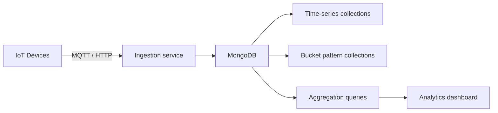

# How to Use MongoDB for IoT Data Storage and Querying

Author: [nawazdhandala](https://www.github.com/nawazdhandala)

Tags: MongoDB, IoT, Time-series, Sensor, Schema

Description: Learn how to store and query IoT sensor data in MongoDB using time-series collections, the bucket pattern, and aggregation pipelines for sensor analytics.

---

## IoT Data Challenges

IoT systems generate high volumes of time-stamped sensor readings. Storing each reading as an individual document creates millions of small documents, which is inefficient for storage and query performance. MongoDB provides two approaches for IoT data: native time-series collections (MongoDB 5.0+) and the classic bucket pattern.



## Option 1: Native Time-Series Collections

MongoDB 5.0+ has built-in time-series collections optimized for sensor data. They compress measurements automatically and support efficient range queries on the time field.

```javascript
// Create a time-series collection
db.createCollection("sensor_readings", {
  timeseries: {
    timeField: "timestamp",
    metaField: "metadata",
    granularity: "minutes"  // "seconds", "minutes", or "hours"
  },
  expireAfterSeconds: 60 * 60 * 24 * 365  // 1-year TTL
});
```

Insert sensor readings:

```javascript
db.sensor_readings.insertMany([
  {
    metadata: {
      deviceId: "sensor-001",
      location: "Building A, Floor 3",
      type: "temperature"
    },
    timestamp: new Date("2025-06-15T10:00:00Z"),
    value: 22.4,
    unit: "celsius"
  },
  {
    metadata: {
      deviceId: "sensor-001",
      location: "Building A, Floor 3",
      type: "humidity"
    },
    timestamp: new Date("2025-06-15T10:00:00Z"),
    value: 58.2,
    unit: "percent"
  }
]);
```

Query recent readings for a device:

```javascript
db.sensor_readings.find({
  "metadata.deviceId": "sensor-001",
  timestamp: {
    $gte: new Date("2025-06-15T00:00:00Z"),
    $lt: new Date("2025-06-16T00:00:00Z")
  }
}).sort({ timestamp: 1 })
```

## Option 2: Bucket Pattern (for pre-5.0 or custom requirements)

The bucket pattern groups multiple readings into a single document per time window, reducing document count and improving query efficiency:

```javascript
// Bucket document holds up to 1 hour of readings for a device
db.sensor_buckets.updateOne(
  {
    deviceId: "sensor-001",
    type: "temperature",
    // Match the current hour bucket
    bucketStart: new Date("2025-06-15T10:00:00Z"),
    measurementCount: { $lt: 200 }  // Max 200 readings per bucket
  },
  {
    $push: {
      readings: {
        ts: new Date("2025-06-15T10:05:00Z"),
        v: 22.6
      }
    },
    $inc: { measurementCount: 1 },
    $min: { minValue: 22.6 },
    $max: { maxValue: 22.6 },
    $set: { updatedAt: new Date() },
    $setOnInsert: {
      deviceId: "sensor-001",
      type: "temperature",
      unit: "celsius",
      bucketStart: new Date("2025-06-15T10:00:00Z"),
      createdAt: new Date()
    }
  },
  { upsert: true }
);
```

## Device Registry

```javascript
db.devices.insertOne({
  deviceId: "sensor-001",
  name: "HVAC Sensor - Building A Floor 3",
  type: "environmental",
  model: "SensePro-2000",
  firmware: "2.4.1",
  location: {
    building: "Building A",
    floor: 3,
    room: "Server Room",
    coordinates: { lat: 37.7749, lon: -122.4194 }
  },
  capabilities: ["temperature", "humidity", "co2"],
  samplingIntervalSeconds: 60,
  status: "active",
  lastSeenAt: new Date(),
  installedAt: new Date("2024-01-10"),
  metadata: {
    installTechnician: "Tech-007",
    warrantyExpiry: new Date("2027-01-10")
  }
});
```

## Aggregating Sensor Data

Average temperature per hour:

```javascript
db.sensor_readings.aggregate([
  {
    $match: {
      "metadata.deviceId": "sensor-001",
      "metadata.type": "temperature",
      timestamp: {
        $gte: new Date("2025-06-15T00:00:00Z"),
        $lt: new Date("2025-06-16T00:00:00Z")
      }
    }
  },
  {
    $group: {
      _id: {
        hour: { $dateTrunc: { date: "$timestamp", unit: "hour" } }
      },
      avgTemp: { $avg: "$value" },
      minTemp: { $min: "$value" },
      maxTemp: { $max: "$value" },
      readingCount: { $sum: 1 }
    }
  },
  { $sort: { "_id.hour": 1 } }
])
```

Detect anomalies (readings outside normal range):

```javascript
db.sensor_readings.find({
  "metadata.type": "temperature",
  $or: [
    { value: { $gt: 35 } },
    { value: { $lt: 10 } }
  ],
  timestamp: { $gte: new Date(Date.now() - 24 * 60 * 60 * 1000) }
}).sort({ timestamp: -1 })
```

Fleet summary - latest readings per device:

```javascript
db.sensor_readings.aggregate([
  {
    $match: {
      timestamp: { $gte: new Date(Date.now() - 5 * 60 * 1000) }  // Last 5 min
    }
  },
  {
    $sort: { "metadata.deviceId": 1, timestamp: -1 }
  },
  {
    $group: {
      _id: "$metadata.deviceId",
      latestTimestamp: { $first: "$timestamp" },
      latestValue: { $first: "$value" },
      type: { $first: "$metadata.type" }
    }
  }
])
```

## Downsampling for Long-Term Storage

Store hourly aggregates for historical queries to keep storage manageable:

```javascript
async function downsampleHourlyAggregates(db, deviceId, hour) {
  const hourEnd = new Date(hour.getTime() + 60 * 60 * 1000);

  const results = await db.collection("sensor_readings").aggregate([
    {
      $match: {
        "metadata.deviceId": deviceId,
        timestamp: { $gte: hour, $lt: hourEnd }
      }
    },
    {
      $group: {
        _id: "$metadata.type",
        avg: { $avg: "$value" },
        min: { $min: "$value" },
        max: { $max: "$value" },
        count: { $sum: 1 }
      }
    }
  ]).toArray();

  for (const result of results) {
    await db.collection("sensor_aggregates_hourly").updateOne(
      { deviceId, type: result._id, hour },
      {
        $set: {
          avg: result.avg,
          min: result.min,
          max: result.max,
          count: result.count,
          updatedAt: new Date()
        }
      },
      { upsert: true }
    );
  }
}
```

## Geospatial Queries for IoT

Query devices within a geographic area:

```javascript
// Create 2dsphere index for geospatial queries
db.devices.createIndex({ "location.coordinates": "2dsphere" });

// Store location as GeoJSON Point
db.devices.updateOne(
  { deviceId: "sensor-001" },
  {
    $set: {
      "location.geoPoint": {
        type: "Point",
        coordinates: [-122.4194, 37.7749]  // [longitude, latitude]
      }
    }
  }
);

// Find devices within 500 meters of a point
db.devices.find({
  "location.geoPoint": {
    $near: {
      $geometry: { type: "Point", coordinates: [-122.419, 37.775] },
      $maxDistance: 500
    }
  }
})
```

## Indexes for IoT Performance

```javascript
// Time-series collections manage their own internal indexes
// For regular collections:
db.sensor_readings.createIndex({ "metadata.deviceId": 1, timestamp: -1 });
db.sensor_readings.createIndex({ "metadata.type": 1, timestamp: -1 });
db.sensor_readings.createIndex({ value: 1 });  // For anomaly threshold queries

db.devices.createIndex({ deviceId: 1 }, { unique: true });
db.devices.createIndex({ status: 1 });
db.devices.createIndex({ "location.building": 1 });
```

## Summary

MongoDB handles IoT data efficiently through native time-series collections in MongoDB 5.0+ or the bucket pattern for older versions. Time-series collections provide automatic compression and optimized time-range queries for high-frequency sensor data. Use aggregation pipelines to compute hourly and daily averages for dashboards, and store downsampled aggregates for long-term historical analysis. Add 2dsphere indexes for geospatial queries on device locations.
