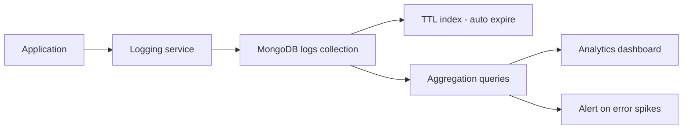

# How to Use MongoDB for Log Management and Analytics

Author: [nawazdhandala](https://www.github.com/nawazdhandala)

Tags: MongoDB, Logging, Analytics, Time-series, Aggregation

Description: Learn how to store, query, and analyze application and infrastructure logs in MongoDB with time-series collections, capped collections, and aggregation pipelines.

---

## Why MongoDB for Log Management

MongoDB is not a dedicated log management tool like Elasticsearch or Loki, but it is a viable choice for log storage when you already use MongoDB and need structured log search and aggregation without adding another system. Key advantages are flexible schema (logs from different services vary in fields), native time-series collections for efficient storage, TTL indexes for automatic retention, and powerful aggregation for analytics.



## Log Document Schema

```javascript
db.logs.insertMany([
  {
    timestamp: new Date(),
    level: "error",
    service: "order-service",
    host: "app-server-01",
    version: "2.4.1",
    traceId: "trace-abc-123",
    spanId: "span-001",
    message: "Failed to process payment for order ORD-001",
    error: {
      type: "PaymentGatewayError",
      message: "Stripe API timeout after 30s",
      stack: "PaymentGatewayError: timeout\n  at payment.js:45..."
    },
    context: {
      orderId: "ORD-2025-001",
      customerId: "cust-001",
      amount: 149.99,
      currency: "USD"
    },
    environment: "production",
    region: "us-east-1"
  },
  {
    timestamp: new Date(),
    level: "info",
    service: "user-service",
    host: "app-server-02",
    version: "1.8.0",
    message: "User login successful",
    context: {
      userId: "user-001",
      ipAddress: "10.0.1.55",
      userAgent: "Mozilla/5.0"
    },
    environment: "production",
    region: "us-east-1"
  }
]);
```

## Using Time-Series Collections for Logs

For high-volume log ingestion, use a time-series collection:

```javascript
db.createCollection("logs_ts", {
  timeseries: {
    timeField: "timestamp",
    metaField: "metadata",
    granularity: "seconds"
  },
  expireAfterSeconds: 60 * 60 * 24 * 30  // Retain 30 days
});

// Insert a log into the time-series collection
db.logs_ts.insertOne({
  metadata: {
    service: "order-service",
    host: "app-server-01",
    level: "error",
    environment: "production"
  },
  timestamp: new Date(),
  message: "Payment processing failed",
  context: { orderId: "ORD-001" }
});
```

## Using Capped Collections for Rolling Log Buffers

Capped collections maintain a fixed size buffer and automatically overwrite oldest entries:

```javascript
db.createCollection("recent_logs", {
  capped: true,
  size: 100 * 1024 * 1024,  // 100 MB
  max: 1000000               // Max 1 million documents
});

// Tail the capped collection (similar to tail -f)
const cursor = db.recent_logs.find().tailable({ awaitData: true });
while (cursor.hasNext()) {
  const log = cursor.next();
  console.log(log.timestamp, log.level, log.message);
}
```

## Log Ingestion from Application Code

Node.js application sending structured logs to MongoDB:

```javascript
const { MongoClient } = require("mongodb");
const winston = require("winston");

const mongoClient = new MongoClient(process.env.MONGODB_URI);
await mongoClient.connect();
const logsDb = mongoClient.db("logs");

// Custom Winston transport for MongoDB
class MongoTransport extends winston.transports.Stream {
  constructor(opts) {
    const passThrough = new require("stream").PassThrough({ objectMode: true });
    super({ stream: passThrough });
    this.collection = opts.collection;

    passThrough.on("data", async (logEntry) => {
      try {
        await this.collection.insertOne({
          timestamp: new Date(logEntry.timestamp),
          level: logEntry.level,
          message: logEntry.message,
          service: process.env.SERVICE_NAME,
          host: require("os").hostname(),
          ...logEntry
        });
      } catch (err) {
        console.error("Failed to write log:", err.message);
      }
    });
  }
}

const logger = winston.createLogger({
  transports: [
    new winston.transports.Console(),
    new MongoTransport({ collection: logsDb.collection("app_logs") })
  ]
});

logger.error("Payment failed", { orderId: "ORD-001", error: "timeout" });
```

## Log Queries

Find recent errors:

```javascript
db.logs.find({
  level: "error",
  timestamp: { $gte: new Date(Date.now() - 60 * 60 * 1000) }  // Last hour
}).sort({ timestamp: -1 }).limit(50)
```

Search logs by context field:

```javascript
db.logs.find({
  "context.orderId": "ORD-2025-001"
}).sort({ timestamp: -1 })
```

Trace all logs for a distributed request:

```javascript
db.logs.find({ traceId: "trace-abc-123" }).sort({ timestamp: 1 })
```

## Log Analytics with Aggregation

Error rate by service per hour:

```javascript
db.logs.aggregate([
  {
    $match: {
      timestamp: { $gte: new Date(Date.now() - 24 * 60 * 60 * 1000) }
    }
  },
  {
    $group: {
      _id: {
        service: "$service",
        hour: { $dateTrunc: { date: "$timestamp", unit: "hour" } },
        level: "$level"
      },
      count: { $sum: 1 }
    }
  },
  {
    $group: {
      _id: { service: "$_id.service", hour: "$_id.hour" },
      total: { $sum: "$count" },
      errors: {
        $sum: {
          $cond: [{ $eq: ["$_id.level", "error"] }, "$count", 0]
        }
      }
    }
  },
  {
    $project: {
      total: 1,
      errors: 1,
      errorRate: { $divide: ["$errors", "$total"] }
    }
  },
  { $sort: { "_id.hour": -1 } }
])
```

Top error messages in the last 24 hours:

```javascript
db.logs.aggregate([
  {
    $match: {
      level: "error",
      timestamp: { $gte: new Date(Date.now() - 24 * 60 * 60 * 1000) }
    }
  },
  {
    $group: {
      _id: "$message",
      count: { $sum: 1 },
      services: { $addToSet: "$service" },
      lastOccurrence: { $max: "$timestamp" }
    }
  },
  { $sort: { count: -1 } },
  { $limit: 20 }
])
```

## TTL Index for Log Retention

```javascript
// Expire logs after 30 days
db.logs.createIndex(
  { timestamp: 1 },
  { expireAfterSeconds: 60 * 60 * 24 * 30 }
);

// Different retention for different environments
// Production: 90 days
db.prod_logs.createIndex(
  { timestamp: 1 },
  { expireAfterSeconds: 60 * 60 * 24 * 90 }
);

// Development: 7 days
db.dev_logs.createIndex(
  { timestamp: 1 },
  { expireAfterSeconds: 60 * 60 * 24 * 7 }
);
```

## Indexes for Log Performance

```javascript
db.logs.createIndex({ timestamp: -1 });
db.logs.createIndex({ level: 1, timestamp: -1 });
db.logs.createIndex({ service: 1, timestamp: -1 });
db.logs.createIndex({ traceId: 1, timestamp: 1 });
db.logs.createIndex({ "context.orderId": 1 }, { sparse: true });
db.logs.createIndex({ "error.type": 1, timestamp: -1 }, { sparse: true });
```

## Summary

MongoDB handles log management through flexible document schemas that accommodate variable log structures across services, TTL indexes for automatic retention management, and aggregation pipelines for error rate analysis and pattern detection. Use native time-series collections for high-volume log ingestion with automatic compression, or capped collections for fixed-size rolling log buffers. For very high log volumes (millions per second), dedicated tools like Elasticsearch or ClickHouse are better choices, but for moderate volumes MongoDB avoids the operational overhead of an additional system.
