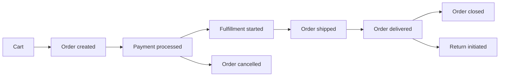

# How to Use MongoDB for Order Management Systems

Author: [nawazdhandala](https://www.github.com/nawazdhandala)

Tags: MongoDB, Order, E-Commerce, Schema, Transaction

Description: Learn how to design a MongoDB schema for an order management system with order lifecycle, status tracking, line items, payments, and shipping management.

---

## Order Management Requirements

An order management system (OMS) needs to:
- Store orders with line items, pricing, and customer information
- Track order status through a lifecycle
- Record payment events
- Manage shipments and fulfillment
- Support order search and reporting



## Order Schema

```javascript
db.orders.insertOne({
  orderId: "ORD-2025-00001",
  orderNumber: "20250001",  // Human-readable sequential number
  status: "pending",         // Order lifecycle status

  // Customer
  customerId: "cust-001",
  customer: {
    firstName: "Alice",
    lastName: "Smith",
    email: "alice@example.com",
    phone: "555-0100"
  },

  // Line items (price snapshot at time of order)
  items: [
    {
      lineItemId: "li-001",
      productId: "prod-001",
      variantId: "var-001",
      sku: "LAPTOP-PRO-15-SLV",
      name: "LaptopPro 15 - Silver",
      quantity: 1,
      unitPrice: 1299.99,
      discountAmount: 0,
      taxAmount: 104.00,
      totalPrice: 1403.99,
      status: "pending"
    },
    {
      lineItemId: "li-002",
      productId: "prod-100",
      variantId: "var-002",
      sku: "TSHIRT-CLASSIC-BLK-M",
      name: "Classic Cotton T-Shirt - Black M",
      quantity: 2,
      unitPrice: 29.99,
      discountAmount: 5.00,
      taxAmount: 4.40,
      totalPrice: 59.38,
      status: "pending"
    }
  ],

  // Totals
  subtotal: 1359.97,
  discountTotal: 5.00,
  shippingTotal: 0,
  taxTotal: 108.40,
  grandTotal: 1463.37,
  currency: "USD",

  // Shipping address (snapshot at order time)
  shippingAddress: {
    firstName: "Alice",
    lastName: "Smith",
    address1: "123 Maple St",
    city: "Springfield",
    state: "IL",
    zip: "62701",
    country: "US"
  },

  // Billing address
  billingAddress: {
    sameAsShipping: true
  },

  // Shipping method chosen
  shippingMethod: {
    id: "free-standard",
    name: "Free Standard Shipping",
    carrierCode: "UPS",
    estimatedDays: 5
  },

  // Payment summary (details in payment_events)
  paymentStatus: "pending",
  paymentMethod: "credit_card",

  // Fulfillment
  fulfillmentStatus: "unfulfilled",
  shipments: [],

  // Applied promotions
  appliedCoupons: ["SAVE5"],
  promotions: [
    {
      code: "SAVE5",
      type: "fixed",
      discountAmount: 5.00
    }
  ],

  // Timestamps
  createdAt: new Date(),
  updatedAt: new Date(),
  completedAt: null,
  cancelledAt: null,

  // Source
  channel: "web",
  ipAddress: "10.0.1.55",

  // Notes
  customerNote: "Please leave at the door",
  internalNotes: []
});
```

## Order Status Lifecycle

Use a state machine pattern to control valid transitions:

```javascript
const ORDER_STATUS_TRANSITIONS = {
  pending: ["confirmed", "cancelled"],
  confirmed: ["processing", "cancelled"],
  processing: ["shipped", "cancelled"],
  shipped: ["delivered", "returned"],
  delivered: ["closed", "returned"],
  returned: ["refunded"],
  cancelled: [],
  refunded: [],
  closed: []
};

async function updateOrderStatus(db, orderId, newStatus, userId, reason) {
  const order = await db.collection("orders").findOne({ orderId });
  if (!order) throw new Error("Order not found");

  const allowed = ORDER_STATUS_TRANSITIONS[order.status] || [];
  if (!allowed.includes(newStatus)) {
    throw new Error(`Invalid transition: ${order.status} -> ${newStatus}`);
  }

  const update = {
    $set: { status: newStatus, updatedAt: new Date() },
    $push: {
      statusHistory: {
        from: order.status,
        to: newStatus,
        reason,
        changedBy: userId,
        changedAt: new Date()
      }
    }
  };

  // Set timestamp fields for terminal states
  if (newStatus === "cancelled") update.$set.cancelledAt = new Date();
  if (newStatus === "closed") update.$set.completedAt = new Date();

  await db.collection("orders").updateOne({ orderId }, update);
}
```

## Payment Events

```javascript
// Record a payment event
db.payment_events.insertOne({
  paymentEventId: "pe-001",
  orderId: "ORD-2025-00001",
  type: "charge",            // "charge", "refund", "chargeback", "void"
  status: "succeeded",
  amount: 1463.37,
  currency: "USD",
  method: "credit_card",
  gateway: "stripe",
  gatewayTransactionId: "ch_abc123",
  last4: "4242",
  brand: "Visa",
  processedAt: new Date()
});

// Update order payment status after successful payment
await db.collection("orders").updateOne(
  { orderId: "ORD-2025-00001" },
  {
    $set: {
      paymentStatus: "paid",
      status: "confirmed",
      updatedAt: new Date()
    }
  }
);
```

## Shipment Tracking

```javascript
// Add shipment to an order
await db.collection("orders").updateOne(
  { orderId: "ORD-2025-00001" },
  {
    $push: {
      shipments: {
        shipmentId: "ship-001",
        status: "shipped",
        carrier: "UPS",
        trackingNumber: "1Z999AA10123456784",
        trackingUrl: "https://www.ups.com/track?loc=en_US&tracknum=1Z999AA10123456784",
        shippedAt: new Date(),
        estimatedDelivery: new Date(Date.now() + 5 * 24 * 60 * 60 * 1000),
        items: [
          { lineItemId: "li-001", quantity: 1 },
          { lineItemId: "li-002", quantity: 2 }
        ]
      }
    },
    $set: {
      fulfillmentStatus: "fulfilled",
      status: "shipped",
      updatedAt: new Date()
    }
  }
);
```

## Order Queries

Get all pending orders:

```javascript
db.orders.find({
  status: "pending",
  createdAt: { $gte: new Date(Date.now() - 24 * 60 * 60 * 1000) }
}).sort({ createdAt: 1 })
```

Customer order history:

```javascript
db.orders.find({ customerId: "cust-001" })
  .sort({ createdAt: -1 })
  .limit(10)
  .project({ orderId: 1, orderNumber: 1, status: 1, grandTotal: 1, createdAt: 1 })
```

Revenue aggregation:

```javascript
db.orders.aggregate([
  {
    $match: {
      status: { $in: ["delivered", "closed"] },
      createdAt: { $gte: new Date("2025-01-01") }
    }
  },
  {
    $group: {
      _id: {
        year: { $year: "$createdAt" },
        month: { $month: "$createdAt" }
      },
      orderCount: { $sum: 1 },
      revenue: { $sum: "$grandTotal" },
      avgOrderValue: { $avg: "$grandTotal" }
    }
  },
  { $sort: { "_id.year": 1, "_id.month": 1 } }
])
```

## Indexes for Order Management

```javascript
db.orders.createIndex({ orderId: 1 }, { unique: true });
db.orders.createIndex({ orderNumber: 1 }, { unique: true });
db.orders.createIndex({ customerId: 1, createdAt: -1 });
db.orders.createIndex({ status: 1, createdAt: -1 });
db.orders.createIndex({ paymentStatus: 1, createdAt: -1 });
db.orders.createIndex({ fulfillmentStatus: 1 });
db.orders.createIndex({ "shipments.trackingNumber": 1 }, { sparse: true });

db.payment_events.createIndex({ orderId: 1, processedAt: -1 });
db.payment_events.createIndex({ gatewayTransactionId: 1 });
```

## Summary

MongoDB's document model is a natural fit for order management because an order and its line items form a cohesive hierarchy that benefits from co-location in a single document. Embed line items, shipping details, and applied promotions in the order document. Use a status history array for auditability. Store payment events in a separate collection for detailed payment tracking. Use multi-document transactions when coordinating order status changes with inventory deductions.
