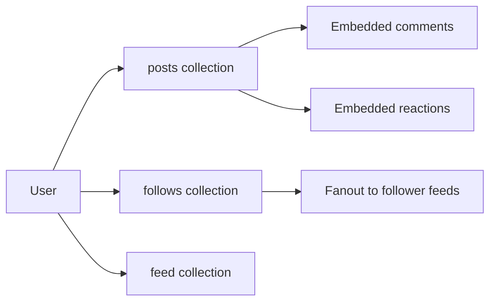

# How to Use MongoDB for Social Network Applications

Author: [nawazdhandala](https://www.github.com/nawazdhandala)

Tags: MongoDB, Social, Schema, Graph, Application

Description: Learn how to design MongoDB schemas for social network features including user profiles, follower graphs, activity feeds, posts, likes, and comments.

---

## Social Network Data Modeling

Social networks have several core features: user profiles, follow/friend relationships, posts, reactions, comments, and feeds. MongoDB's document model handles profile data and embedded reactions well. Graph traversals (mutual friends, degrees of connection) work but are better kept shallow to avoid deep `$lookup` chains.



## User Profile Schema

```javascript
db.users.insertOne({
  userId: "user-uuid-001",
  username: "alice_codes",
  displayName: "Alice Johnson",
  email: "alice@example.com",
  avatarUrl: "https://cdn.example.com/avatars/alice.jpg",
  bio: "Software engineer, coffee lover, MongoDB enthusiast.",
  website: "https://alice.dev",

  location: "San Francisco, CA",

  // Counts (cached for fast display, updated with $inc)
  followerCount: 1250,
  followingCount: 340,
  postCount: 87,

  // Settings
  isPrivate: false,
  isVerified: true,
  notificationsEnabled: true,

  joinedAt: new Date("2022-03-15"),
  lastActiveAt: new Date()
});

db.users.createIndex({ username: 1 }, { unique: true });
db.users.createIndex({ email: 1 }, { unique: true });
db.users.createIndex({ followerCount: -1 });  // For discovering popular accounts
```

## Follow Relationships

Store follows in a separate collection to support bidirectional queries:

```javascript
// Follow an account
await db.collection("follows").insertOne({
  followerId: "user-uuid-001",
  followeeId: "user-uuid-002",
  createdAt: new Date()
});

// Increment follower/following counts atomically
await db.collection("users").bulkWrite([
  {
    updateOne: {
      filter: { userId: "user-uuid-001" },
      update: { $inc: { followingCount: 1 } }
    }
  },
  {
    updateOne: {
      filter: { userId: "user-uuid-002" },
      update: { $inc: { followerCount: 1 } }
    }
  }
]);

// Indexes for follow queries
db.follows.createIndex({ followerId: 1, followeeId: 1 }, { unique: true });
db.follows.createIndex({ followeeId: 1, createdAt: -1 });
db.follows.createIndex({ followerId: 1, createdAt: -1 });
```

## Post Schema

```javascript
db.posts.insertOne({
  postId: "post-uuid-001",
  authorId: "user-uuid-001",
  authorUsername: "alice_codes",  // Denormalized for fast feed rendering

  type: "post",  // "post", "repost", "quote_post"
  content: "Just pushed a major MongoDB performance improvement. 3x faster queries!",

  media: [
    {
      type: "image",
      url: "https://cdn.example.com/posts/img-001.jpg",
      width: 1200,
      height: 800
    }
  ],

  tags: ["mongodb", "performance", "databases"],
  mentions: ["user-uuid-007"],

  // Cached counts (updated with $inc)
  likeCount: 87,
  commentCount: 12,
  repostCount: 23,
  viewCount: 4500,

  // Reactions summary (top 3 types + total)
  reactions: {
    like: 60,
    love: 20,
    laugh: 7,
    total: 87
  },

  createdAt: new Date(),
  updatedAt: new Date(),
  isDeleted: false
});

db.posts.createIndex({ authorId: 1, createdAt: -1 });
db.posts.createIndex({ tags: 1, createdAt: -1 });
db.posts.createIndex({ createdAt: -1 });
```

## Comments with Embedding

For posts with moderate comment volumes, embed the latest comments and store overflow in a separate collection:

```javascript
// Add a comment to a post
async function addComment(db, postId, authorId, username, text) {
  const comment = {
    commentId: new ObjectId().toString(),
    authorId,
    authorUsername: username,
    text,
    likeCount: 0,
    createdAt: new Date()
  };

  // Embed up to 3 most recent comments for fast rendering
  const post = await db.collection("posts").findOneAndUpdate(
    { postId },
    {
      $inc: { commentCount: 1 },
      $push: {
        recentComments: {
          $each: [comment],
          $sort: { createdAt: -1 },
          $slice: 3
        }
      }
    }
  );

  // Also store in the full comments collection
  await db.collection("comments").insertOne({
    ...comment,
    postId,
    authorId
  });

  return comment;
}

db.comments.createIndex({ postId: 1, createdAt: -1 });
```

## Activity Feed

Use a fan-out-on-write pattern for small networks or fan-out-on-read for large ones:

```javascript
// Fan-out-on-write: push post to each follower's feed (good for < 10,000 followers)
async function fanoutPost(db, authorId, postId) {
  const followers = await db.collection("follows").find(
    { followeeId: authorId },
    { projection: { followerId: 1 } }
  ).toArray();

  const feedEntries = followers.map(f => ({
    ownerId: f.followerId,
    postId,
    authorId,
    createdAt: new Date()
  }));

  if (feedEntries.length > 0) {
    await db.collection("feeds").insertMany(feedEntries);
  }
}

// Read feed for a user
db.feeds.find({ ownerId: "user-uuid-001" })
  .sort({ createdAt: -1 })
  .limit(20)
```

## Likes with Idempotency

```javascript
async function likePost(db, postId, userId) {
  // Use a separate likes collection to track who liked what
  try {
    await db.collection("likes").insertOne({
      postId,
      userId,
      createdAt: new Date()
    });

    // Increment the cached like count on the post
    await db.collection("posts").updateOne(
      { postId },
      { $inc: { likeCount: 1, "reactions.like": 1, "reactions.total": 1 } }
    );

    return { liked: true };
  } catch (err) {
    if (err.code === 11000) {
      // Already liked (duplicate key)
      return { alreadyLiked: true };
    }
    throw err;
  }
}

db.likes.createIndex({ postId: 1, userId: 1 }, { unique: true });
```

## Mutual Friends / Suggested Follows

Find users that a target user's followees also follow (second-degree connections):

```javascript
// Users that alice follows
const aliceFollowing = await db.collection("follows")
  .find({ followerId: "user-uuid-001" })
  .project({ followeeId: 1 })
  .toArray()
  .then(docs => docs.map(d => d.followeeId));

// Users followed by those users but NOT already followed by alice
db.follows.aggregate([
  { $match: { followerId: { $in: aliceFollowing } } },
  { $group: { _id: "$followeeId", score: { $sum: 1 } } },
  {
    $match: {
      _id: { $nin: [...aliceFollowing, "user-uuid-001"] }
    }
  },
  { $sort: { score: -1 } },
  { $limit: 10 }
])
```

## Summary

MongoDB supports social network features through a combination of document embedding (cached counts, recent comments) and separate collections (follows, comments, likes, feeds). Use cached count fields updated with `$inc` for fast profile and post display. Embed recent comments in post documents for single-document reads. Use the fan-out-on-write pattern for feeds to keep read latency low. Track likes in a separate collection with a unique compound index on postId and userId to enforce one like per user.
