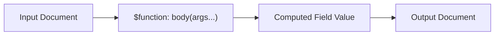

# How to Use $function for Custom JavaScript Logic in MongoDB 4.4+

Author: [nawazdhandala](https://www.github.com/nawazdhandala)

Tags: MongoDB, Aggregation, Pipeline, JavaScript, Expression

Description: Learn how to use $function in MongoDB 4.4+ to execute custom JavaScript expressions per document in $project and $addFields stages when built-in operators fall short.

---

## Overview

`$function` was introduced in MongoDB 4.4. It lets you run a JavaScript function on a per-document basis inside aggregation pipeline stages like `$project`, `$addFields`, and `$match` (via `$expr`). Unlike `$accumulator`, `$function` is stateless and processes one document at a time.



## Syntax

```javascript
{
  $function: {
    body: <JavaScript function or string>,
    args: [ <expression>, ... ],
    lang: "js"
  }
}
```

- `body` - JavaScript function that receives the evaluated `args` and returns a value
- `args` - array of aggregation expressions whose results are passed as arguments
- `lang` - must be `"js"` (currently the only supported language)

## Examples

### Example 1 - Compute a Value Not Available as a Built-in

Compute the Luhn check digit for credit card validation:

```javascript
db.cards.aggregate([
  {
    $addFields: {
      luhnValid: {
        $function: {
          body: function(cardNumber) {
            var digits = String(cardNumber).split("").reverse();
            var sum = digits.reduce(function(acc, d, i) {
              var n = parseInt(d);
              if (i % 2 === 1) {
                n *= 2;
                if (n > 9) n -= 9;
              }
              return acc + n;
            }, 0);
            return sum % 10 === 0;
          },
          args: ["$cardNumber"],
          lang: "js"
        }
      }
    }
  }
])
```

### Example 2 - Complex String Formatting

Format a name field using custom capitalization rules:

```javascript
db.users.aggregate([
  {
    $project: {
      displayName: {
        $function: {
          body: function(first, last) {
            function titleCase(s) {
              return s.charAt(0).toUpperCase() + s.slice(1).toLowerCase();
            }
            return titleCase(first) + " " + titleCase(last);
          },
          args: ["$firstName", "$lastName"],
          lang: "js"
        }
      }
    }
  }
])
```

### Example 3 - Parse a Non-Standard Date String

Convert a legacy date string like `"25/12/2023"` to an ISODate:

```javascript
db.legacy.aggregate([
  {
    $addFields: {
      parsedDate: {
        $function: {
          body: function(dateStr) {
            var parts = dateStr.split("/");
            return new Date(
              parseInt(parts[2]),
              parseInt(parts[1]) - 1,
              parseInt(parts[0])
            );
          },
          args: ["$legacyDate"],
          lang: "js"
        }
      }
    }
  }
])
```

### Example 4 - Classify a Value with Complex Logic

Assign a risk tier based on multiple criteria:

```javascript
db.loans.aggregate([
  {
    $addFields: {
      riskTier: {
        $function: {
          body: function(score, balance, daysOverdue) {
            if (daysOverdue > 90) return "critical";
            if (score < 600 || balance > 100000) return "high";
            if (score < 700 || daysOverdue > 30) return "medium";
            return "low";
          },
          args: ["$creditScore", "$balance", "$daysOverdue"],
          lang: "js"
        }
      }
    }
  }
])
```

### Example 5 - Use $function Inside $match with $expr

Filter documents using JavaScript logic not expressible in MQL:

```javascript
db.products.aggregate([
  {
    $match: {
      $expr: {
        $function: {
          body: function(name, tags) {
            return name.length > 10 && tags.includes("featured");
          },
          args: ["$name", "$tags"],
          lang: "js"
        }
      }
    }
  }
])
```

### Example 6 - Provide the Function as a String

You can pass the function body as a string instead of a function literal, which is useful for drivers that serialize to JSON:

```javascript
db.items.aggregate([
  {
    $addFields: {
      slugified: {
        $function: {
          body: "function(name) { return name.toLowerCase().replace(/\\s+/g, '-'); }",
          args: ["$name"],
          lang: "js"
        }
      }
    }
  }
])
```

## Requirements and Limitations

- MongoDB 4.4 or later
- Server-side JavaScript must be enabled (`security.javascriptEnabled: true`)
- Performance is significantly slower than native operators; use as a last resort
- Cannot perform I/O, network calls, or access the `db` object
- Not supported in Atlas Serverless instances by default

## Comparison: $function vs. $accumulator

| Aspect | $function | $accumulator |
|---|---|---|
| Scope | Per document | Across group |
| Stages | `$project`, `$addFields`, `$match` | `$group`, `$setWindowFields` |
| State | Stateless | Stateful |
| Use case | Transform a single document | Aggregate across many |

## Summary

`$function` unlocks arbitrary JavaScript computation inside MongoDB aggregation pipelines, useful for complex string transforms, custom date parsing, multi-field classification, and any logic that cannot be expressed with built-in operators. Always prefer native operators for performance-sensitive workloads. Use `$function` only when the logic truly cannot be replicated with `$cond`, `$switch`, `$regexMatch`, or other built-in expressions.
